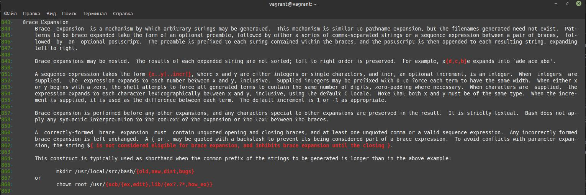

# Olga Ivanova, devops-10. Домашнее задание к занятию "3.1. Работа в терминале, лекция 1"

5. Ознакомьтесь с графическим интерфейсом VirtualBox, посмотрите как выглядит виртуальная машина, 
   которую создал для вас Vagrant, какие аппаратные ресурсы ей выделены. Какие ресурсы выделены по умолчанию?

Ресурсы по умолчанию:  
Оперативная память - 1024 Мб  
Процессоры - 2  
Видеопамять - 4 Мб  


6. Ознакомьтесь с возможностями конфигурации VirtualBox через Vagrantfile: [документация](https://www.vagrantup.com/docs/providers/virtualbox/configuration.html). 
   Как добавить оперативной памяти или ресурсов процессора виртуальной машине?
   
Для добавления ресурсов можно внести следующие правки в Vagrantfile:  
```bash
config.vm.provider "virtualbox" do |v|
  v.memory = 2048
  v.cpus = 4
end
```

8. Ознакомиться с разделами `man bash`, почитать о настройках самого bash:
* какой переменной можно задать длину журнала `history`, и на какой строчке manual это описывается?
      
Для получения ответа используем, например, команду `man bash | grep -in hist` (-i - без учёта регистра, -n - с номером строки).  
HISTFILESIZE (строка 1155) - максимальное число сохраняемых строк в файле истории.  
HISTSIZE (строка 1178) - максимальное число сохраняемых команд.  


* что делает директива `ignoreboth` в bash?

Для получения ответа используем команду `man bash | grep -in -C 20 ignoreboth` (-C 20 - чтобы вывести по 20 строк до и после найденного текста).  
Это возможное значение HISTCONTROL (как команды сохраняются в истории). ignoreboth - это комбинация ignorespace
(строки, начинающиеся с пробела, не сохраняются в истории) и ignoredups (строки, совпадающие с предыдущими записями, не сохраняются, т.е. игнорируются дубликаты).   


9. В каких сценариях использования применимы скобки `{}` и на какой строчке `man bash` это описано?
   
Используем команду `man bash | grep -En -C 30 '{.*}'` (-E - для поиска по регулярному выражению).  

Номер строки зависит от размера окна терминала. Поэтому результаты могут получаться разными.

Начиная с 213 строки. `{ list; }` - Внутри {} можно указать группу команд, которые будут выполнены в текущем окружении. Список должен завершаться переносом строки или точкой с запятой.
{} относятся к зарезервированным.  


Начиная с 800 строки. `${name[subscript]}` - Могут быть использованы при доступе к элементам массива.  


Начиная с 843 строки. Могут быть использованы для генерации строк.  


Начиная с 894 строки. Могут быть использованы при подстановке значения параметра.  


10. Основываясь на предыдущем вопросе, как создать однократным вызовом `touch` 100000 файлов? А получилось ли создать 300000?
   
Создание 100000 файлов.
```bash
touch {000001..100000}.txt
```
300000 создать не получается. Ошибка: `-bash: /usr/bin/touch: Argument list too long`

11. В man bash поищите по `/\[\[`. Что делает конструкция `[[ -d /tmp ]]`
    
Команда: `man bash | grep -En -C 20 '\[\['`  

`[[ -d /tmp ]]` проверяет условие, что /tmp существует и является директорией, и возвращает true, если это так.  


12. Основываясь на знаниях о просмотре текущих (например, PATH) и установке новых переменных; командах, которые мы рассматривали, 
   добейтесь в выводе type -a bash в виртуальной машине наличия первым пунктом в списке bash is /tmp/new_path_directory/bash

Первоначальный вывод:
```bash
vagrant@vagrant:~$ type -a bash
bash is /usr/bin/bash
bash is /bin/bash

vagrant@vagrant:~$ echo $PATH
/usr/local/sbin:/usr/local/bin:/usr/sbin:/usr/bin:/sbin:/bin:/usr/games:/usr/local/games:/snap/bin
```
   
Команды (создаём директорию, символическую ссылку на /bin/bash, обновляем значение переменной PATH):
```bash
vagrant@vagrant:~$ mkdir -p /tmp/new_path_directory
vagrant@vagrant:~$ ln -s /bin/bash /tmp/new_path_directory
vagrant@vagrant:~$ ll -a /tmp/new_path_directory
total 8
drwxrwxr-x  2 vagrant vagrant 4096 Jun 22 09:46 ./
drwxrwxrwt 10 root    root    4096 Jun 22 09:46 ../
lrwxrwxrwx  1 vagrant vagrant    9 Jun 22 09:46 bash -> /bin/bash*
vagrant@vagrant:~$ PATH=/tmp/new_path_directory:$PATH
```


13. Чем отличается планирование команд с помощью `batch` и `at`?

`man batch`: at и batch считывают команды из stdin или указанного файла, которые впоследствии будут выполнены с использованием /bin/sh.  
at - выполняет команды в определённое время.  
batch - выполняет команды, когда загрузка системы становится ниже определённого уровня (1.5 или другого указанного в atd значения).  


14. Завершите работу виртуальной машины чтобы не расходовать ресурсы компьютера и/или батарею ноутбука.

`vagrant suspend`