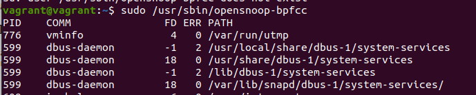
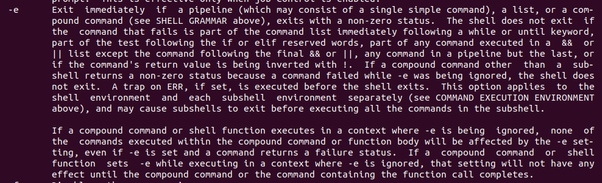

# Olga Ivanova, devops-10. Домашнее задание к занятию "3.3. Операционные системы, лекция 1"


1. Какой системный вызов делает команда `cd`? В прошлом ДЗ мы выяснили, что `cd` не является самостоятельной программой, 
   это `shell builtin`, поэтому запустить `strace` непосредственно на `cd` не получится. Тем не менее вы можете запустить `strace` на `/bin/bash -c 'cd /tmp'`. 
   В этом случае вы увидите полный список системных вызовов, которые делает сам `bash` при старте. Вам нужно найти тот единственный, который относится именно к `cd`.
   
Ответ:  
`cd` делает системный вызов `chdir("/tmp")`.  
```bash
vagrant@vagrant:~$ strace /bin/bash -c 'cd /tmp' 2>&1 | grep tmp
execve("/bin/bash", ["/bin/bash", "-c", "cd /tmp"], 0x7fffe90ad6f0 /* 24 vars */) = 0
stat("/tmp", {st_mode=S_IFDIR|S_ISVTX|0777, st_size=4096, ...}) = 0
chdir("/tmp")                           = 0
```

2. Попробуйте использовать команду `file` на объекты разных типов на файловой системе. Например:
    ```bash
    vagrant@netology1:~$ file /dev/tty
    /dev/tty: character special (5/0)
    vagrant@netology1:~$ file /dev/sda
    /dev/sda: block special (8/0)
    vagrant@netology1:~$ file /bin/bash
    /bin/bash: ELF 64-bit LSB shared object, x86-64
    ```
   Используя `strace` выясните, где находится база данных `file` на основании которой она делает свои догадки.
   
Ответ:  
База данных находится в `/usr/share/misc/magic.mgc`. До этого проверяются другие (вероятно, пользовательские) 
файлы (`/home/vagrant/.magic.mgc` и т.д.), но они не существуют.

```bash
vagrant@vagrant:~$ strace -e trace=file /bin/bash -c 'file /dev/tty' 2>&1
...
openat(AT_FDCWD, "/lib/x86_64-linux-gnu/libpthread.so.0", O_RDONLY|O_CLOEXEC) = 3
openat(AT_FDCWD, "/usr/lib/locale/locale-archive", O_RDONLY|O_CLOEXEC) = 3
stat("/home/vagrant/.magic.mgc", 0x7ffe905aad50) = -1 ENOENT (No such file or directory)
stat("/home/vagrant/.magic", 0x7ffe905aad50) = -1 ENOENT (No such file or directory)
openat(AT_FDCWD, "/etc/magic.mgc", O_RDONLY) = -1 ENOENT (No such file or directory)
stat("/etc/magic", {st_mode=S_IFREG|0644, st_size=111, ...}) = 0
openat(AT_FDCWD, "/etc/magic", O_RDONLY) = 3
openat(AT_FDCWD, "/usr/share/misc/magic.mgc", O_RDONLY) = 3
openat(AT_FDCWD, "/usr/lib/x86_64-linux-gnu/gconv/gconv-modules.cache", O_RDONLY) = 3
lstat("/dev/tty", {st_mode=S_IFCHR|0666, st_rdev=makedev(0x5, 0), ...}) = 0
/dev/tty: character special (5/0)
+++ exited with 0 +++
```

3. Предположим, приложение пишет лог в текстовый файл. Этот файл оказался удален (deleted в lsof), однако возможности 
   сигналом сказать приложению переоткрыть файлы или просто перезапустить приложение нет. Так как приложение продолжает 
   писать в удаленный файл, место на диске постепенно заканчивается. Основываясь на знаниях о перенаправлении потоков, 
   предложите способ обнуления открытого удаленного файла (чтобы освободить место на файловой системе).

Ответ:  
В одном терминале открываем на редактирование файл `vim test`.  
В другом ищем pid процесса, смотрим его файловые дескрипторы (в папке `/proc` и с помощью `lsof`):
```bash
vagrant@vagrant:~$ ps au | grep vim
vagrant    12863  0.0  0.9  24440  9728 pts/0    S+   12:36   0:00 vim test
vagrant    12873  0.0  0.0   8900   724 pts/1    S+   12:38   0:00 grep --color=auto vim
vagrant@vagrant:~$ ll /proc/12863/fd
total 0
dr-x------ 2 vagrant vagrant  0 Jun 29 12:37 ./
dr-xr-xr-x 9 vagrant vagrant  0 Jun 29 12:36 ../
lrwx------ 1 vagrant vagrant 64 Jun 29 12:37 0 -> /dev/pts/0
lrwx------ 1 vagrant vagrant 64 Jun 29 12:37 1 -> /dev/pts/0
lrwx------ 1 vagrant vagrant 64 Jun 29 12:37 2 -> /dev/pts/0
lrwx------ 1 vagrant vagrant 64 Jun 29 12:37 4 -> /tmp/.test.swp
vagrant@vagrant:/proc/12863/fd$ lsof -p 12863 | grep test
vim     12863 vagrant    4u   REG  253,0    12288 2228233 /tmp/.test.swp
```  
Удаляем файл:  
```bash
vagrant@vagrant:/proc/12863/fd$ lsof -p 12863 | grep test
vim     12863 vagrant    4u   REG  253,0    12288 2228233 /tmp/.test.swp (deleted)
```  

Если продолжаем редактировать в vim, то через вызов `cat /proc/12863/fd/4` видим, что в файловом дескрипторе данные меняются.  
Чтобы "обнулить" файл, записываем в файловый дескриптор пустую строку:
```bash
vagrant@vagrant:/proc/12863/fd$ echo ''>/proc/12863/fd/4
```

4. Занимают ли зомби-процессы какие-то ресурсы в ОС (CPU, RAM, IO)?

Ответ:  
Зомби-процессы - это дочерние процессы, которые завершили своё выполнение, но ждут, пока родительский процесс прочитает их код завершения.  
Они не потребляют ресурсов, но блокируют pid-ы (т.к. остаются записями в таблице процессов).

5. В iovisor BCC есть утилита `opensnoop`:
    ```bash
    root@vagrant:~# dpkg -L bpfcc-tools | grep sbin/opensnoop
    /usr/sbin/opensnoop-bpfcc
    ```
   На какие файлы вы увидели вызовы группы `open` за первую секунду работы утилиты? Воспользуйтесь пакетом `bpfcc-tools` 
   для Ubuntu 20.04. Дополнительные [сведения по установке](https://github.com/iovisor/bcc/blob/master/INSTALL.md).

Ответ:  
Устанавливаем утилиту (`sudo apt-get install bpfcc-tools linux-headers-$(uname -r)`).  
Результат запуска:  


6. Какой системный вызов использует `uname -a`? Приведите цитату из man по этому системному вызову, где описывается 
   альтернативное местоположение в `/proc`, где можно узнать версию ядра и релиз ОС.

Ответ:  
Системный вызов uname():  
```bash
vagrant@vagrant:~$ strace uname -a
...
uname({sysname="Linux", nodename="vagrant", ...}) = 0
fstat(1, {st_mode=S_IFCHR|0620, st_rdev=makedev(0x88, 0x1), ...}) = 0
uname({sysname="Linux", nodename="vagrant", ...}) = 0
uname({sysname="Linux", nodename="vagrant", ...}) = 0
...
```  
С помощью команды `man 2 uname | grep -C 30 proc` находим цитату: `Part  of the utsname information is also accessible via /proc/sys/kernel/{ostype, hostname, osre‐
lease, version, domainname}.`

7. Чем отличается последовательность команд через `;` и через `&&` в bash? Например:
    ```bash
    root@netology1:~# test -d /tmp/some_dir; echo Hi
    Hi
    root@netology1:~# test -d /tmp/some_dir && echo Hi
    root@netology1:~#
    ```
   Есть ли смысл использовать в bash `&&`, если применить `set -e`?

Ответ:  
При `;` команды выполняются последовательно, независимо от результата работы предыдущей. Если первая команда завершится с ошибкой, то вторая всё равно выполнится.  
При `&&` вторая команда выполнится только в том случае, если первая завершится успешно.  

Пробуем выполнить с `set -e`:  
```bash
vagrant@vagrant:~$ set -e
vagrant@vagrant:~$ ll /root; echo Hi
ls: cannot open directory '/root': Permission denied
Connection to 127.0.0.1 closed.
vagrant@vagrant:~$ echo Hi; ll /root
Hi
ls: cannot open directory '/root': Permission denied
Connection to 127.0.0.1 closed.
vagrant@vagrant:~$ ll /root && echo Hi
ls: cannot open directory '/root': Permission denied
vagrant@vagrant:~$ echo Hi && ll /root
Hi
ls: cannot open directory '/root': Permission denied
Connection to 127.0.0.1 closed.
```
В справке `man bash` по поводу `set -e` написано:  
  

Таким образом, shell при данной опции не завершается в том случае, если выражение, вернувшее ненулевой статус, 
является частью команд, выполняемых в списке с `&&` или `||`, кроме последней. Аналогичный результат получили при тестировании. 
Поэтому `&&` при данной опции использовать нет смысла. При `;` и данной опциии shell завершается сразу при получении ненулевого кода.

8. Из каких опций состоит режим bash `set -euxo pipefail` и почему его хорошо было бы использовать в сценариях?

Ответ:  
Ищем в `man bash`.  
`-o pipefail` - (где `-o` - это список опций) возвращаемое значение pipeline - это ненулевой код завершения самой последней (правой) команды или нулевой, если все завершились успешно.  
`-e` - завершить сразу, если pipeline, список команд или составная команда завершится с ненулевым статусом (кроме некоторых случаев, например: 
эта команда выполняется в `while` или `until`, проверяется в условиях `if` или `elif`, является частью команд в списке с `&&` или `||` (кроме последней), её код завершения инвертируется).  
`-u` - считать неустановленные переменные и параметры, кроме `@` и `*`, ошибками.  
`-x` - после каждой команды отображать расширенную информацию с аргументами и трассировкой.  

Его удобно использовать в сценариях, т.к. добавляется логирование, сценарий завершается при наличии ошибок, неустановленные переменные считает ошибками.

9. Используя `-o stat` для `ps`, определите, какой наиболее часто встречающийся статус у процессов в системе. 
   В `man ps` ознакомьтесь (`/PROCESS STATE CODES`), что значат дополнительные к основной заглавной буквы статуса процессов. 
   Его можно не учитывать при расчете (считать S, Ss или Ssl равнозначными).
   
Ответ:  
Выполняем `ps a -o stat`, получаем, что наиболее часто встречающийся статус - это S (т.е. спящие, ожидающие какого-либо события, но которые можно прервать).  
Дополнительные буквы статуса - это дополнительные характеристики (приоритет, многопоточность и др.).