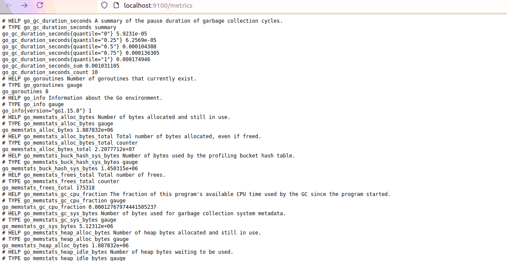
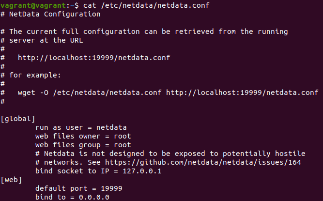
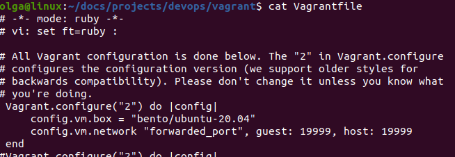
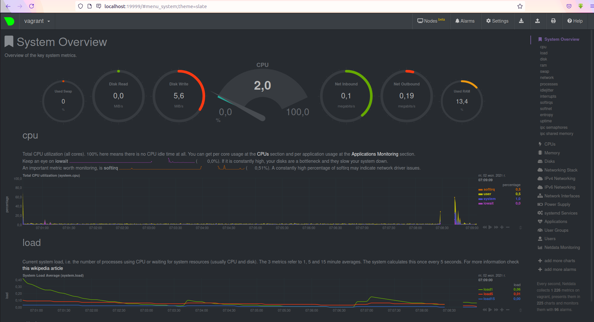
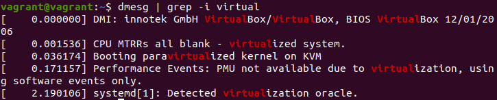

# Olga Ivanova, devops-10. Домашнее задание к занятию "3.4. Операционные системы, лекция 2"


1. На лекции мы познакомились с [node_exporter](https://github.com/prometheus/node_exporter/releases). В демонстрации его 
   исполняемый файл запускался в background. Этого достаточно для демо, но не для настоящей production-системы, где 
   процессы должны находиться под внешним управлением. Используя знания из лекции по systemd, создайте самостоятельно простой 
   [unit-файл](https://www.freedesktop.org/software/systemd/man/systemd.service.html) для node_exporter:

   * поместите его в автозагрузку,
   * предусмотрите возможность добавления опций к запускаемому процессу через внешний файл (посмотрите, например, на `systemctl cat cron`),
   * удостоверьтесь, что с помощью systemctl процесс корректно стартует, завершается, а после перезагрузки автоматически поднимается.
   
Ответ:  
Установка:  
```bash
vagrant@vagrant:~$ wget https://github.com/prometheus/node_exporter/releases/download/v1.1.2/node_exporter-1.1.2.linux-amd64.tar.gz
vagrant@vagrant:~$ tar xvfz node_exporter-1.1.2.linux-amd64.tar.gz
````

Создаём unit-файл для systemd, где ExecStart - путь к исполняемому файлу node exporter, а EnvironmentFile - путь к файлу, в котором будут добавляться опции.  
```bash
vagrant@vagrant:~/node_exporter-1.1.2.linux-amd64$ cd /etc/systemd/system
vagrant@vagrant:/etc/systemd/system$ sudo nano node-exporter.service
vagrant@vagrant:/etc/systemd/system$ cat /etc/systemd/system/node-exporter.service
[Unit]
Description=Node Exporter
 
[Service]
ExecStart=/home/vagrant/node_exporter/node_exporter
EnvironmentFile=/home/vagrant/node_exporter/env
 
[Install]
WantedBy=multi-user.target
vagrant@vagrant:/etc/systemd/system$ cat /home/vagrant/node_exporter/env
MY_VAR=my_value
```

Добавляем в автозагрузку:  
```bash
vagrant@vagrant:/etc/systemd/system$ sudo systemctl enable node-exporter.service
Created symlink /etc/systemd/system/multi-user.target.wants/node-exporter.service → /etc/systemd/system/node-exporter.service.
```

Стартуем, пробуем остановить, перезапустить (также выполнялся и vagrant reload).
```bash
vagrant@vagrant:/etc/systemd/system$ sudo systemctl start node-exporter.service
vagrant@vagrant:~$ systemctl list-unit-files --type=service | grep node-ex
node-exporter.service                  enabled         enabled      
vagrant@vagrant:~$ ps aux | grep node_ex
root         613  0.2  1.9 718340 19832 ?        Ssl  11:06   0:00 /home/vagrant/node_exporter/node_exporter
vagrant@vagrant:~$ sudo systemctl restart node-exporter.service
vagrant@vagrant:~$ ps aux | grep node_ex
root        1333  0.0  1.1 716676 11664 ?        Ssl  11:10   0:00 /home/vagrant/node_exporter/node_exporter
vagrant@vagrant:~$ sudo systemctl stop node-exporter.service
vagrant@vagrant:~$ ps aux | grep node_ex
```

Проверяем переменные окружения запущенного процесса:  
```bash
vagrant@vagrant:~$ sudo cat /proc/1377/environ
LANG=en_US.UTF-8LANGUAGE=en_US:PATH=/usr/local/sbin:/usr/local/bin:/usr/sbin:/usr/bin:/sbin:/bin:/snap/binINVOCATION_ID=e98ef3121528498796a3ec6e6816eb07JOURNAL_STREAM=9:30289MY_VAR=my_value
```

Порт проброшен на хостовую машину (в Vagrantfile добавлен `config.vm.network "forwarded_port", guest: 9100, host: 9100`):


2. Ознакомьтесь с опциями node_exporter и выводом `/metrics` по умолчанию. Приведите несколько опций, которые вы бы 
   выбрали для базового мониторинга хоста по CPU, памяти, диску и сети.

Ответ:  
CPU (по каждому ядру отдельно):   
node_cpu_seconds_total{cpu="0",mode="idle"}  
node_cpu_seconds_total{cpu="0",mode="iowait"}  
node_cpu_seconds_total{cpu="0",mode="system"}  
node_cpu_seconds_total{cpu="0",mode="user"}  
process_cpu_seconds_total  

Память:  
node_memory_MemAvailable_bytes  
node_memory_MemFree_bytes  

Диск (по каждому отдельно):  
node_disk_io_time_seconds_total{device="sda"}
node_disk_read_bytes_total{device="sda"}  
node_disk_read_time_seconds_total{device="sda"}  
node_disk_write_time_seconds_total{device="sda"}  
node_disk_written_bytes_total{device="sda"}  

Сеть:  
node_network_receive_bytes_total{device="eth0"}  
node_network_receive_errs_total{device="eth0"}  
node_network_transmit_bytes_total{device="eth0"}  
node_network_transmit_errs_total{device="eth0"}  

3. Установите в свою виртуальную машину [Netdata](https://github.com/netdata/netdata). 
   Воспользуйтесь [готовыми пакетами](https://packagecloud.io/netdata/netdata/install) для установки (`sudo apt install -y netdata`). 
   После успешной установки:
   * в конфигурационном файле `/etc/netdata/netdata.conf` в секции [web] замените значение с localhost на `bind to = 0.0.0.0`,
   * добавьте в Vagrantfile проброс порта Netdata на свой локальный компьютер и сделайте `vagrant reload`:

    ```bash
    config.vm.network "forwarded_port", guest: 19999, host: 19999
    ```

   После успешной перезагрузки в браузере *на своем ПК* (не в виртуальной машине) вы должны суметь зайти на `localhost:19999`. 
   Ознакомьтесь с метриками, которые по умолчанию собираются Netdata, и с комментариями, которые даны к этим метрикам.

Ответ:  
Конфигурационный файл Netdata:  
  
Vagrantfile:  
  
После `vagrant reload`:  



4. Можно ли по выводу `dmesg` понять, осознает ли ОС, что загружена не на настоящем оборудовании, а на системе виртуализации?

Ответ:  
Да (`dmesg | grep -i virtual`):  



5. Как настроен sysctl `fs.nr_open` на системе по-умолчанию? Узнайте, что означает этот параметр. Какой другой существующий лимит не 
   позволит достичь такого числа (`ulimit --help`)?  
   
Ответ:
```bash
vagrant@vagrant:~$ cat /proc/sys/fs/nr_open
1048576
vagrant@vagrant:~$ /sbin/sysctl -n fs.nr_open
1048576
```  
Это максимальное число открытых дескрипторов файлов. Значение по умолчанию - 1024*1024 (1048576).

Результаты работы `ulimit`:  
```bash
vagrant@vagrant:~$ ulimit -n
1024
vagrant@vagrant:~$ ulimit -Sn
1024
vagrant@vagrant:~$ ulimit -Hn
1048576
```  
`ulimit -n` и `ulimit -Sn` - это "мягкий" лимит (используется для лимитирования ресурсов),  
`ulimit -Hn` - "жёсткий" лимит (максимальное значение для "мягкого" лимита).  


6. Запустите любой долгоживущий процесс (не `ls`, который отработает мгновенно, а, например, `sleep 1h`) в 
   отдельном неймспейсе процессов; покажите, что ваш процесс работает под PID 1 через `nsenter`. Для простоты 
   работайте в данном задании под root (`sudo -i`). Под обычным пользователем требуются дополнительные опции (`--map-root-user`) и т.д.
   
Ответ:  
В одном терминале выполняем:  
```bash
vagrant@vagrant:~$ sudo -i
root@vagrant:~# unshare -f --pid --mount-proc /bin/bash
root@vagrant:~# sleep 1h &
[1] 8
root@vagrant:~# ps aux
USER         PID %CPU %MEM    VSZ   RSS TTY      STAT START   TIME COMMAND
root           1  0.0  0.3   9836  3996 pts/0    S    06:47   0:00 /bin/bash
root           8  0.0  0.0   8076   588 pts/0    S    06:47   0:00 sleep 1h
root           9  0.0  0.3  11492  3300 pts/0    R+   06:47   0:00 ps aux
```  

В другом терминале:
```bash
root@vagrant:~# ps aux | grep sleep
root        1882  0.0  0.0   8076   588 pts/0    S    06:47   0:00 sleep 1h
root        1956  0.0  0.0   8900   740 pts/1    S+   06:52   0:00 grep --color=auto sleep
root@vagrant:~# nsenter --target 1882 --pid --mount
root@vagrant:/# ps aux
USER         PID %CPU %MEM    VSZ   RSS TTY      STAT START   TIME COMMAND
root           1  0.0  0.3   9836  4016 pts/0    S+   06:47   0:00 /bin/bash
root           8  0.0  0.0   8076   588 pts/0    S    06:47   0:00 sleep 1h
root          10  0.0  0.3   9836  3932 pts/1    S    06:53   0:00 -bash
root          19  0.0  0.3  11492  3264 pts/1    R+   06:53   0:00 ps aux
```

7. Найдите информацию о том, что такое `:(){ :|:& };:`. Запустите эту команду в своей виртуальной машине Vagrant с Ubuntu 20.04 
   (**это важно, поведение в других ОС не проверялось**). Некоторое время все будет "плохо", после чего (минуты) – ОС должна стабилизироваться. 
   Вызов `dmesg` расскажет, какой механизм помог автоматической стабилизации. Как настроен этот механизм по умолчанию, и как изменить число процессов, 
   которое можно создать в сессии?

Ответ:  
`:(){ :|:& };:` - это классический пример fork-бомбы, когда программа бесконечно создаёт свои копии, которые тоже создают свои копии и т.д.  
Здесь `:` - название функции, в теле функции повторно вызывается она же (`:`), результат передаётся через pipe ей же, вызванной в бэкграунде (`:&`).  
Автоматической стабилизации помог механизм cgroups: `cgroup: fork rejected by pids controller in /user.slice/user-1000.slice/session-3.scope`.  
Дело в том, что systemd создаёт cgroup для каждого пользователя, соответственно, все процессы пользователя принадлежат этой группе. Каждая c-группа имеет лимиты.
Вызвав `systemctl status user-1000.slice`, увидим количество разрешённых процессов.  
По умолчанию максимальное количество создаваемых процессов - 33% (`TasksMax=33%`) от максимума по всей системе (`sysctl kernel.threads-max`).  
Это можно посмотреть в `cat /usr/lib/systemd/system/user-.slice.d/10-defaults.conf`.  
Если нужно поменять значение, то можно либо задать значение TasksMax в `/etc/systemd/system/user-.slice.d/15-limits.conf` (применится для каждого пользователя),
либо задать значение для конкретного пользователя `systemctl [--runtime] set-property user-<uid>.slice TasksMax=<value>`.  
В принципе можно ещё использовать `ulimit -u <value>`, но это применится только к текущей среде выполнения.