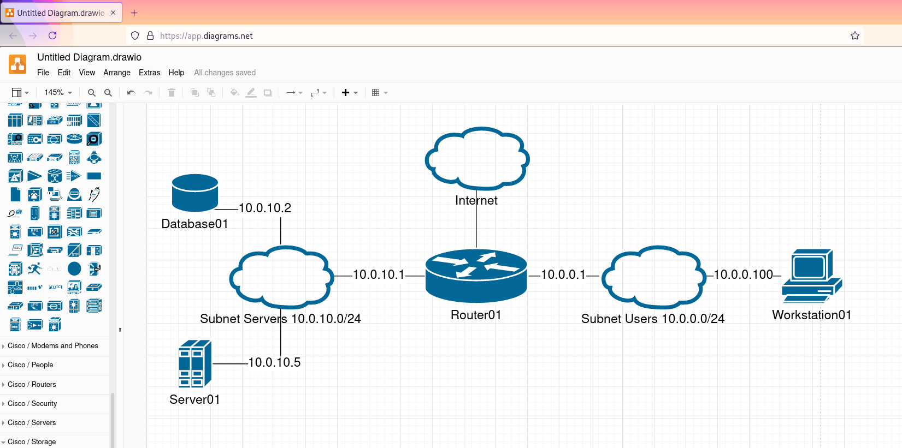

# Olga Ivanova, devops-10. Домашнее задание к занятию "3.8. Компьютерные сети, лекция 3"

1. Подключитесь к публичному маршрутизатору в интернет. Найдите маршрут к вашему публичному IP
```bash
telnet route-views.routeviews.org
Username: rviews
show ip route x.x.x.x/32
show bgp x.x.x.x/32
```

Ответ:  
```bash
vagrant@vagrant:~$ telnet route-views.routeviews.org
Username: rviews
route-views>show ip route 91.79.30.64
Routing entry for 91.76.0.0/14
  Known via "bgp 6447", distance 20, metric 0
  Tag 2497, type external
  Last update from 202.232.0.2 7w0d ago
  Routing Descriptor Blocks:
  * 202.232.0.2, from 202.232.0.2, 7w0d ago
      Route metric is 0, traffic share count is 1
      AS Hops 2
      Route tag 2497
      MPLS label: none
route-views>show bgp 91.79.30.64
BGP routing table entry for 91.76.0.0/14, version 133581250
Paths: (25 available, best #20, table default)
  Not advertised to any peer
  Refresh Epoch 1
  20912 3257 3356 8359
    212.66.96.126 from 212.66.96.126 (212.66.96.126)
      Origin IGP, localpref 100, valid, external
      Community: 3257:8070 3257:30515 3257:50001 3257:53900 3257:53902 20912:65004
      path 7FE12E9F1910 RPKI State not found
      rx pathid: 0, tx pathid: 0
  Refresh Epoch 1
  3561 3910 3356 8359
    206.24.210.80 from 206.24.210.80 (206.24.210.80)
      Origin IGP, localpref 100, valid, external
      path 7FE107C2EC78 RPKI State not found
      rx pathid: 0, tx pathid: 0
  Refresh Epoch 1
  3267 1299 8359
    194.85.40.15 from 194.85.40.15 (185.141.126.1)
      Origin IGP, metric 0, localpref 100, valid, external
      path 7FE08D2E15A8 RPKI State not found
      rx pathid: 0, tx pathid: 0
  Refresh Epoch 1
  3333 8359
 --More--
```

2. Создайте dummy0 интерфейс в Ubuntu. Добавьте несколько статических маршрутов. Проверьте таблицу маршрутизации.  

Ответ:  
Чтобы модуль автоматически запускался при старте системы, то добавим в файл `/etc/modules` (при запуске создастся один интерфейс dummy0):  
```bash
vagrant@vagrant:~$ sudo su
root@vagrant:/home/vagrant# echo "dummy" >> /etc/modules
```

Задаём настройки `dummy0` в `/etc/network/interfaces`:  
```bash
root@vagrant:/home/vagrant# cat /etc/network/interfaces
# interfaces(5) file used by ifup(8) and ifdown(8)
# Include files from /etc/network/interfaces.d:
source-directory /etc/network/interfaces.d
auto dummy0
iface dummy0 inet static
address 10.10.0.1/24
pre-up ip link add dummy0 type dummy
post-down ip link del dummy0 type dummy
```

Добавляем модуль `dummy`, проверяем, что он загрузился и что создались интерфейсы:  
```bash
root@vagrant:/home/vagrant# sudo modprobe -v dummy numdummies=1
insmod /lib/modules/5.4.0-73-generic/kernel/drivers/net/dummy.ko numdummies=0 numdummies=1
root@vagrant:/home/vagrant# lsmod | grep dummy
dummy                  16384  0
root@vagrant:/home/vagrant# ifconfig -a | grep dummy
dummy0: flags=130<BROADCAST,NOARP>  mtu 1500
```

Добавляем временный статический маршрут:  
```bash
root@vagrant:/home/vagrant# ip route add 172.16.10.0/24 dev eth0
```

Добавляем постоянный статический маршрут в `/etc/network/interfaces` (через `up route add`) и выполняем `ifup eth0` (или `systemctl restart networking`):  
```bash
root@vagrant:/home/vagrant# cat /etc/network/interfaces
# interfaces(5) file used by ifup(8) and ifdown(8)
# Include files from /etc/network/interfaces.d:
source-directory /etc/network/interfaces.d

auto dummy0
iface dummy0 inet static
address 10.10.0.1/24
pre-up ip link add dummy0 type dummy
post-down ip link del dummy0 type dummy

auto eth0
iface eth0 inet static
      address 192.168.1.2
      netmask 255.255.255.0
      up route add -net 192.168.0.0 netmask 255.255.0.0 gw 192.168.1.1
      up route add -net 172.16.0.0 netmask 255.240.0.0 gw 192.168.1.1
```

Таблица маршрутизации:  
```bash
root@vagrant:/home/vagrant# ip -br route
default via 10.0.2.2 dev eth0 proto dhcp src 10.0.2.15 metric 100 
10.0.2.0/24 dev eth0 proto kernel scope link src 10.0.2.15 
10.0.2.2 dev eth0 proto dhcp scope link src 10.0.2.15 metric 100 
10.10.0.0/24 dev dummy0 proto kernel scope link src 10.10.0.1 
172.16.0.0/12 via 192.168.1.1 dev eth0 
172.16.10.0/24 dev eth0 scope link 
192.168.0.0/16 via 192.168.1.1 dev eth0 
192.168.1.0/24 dev eth0 proto kernel scope link src 192.168.1.2
```

3. Проверьте открытые TCP порты в Ubuntu, какие протоколы и приложения используют эти порты? Приведите несколько примеров.  

Ответ:
```bash
[olga@fedora ~]$ ss -tap
State       Recv-Q      Send-Q                Local Address:Port                       Peer Address:Port               Process                                                                
LISTEN      0           4096                        0.0.0.0:hostmon                         0.0.0.0:*                                                                                         
LISTEN      0           128                         0.0.0.0:ctdp                            0.0.0.0:*                   users:(("sshd",pid=6451,fd=5))                                        
LISTEN      0           5                         127.0.0.1:49582                           0.0.0.0:*                   users:(("nxproxy",pid=6446,fd=31),("x2goclient",pid=6407,fd=31))      
LISTEN      0           10                        127.0.0.1:EtherNet/IP-1                   0.0.0.0:*                                                                                         
LISTEN      0           32                    192.168.122.1:domain                          0.0.0.0:*                                                                                         
LISTEN      0           4096                  127.0.0.53%lo:domain                          0.0.0.0:*                                                                                         
LISTEN      0           128                       127.0.0.1:ipp                             0.0.0.0:*                                                                                         
ESTAB       0           0                      192.168.1.65:33446                      5.255.255.55:https               users:(("firefox",pid=4858,fd=309))                                   
ESTAB       0           0                         127.0.0.1:35316                         127.0.0.1:EtherNet/IP-1       users:(("ssh",pid=4575,fd=4))                                         
ESTAB       0           0                         127.0.0.1:49582                         127.0.0.1:47292               users:(("x2goclient",pid=6407,fd=32))                                 
ESTAB       0           0                      192.168.1.65:53176                     52.38.251.151:https               users:(("firefox",pid=4858,fd=127))                                   
ESTAB       0           0                         127.0.0.1:57306                         127.0.0.1:ctdp                users:(("x2goclient",pid=6407,fd=35))                                 
ESTAB       0           0                      192.168.1.65:37866                     34.107.221.82:http                users:(("firefox",pid=4858,fd=306))                                   
ESTAB       0           0                      192.168.1.65:37864                     34.107.221.82:http                users:(("firefox",pid=4858,fd=303))                                   
ESTAB       0           0                         127.0.0.1:47292                         127.0.0.1:49582               users:(("nxproxy",pid=6446,fd=5))                                     
ESTAB       0           0                      192.168.1.65:58802                     78.41.196.250:https                                                                                     
ESTAB       0           0                      10.77.252.79:38488                    192.168.79.107:ssh                 users:(("nxproxy",pid=6446,fd=30),("x2goclient",pid=6407,fd=30))      
ESTAB       0           0                         127.0.0.1:EtherNet/IP-1                 127.0.0.1:35316                                                                                     
ESTAB       0           0                         127.0.0.1:ctdp                          127.0.0.1:57306               users:(("sshd",pid=6457,fd=5),("sshd",pid=6455,fd=5))                 
ESTAB       0           0                      192.168.1.65:35262                    149.154.167.51:https               users:(("telegram-deskto",pid=2584,fd=40))                            
ESTAB       0           0                      192.168.1.65:34332                    198.252.206.25:https               users:(("firefox",pid=4858,fd=220))                                   
LISTEN      0           4096             [::ffff:127.0.0.1]:6942                                  *:*                   users:(("java",pid=3171,fd=32))                                       
LISTEN      0           4096                           [::]:hostmon                            [::]:*                                                                                         
LISTEN      0           128                            [::]:ctdp                               [::]:*                   users:(("sshd",pid=6451,fd=6))                                        
LISTEN      0           4096             [::ffff:127.0.0.1]:63342                                 *:*                   users:(("java",pid=3171,fd=47))                                       
LISTEN      0           128                           [::1]:ipp                                [::]:*
```
`-t` - TCP-порты  
`-a` - все  
`-p` - показывать процессы  

Видим, например, firefox по протоколам https и http, telegram по протоколу https, x2goclient по протоколу ssh.

4. Проверьте используемые UDP сокеты в Ubuntu, какие протоколы и приложения используют эти порты?

Ответ:
```bash
[olga@fedora ~]$ ss -uap
State           Recv-Q          Send-Q                         Local Address:Port                          Peer Address:Port            Process                                               
UNCONN          0               0                                    0.0.0.0:57209                              0.0.0.0:*                users:(("firefox",pid=4858,fd=218))                  
ESTAB           0               0                               192.168.1.65:40855                       173.194.220.94:https            users:(("chromium-browse",pid=7975,fd=152))          
UNCONN          0               0                              192.168.122.1:domain                             0.0.0.0:*                                                                     
UNCONN          0               0                              127.0.0.53%lo:domain                             0.0.0.0:*                                                                     
UNCONN          0               0                             0.0.0.0%virbr0:bootps                             0.0.0.0:*                                                                     
ESTAB           0               0                        192.168.1.65%wlp4s0:bootpc                       192.168.1.254:bootps                                                                
UNCONN          0               0                                  127.0.0.1:323                                0.0.0.0:*                                                                     
ESTAB           0               0                               192.168.1.65:35977                        78.41.196.250:https                                                                 
UNCONN          0               0                                    0.0.0.0:44455                              0.0.0.0:*                users:(("firefox",pid=4858,fd=325))                  
UNCONN          0               0                                224.0.0.251:mdns                               0.0.0.0:*                users:(("chromium-browse",pid=7935,fd=302))          
UNCONN          0               0                                224.0.0.251:mdns                               0.0.0.0:*                users:(("chromium-browse",pid=7935,fd=301))          
UNCONN          0               0                                    0.0.0.0:mdns                               0.0.0.0:*                                                                     
UNCONN          0               0                                    0.0.0.0:hostmon                            0.0.0.0:*                                                                     
UNCONN          0               0                                    0.0.0.0:39503                              0.0.0.0:*                                                                     
UNCONN          0               0                                      [::1]:323                                   [::]:*                                                                     
UNCONN          0               0                                       [::]:50674                                 [::]:*                                                                     
UNCONN          0               0                                       [::]:mdns                                  [::]:*                                                                     
UNCONN          0               0                                       [::]:hostmon                               [::]:*
```
`-t` - UDP-порты  
`-a` - все  
`-p` - показывать процессы

Видим firefox и chromium по https.

5. Используя diagrams.net, создайте L3 диаграмму вашей домашней сети или любой другой сети, с которой вы работали. 

Ответ:  
Файл с L3 диаграммой: [L3 diagram](L3.drawio)  
(сеть выдумана)  
  
