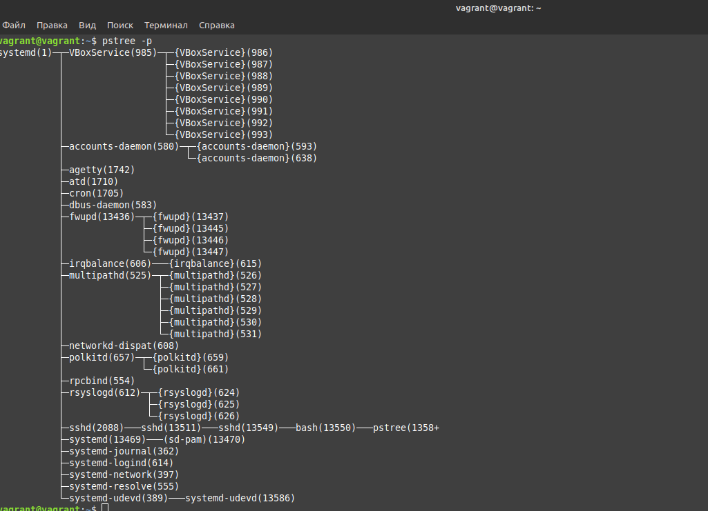
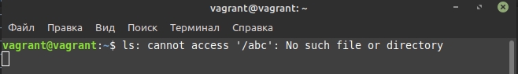
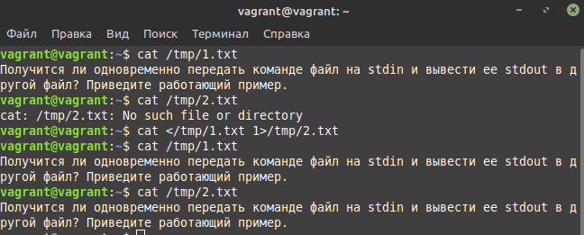
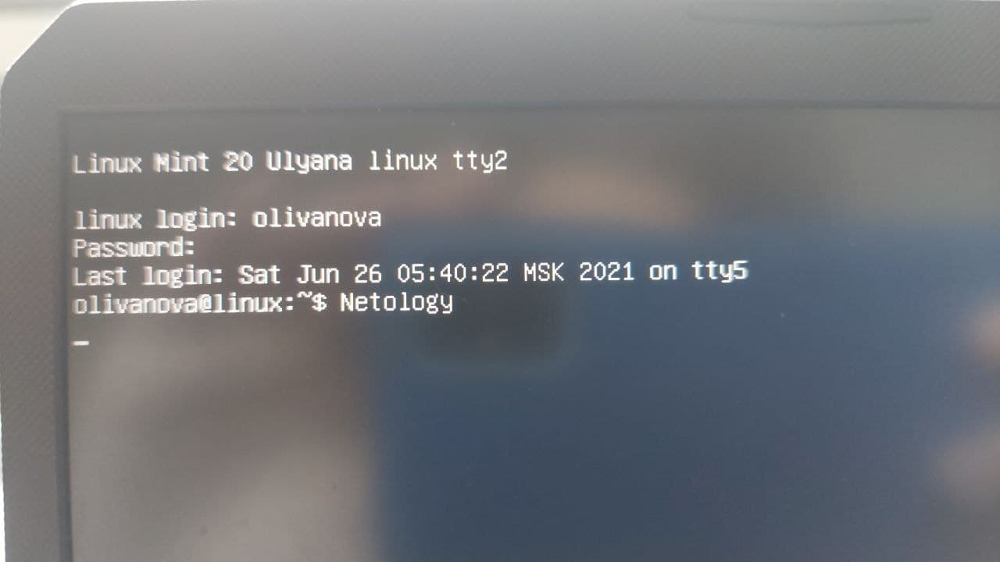

# Olga Ivanova, devops-10. Домашнее задание к занятию "3.2. Работа в терминале, лекция 2"


1. Какого типа команда `cd`? Попробуйте объяснить, почему она именно такого типа; опишите ход своих мыслей, если считаете что она могла бы быть другого типа.

Ответ:  
`cd` - это встроенная команда, меняет текущую директорию. (`type cd`)  
Команды делают встроенными, когда их невозможно или неудобно реализовать в качестве внешних утилит.  
В данном случае внешняя утилита не сможет повлиять на состояние shell. Поэтому `cd` реализована как встроенная.  
Теоретически можно было бы реализовать её как внешнюю, но в этом нет особого смысла, т.к. всё равно повлиять на shell 
она не сможет, а сможет только передать новый каталог процессу shell.


2. Какая альтернатива без pipe команде `grep <some_string> <some_file> | wc -l`? `man grep` поможет в ответе на этот вопрос. Ознакомьтесь с [документом](http://www.smallo.ruhr.de/award.html) о других подобных некорректных вариантах использования pipe.

Ответ: `grep <some_string> <some_file> -c`, например: `grep ll .bash_history -c`

3. Какой процесс с PID `1` является родителем для всех процессов в вашей виртуальной машине Ubuntu 20.04?
   
Ответ: выполняем `pstree -p`, получаем systemd(1)  


4. Как будет выглядеть команда, которая перенаправит вывод stderr `ls` на другую сессию терминала?  
   
Ответ:  
Открываем 2 окна с терминалом, в которых выполнено `vagrant ssh`.  
Выполняем в каждом команду `tty`, чтобы понять к какому `/dev/pts` относимся.  
Из терминала с `/dev/pts/0` выполняем `ls /abc 2>/dev/pts/1`.  
В другом видим:  


5. Получится ли одновременно передать команде файл на stdin и вывести ее stdout в другой файл? Приведите работающий пример.

Ответ: `cat </tmp/1.txt 1>/tmp/2.txt`  
  


6. Получится ли вывести, находясь в графическом режиме, данные из PTY в какой-либо из эмуляторов TTY? Сможете ли вы наблюдать выводимые данные?
   
Ответ:  
Сначала открываем какой-либо из tty (например, ctrl+alt+F2) и логинимся.  
Возращаемся обратно в графический режим (alt+F7), перенаправляем вывод в tty2:  
```bash
olivanova@linux:~$ tty
/dev/pts/0
olivanova@linux:~$ echo Netology >/dev/tty2
```
Переключаемся обратно в tty2 (ctrl+alt+F2), видим отправленный нами текст.  
  

7. Выполните команду `bash 5>&1`. К чему она приведет? Что будет, если вы выполните `echo netology > /proc/$$/fd/5`? Почему так происходит?
   
Ответ:  
`bash 5>&1` - создаст новый файловый дескриптор 5 и перенаправит его на 1 (т.е. stdout).   
`/proc/$$/fd` - содержит ссылки для дескрипторов файлов, которые были открыты собственным процессом $$.  
`echo netology > /proc/$$/fd/5` - выведет netology, т.к. мы перенаправили вывод echo в дескриптор 5, а он в свою очередь в stdout.
Если выполнить эту команду без `bash 5>&1`, будет ошибка, т.к. дескриптора 5 не будет.  

```bash
vagrant@vagrant:~$ ls /proc/$$/fd
0  1  2  255  5
vagrant@vagrant:~$ echo netology > /proc/$$/fd/5
netology
```


8. Получится ли в качестве входного потока для pipe использовать только stderr команды, не потеряв при этом отображение stdout на pty? 
   Напоминаем: по умолчанию через pipe передается только stdout команды слева от `|` на stdin команды справа.
   Это можно сделать, поменяв стандартные потоки местами через промежуточный новый дескриптор, который вы научились создавать в предыдущем вопросе.
   
Ответ:  
```bash
vagrant@vagrant:~$ ls /tmp1 3>&2 2>&1 1>&3 | grep -in "no such"
1:ls: cannot access '/tmp1': No such file or directory
```
`3>&2` - новый дескриптор 3 перенаправили в stderr  
`2>&1` - stderr перенаправили в stdout  
`1>&3` - stdout перенаправили в новый дескриптор  
`grep -in "no such"` - ищем текст без учёта регистра с выводом номера строки

9. Что выведет команда `cat /proc/$$/environ`? Как еще можно получить аналогичный по содержанию вывод?
   
Ответ:
`/proc/$$/environ` выведет переменные окружения процесса (записи в файлы разделены непечатаемыми символами).  
Для вывода текущих переменных окружения можно использовать `printenv` и `env` (будут разделены переносами строк).

10. Используя `man`, опишите что доступно по адресам `/proc/<PID>/cmdline`, `/proc/<PID>/exe`.
    
Ответ:  
Используя `man proc | grep -C 30 cmdline`, получаем: `/proc/[pid]/cmdline` - файл, доступный только для чтения,
содержит полную командную строку (с аргументами), которой запущен данный процесс, в том случае, если он не является процессом-зомби
(т.е. процессом, который завершил выполнение, но присутствует в списке процессов, чтобы дать родительскому процессу считать код завершения).  
Используя `man proc | grep -C 30 exe`, получаем: `/proc/[pid]/exe` - символическая ссылка на файл, который инициировал запуск процесса.  

11. Узнайте, какую наиболее старшую версию набора инструкций SSE поддерживает ваш процессор с помощью `/proc/cpuinfo`.
    
Ответ: sse4_2  
Команда `grep -i sse /proc/cpuinfo`.

12. При открытии нового окна терминала и `vagrant ssh` создается новая сессия и выделяется pty. Это можно подтвердить командой `tty`, 
    которая упоминалась в лекции 3.2. Однако:

    ```bash
	vagrant@netology1:~$ ssh localhost 'tty'
	not a tty
    ```

   Почитайте, почему так происходит, и как изменить поведение.

Ответ:  
`tty` выводит имя терминала, связанного с stdin.  
При выполнении `ssh localhost 'tty'`, чтобы запустить `tty` на хосте localhost, команда выполняется не в терминале.  
Чтобы это решить, нужно добавить флаг -t, т.е. `ssh -t localhost 'tty'`. Это флаг принудительно создаёт псевдотерминал.

```bash
vagrant@vagrant:~$ ssh localhost 'tty'
vagrant@localhost's password:
not a tty
vagrant@vagrant:~$ ssh -t localhost 'tty'
vagrant@localhost's password:
/dev/pts/10
Connection to localhost closed.
```


13. Бывает, что есть необходимость переместить запущенный процесс из одной сессии в другую. 
    Попробуйте сделать это, воспользовавшись `reptyr`. Например, так можно перенести в `screen` процесс, 
    который вы запустили по ошибке в обычной SSH-сессии.
    
Ответ:  
Устанавливаем reptyr `sudo apt install reptyr`.  
В одном терминале запускаем `nano 1.txt`.  
Открываем ещё один терминал, в котором вызываем `vagrant ssh`.  
С помощью `ps -a` ищем процесс nano, копируем pid.  
При первом вызове `reptyr -s 3230` получаем ошибку:
 ```bash
Unable to attach to pid 3230: Operation not permitted
The kernel denied permission while attaching. If your uid matches
the target's, check the value of /proc/sys/kernel/yama/ptrace_scope.
For more information, see /etc/sysctl.d/10-ptrace.conf
 ```   
В файле `/etc/sysctl.d/10-ptrace.conf` меняем `kernel.yama.ptrace_scope = 1` (только дочерние процессы) на `kernel.yama.ptrace_scope = 0`.  
Загружаем настройки `sysctl -p /etc/sysctl.d/10-ptrace.conf`.  
Повторный вызов `reptyr 3230` открывает редактирование 1.txt. 

14. `sudo echo string > /root/new_file` не даст выполнить перенаправление под обычным пользователем, 
    так как перенаправлением занимается процесс shell'а, который запущен без `sudo` под вашим пользователем. 
    Для решения данной проблемы можно использовать конструкцию `echo string | sudo tee /root/new_file`. 
    Узнайте, что делает команда `tee` и почему в отличие от `sudo echo` команда с `sudo tee` будет работать.

Ответ:  
Согласно `man tee` команда `tee` читает из stdin и пишет в stdout и файлы.  
`sudo echo` применяет sudo к echo, а не к записи в файл. А `sudo tee` применяется к `tee`, значит, что у `tee` будут права на запись в файл.
Выполняем `echo` обычным пользователем, далее вывод stdout `echo` перенаправляется на stdin `tee`, запущенной от `sudo`, и она записывает данные в файл.
