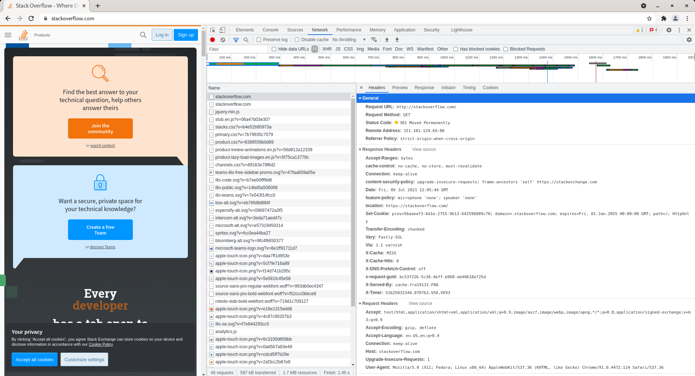
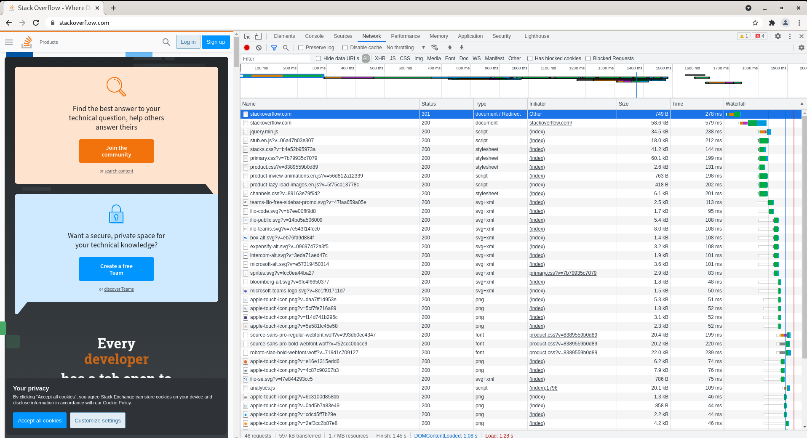
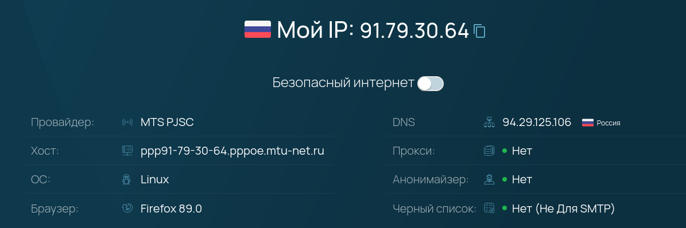
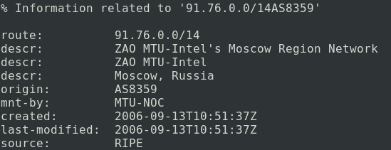
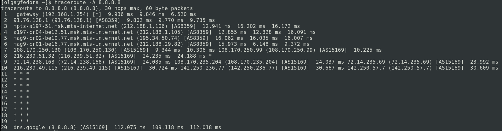
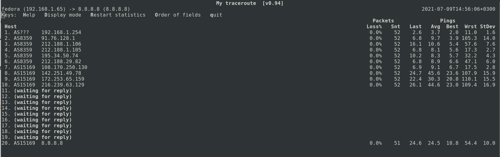
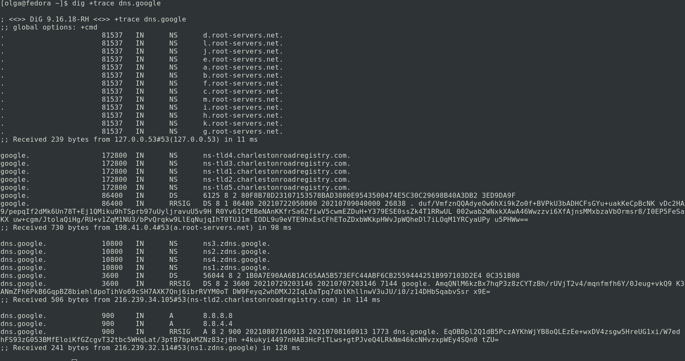
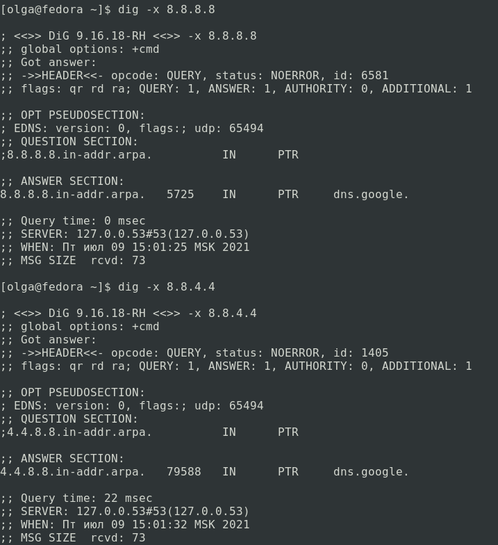

# Olga Ivanova, devops-10. Домашнее задание к занятию "3.6. Компьютерные сети, лекция 1"

1. Работа c HTTP через телнет.
- Подключитесь утилитой телнет к сайту stackoverflow.com
  `telnet stackoverflow.com 80`
- отправьте HTTP запрос
```bash
GET /questions HTTP/1.0
HOST: stackoverflow.com
[press enter]
[press enter]
```
- В ответе укажите полученный HTTP код, что он означает?

Ответ:   
  
Полученный код 301 (Moved permanently) означает, что ресурс был перемещён на постоянной основе в новое месторасположение.  
Адрес нового месторасположения указан в location, т.е. это `https://stackoverflow.com/questions`.  

2. Повторите задание 1 в браузере, используя консоль разработчика F12.
- откройте вкладку `Network`
- отправьте запрос http://stackoverflow.com
- найдите первый ответ HTTP сервера, откройте вкладку `Headers`
- укажите в ответе полученный HTTP код.
- проверьте время загрузки страницы, какой запрос обрабатывался дольше всего?
- приложите скриншот консоли браузера в ответ.

Ответ:  
Первый ответ HTTP-сервера - 301 (Moved permanently). Дольше всего обрабатывался запрос `https://stackoverflow.com`.  
  


3. Какой IP адрес у вас в интернете?

Ответ:  
Используя сайт `https://whoer.net`, получаем: `91.79.30.64`.  


4. Какому провайдеру принадлежит ваш IP адрес? Какой автономной системе AS? Воспользуйтесь утилитой `whois`

Ответ:
Выполняем `whois -h whois.ripe.net 91.79.30.64`.  
  
AS - `AS8359`  
Провайдер - `ZAO MTU-Intel's Moscow Region Network`  

5. Через какие сети проходит пакет, отправленный с вашего компьютера на адрес 8.8.8.8? Через какие AS? Воспользуйтесь утилитой `traceroute`

Ответ:  
`traceroute -A 8.8.8.8`:  


6. Повторите задание 5 в утилите `mtr`. На каком участке наибольшая задержка - delay?

Ответ:  
`mtr -zn 8.8.8.8`:   
  
Наибольшая задержка - в AS15169, IP - 142.251.49.78, 209.85.255.136.  

7. Какие DNS сервера отвечают за доменное имя dns.google? Какие A записи? воспользуйтесь утилитой `dig`

Ответ:  
`dig +trace dns.google`:  
  

A записи:  
```bash
dns.google.		900	IN	A	8.8.8.8
dns.google.		900	IN	A	8.8.4.4
```  
Записи NS - авторизованные DNS-серверы.

8. Проверьте PTR записи для IP адресов из задания 7. Какое доменное имя привязано к IP? воспользуйтесь утилитой `dig`  

Ответ:  
`dig -x 8.8.8.8` и `dig -x 8.8.4.4`:  

```bash
;; ANSWER SECTION:
8.8.8.8.in-addr.arpa.	5725	IN	PTR	dns.google.
;; ANSWER SECTION:
4.4.8.8.in-addr.arpa.	79588	IN	PTR	dns.google.
```