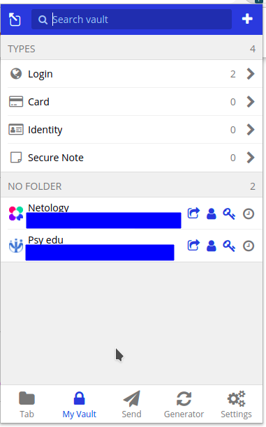
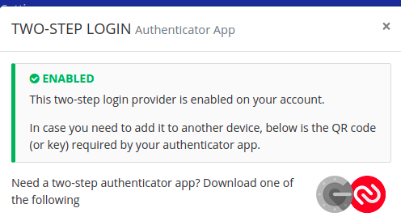
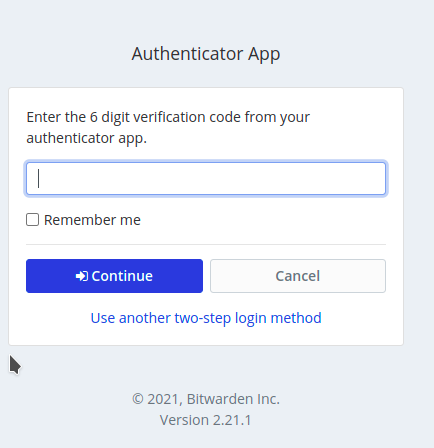
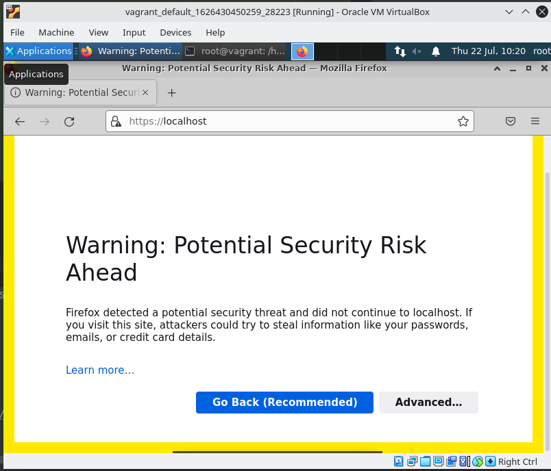
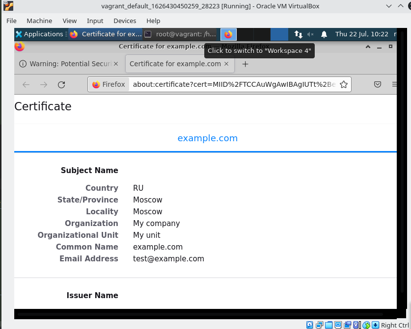
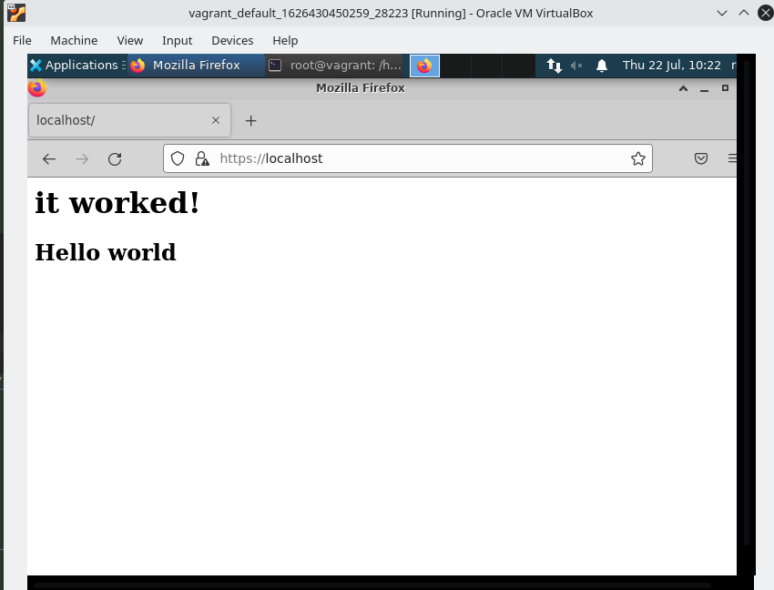
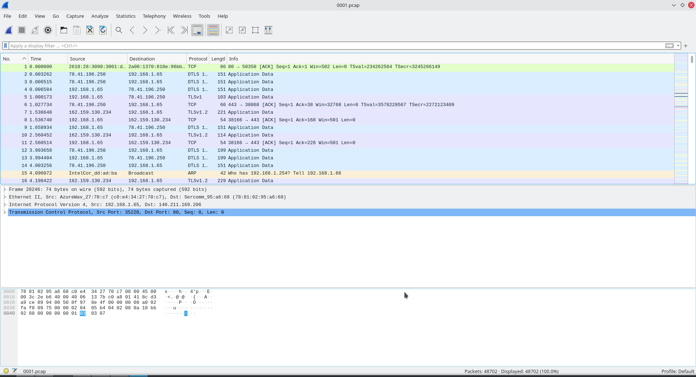
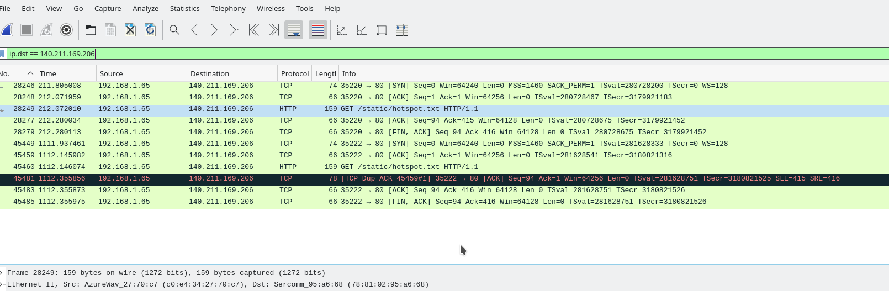

# Olga Ivanova, devops-10. Домашнее задание к занятию "3.9. Элементы безопасности информационных систем"

1. Установите Bitwarden плагин для браузера. Зарегистрируйтесь и сохраните несколько паролей.

Ответ:  
Выполнено:  


2. Установите Google authenticator на мобильный телефон. Настройте вход в Bitwarden аккаунт через Google authenticator OTP.
   
Ответ:  
1) На телефоне установлен Google authenticator    
2) На компьютере выполнен вход в `https://vault.bitwarden.com/`  
3) Settings -> Two-step Login -> Authenticator App -> Manage -> Введён пароль от Bitwarden -> Отсканирован QR-код в приложении ->
Введён код, полученный в приложении  

   
Теперь при логине в Bitwarden появляется окно:  


3. Установите apache2, сгенерируйте самоподписанный сертификат, настройте тестовый сайт для работы по HTTPS.  

Ответ:  

Устанавливаем apache2 и включаем модуль Apache `mod_ssl`:  
```bash
vagrant@vagrant:~$ sudo apt install apache2
vagrant@vagrant:~$ sudo a2enmod ssl
vagrant@vagrant:~$ sudo systemctl restart apache2
```

Создаём самоподписанный SSL-сертификат:  
```bash
vagrant@vagrant:~$ sudo openssl req -x509 -nodes -days 365 -newkey rsa:2048 -keyout /etc/ssl/private/apache-selfsigned.key -out /etc/ssl/certs/apache-selfsigned.crt
Generating a RSA private key
...............................................................+++++
..............................................................................................................+++++
writing new private key to '/etc/ssl/private/apache-selfsigned.key'
-----
You are about to be asked to enter information that will be incorporated
into your certificate request.
What you are about to enter is what is called a Distinguished Name or a DN.
There are quite a few fields but you can leave some blank
For some fields there will be a default value,
If you enter '.', the field will be left blank.
-----
Country Name (2 letter code) [AU]:RU
State or Province Name (full name) [Some-State]:Moscow
Locality Name (eg, city) []:Moscow
Organization Name (eg, company) [Internet Widgits Pty Ltd]:My company
Organizational Unit Name (eg, section) []:My unit
Common Name (e.g. server FQDN or YOUR name) []:example.com
Email Address []:test@example.com
```  

Настраиваем Apache для использования SSL:
```bash
vagrant@vagrant:~$ sudo nano /etc/apache2/sites-available/example.com.conf
<VirtualHost *:443>
ServerName example.com
DocumentRoot /var/www/example.com
SSLEngine on
SSLCertificateFile /etc/ssl/certs/apache-selfsigned.crt
SSLCertificateKeyFile /etc/ssl/private/apache-selfsigned.key
</VirtualHost>
vagrant@vagrant:~$ sudo mkdir /var/www/example.com
vagrant@vagrant:~$ sudo nano /var/www/example.com/index.html
<h1>it worked!</h1>
<h2>Hello world</h2>
vagrant@vagrant:~$ sudo a2ensite example.com.conf
vagrant@vagrant:~$ sudo apache2ctl configtest
Syntax OK
vagrant@vagrant:~$ sudo systemctl reload apache2
```

Результат:  
  
  
  

4. Проверьте на TLS уязвимости произвольный сайт в интернете.

Ответ:  
```bash
vagrant@vagrant:~$ git clone --depth 1 https://github.com/drwetter/testssl.sh.git
Cloning into 'testssl.sh'...
remote: Enumerating objects: 95, done.
remote: Counting objects: 100% (95/95), done.
remote: Compressing objects: 100% (88/88), done.
remote: Total 95 (delta 13), reused 36 (delta 5), pack-reused 0
Unpacking objects: 100% (95/95), 8.60 MiB | 3.08 MiB/s, done.
vagrant@vagrant:~$ cd testssl.sh
vagrant@vagrant:~/testssl.sh$ ./testssl.sh -U --sneaky https://www.ya.ru/     

###########################################################
    testssl.sh       3.1dev from https://testssl.sh/dev/
    (05d087a 2021-07-21 09:22:38 -- )

      This program is free software. Distribution and
             modification under GPLv2 permitted.
      USAGE w/o ANY WARRANTY. USE IT AT YOUR OWN RISK!

       Please file bugs @ https://testssl.sh/bugs/

###########################################################

 Using "OpenSSL 1.0.2-chacha (1.0.2k-dev)" [~183 ciphers]
 on vagrant:./bin/openssl.Linux.x86_64
 (built: "Jan 18 17:12:17 2019", platform: "linux-x86_64")


 Start 2021-07-22 06:35:29        -->> 87.250.250.242:443 (www.ya.ru) <<--

 Further IP addresses:   2a02:6b8::2:242 
 rDNS (87.250.250.242):  ya.ru.
 Service detected:       HTTP


 Testing vulnerabilities 

 Heartbleed (CVE-2014-0160)                not vulnerable (OK), no heartbeat extension
 CCS (CVE-2014-0224)                       not vulnerable (OK)
 Ticketbleed (CVE-2016-9244), experiment.  not vulnerable (OK)
 ROBOT                                     not vulnerable (OK)
 Secure Renegotiation (RFC 5746)           supported (OK)
 Secure Client-Initiated Renegotiation     not vulnerable (OK)
 CRIME, TLS (CVE-2012-4929)                not vulnerable (OK)
 BREACH (CVE-2013-3587)                    no gzip/deflate/compress/br HTTP compression (OK)  - only supplied "/" tested
 POODLE, SSL (CVE-2014-3566)               not vulnerable (OK)
 TLS_FALLBACK_SCSV (RFC 7507)              Downgrade attack prevention supported (OK)
 SWEET32 (CVE-2016-2183, CVE-2016-6329)    VULNERABLE, uses 64 bit block ciphers
 FREAK (CVE-2015-0204)                     not vulnerable (OK)
 DROWN (CVE-2016-0800, CVE-2016-0703)      not vulnerable on this host and port (OK)
                                           make sure you don't use this certificate elsewhere with SSLv2 enabled services
                                           https://censys.io/ipv4?q=724838BEE5F168498080A4F51507817CF56AA6FFF0426DC23233D2DC9BE63C4F could help you to find out
 LOGJAM (CVE-2015-4000), experimental      not vulnerable (OK): no DH EXPORT ciphers, no DH key detected with <= TLS 1.2
 BEAST (CVE-2011-3389)                     TLS1: ECDHE-RSA-AES128-SHA AES128-SHA DES-CBC3-SHA 
                                           VULNERABLE -- but also supports higher protocols  TLSv1.1 TLSv1.2 (likely mitigated)
 LUCKY13 (CVE-2013-0169), experimental     potentially VULNERABLE, uses cipher block chaining (CBC) ciphers with TLS. Check patches
 Winshock (CVE-2014-6321), experimental    not vulnerable (OK)
 RC4 (CVE-2013-2566, CVE-2015-2808)        no RC4 ciphers detected (OK)


 Done 2021-07-22 06:36:05 [  37s] -->> 87.250.250.242:443 (www.ya.ru) <<--
```

Видим следующие проблемы:  
```bash
 SWEET32 (CVE-2016-2183, CVE-2016-6329)    VULNERABLE, uses 64 bit block ciphers
 BEAST (CVE-2011-3389)                     TLS1: ECDHE-RSA-AES128-SHA AES128-SHA DES-CBC3-SHA 
                                           VULNERABLE -- but also supports higher protocols  TLSv1.1 TLSv1.2 (likely mitigated)
 LUCKY13 (CVE-2013-0169), experimental     potentially VULNERABLE, uses cipher block chaining (CBC) ciphers with TLS. Check patches
```

5. Установите на Ubuntu ssh сервер, сгенерируйте новый приватный ключ. Скопируйте свой публичный ключ на другой сервер. 
   Подключитесь к серверу по SSH-ключу.

Ответ:  

Устанавливаем ssh-сервер:  
```bash
vagrant@vagrant:~$ sudo apt install openssh-server
vagrant@vagrant:~$ sudo systemctl start sshd.service
vagrant@vagrant:~$ sudo systemctl enable sshd.service
vagrant@vagrant:~$ sudo systemctl status ssh
● ssh.service - OpenBSD Secure Shell server
     Loaded: loaded (/lib/systemd/system/ssh.service; enabled; vendor preset: enabled)
     Active: active (running) since Sun 2021-07-18 05:53:35 UTC; 4 days ago
       Docs: man:sshd(8)
             man:sshd_config(5)
```

Генерируем ключи:
```bash
vagrant@vagrant:~$ ssh-keygen
```

Копируем публичный ключ на удалённый сервер (ключ на локальной машине `~/.ssh/id_rsa.pub` в файл `~/.ssh/authorized_keys` на удалённой машине):
```bash
vagrant@vagrant:~/.ssh$ ssh-copy-id olivanova@192.168.79.107
```

И теперь можно подключаться по ssh-ключу без ввода паролей:  
```bash
vagrant@vagrant:~/.ssh$ ssh olivanova@192.168.79.107
```

6. Переименуйте файлы ключей из задания 5. Настройте файл конфигурации SSH клиента так, чтобы вход на удаленный сервер 
   осуществлялся по имени сервера.

Ответ:  

Переименовываем файлы и логинимся с их использованием:
```bash
vagrant@vagrant:~/.ssh$ mv id_rsa id_rsa_renamed
vagrant@vagrant:~/.ssh$ mv id_rsa.pub id_rsa_renamed.pub
vagrant@vagrant:~/.ssh$ ssh -i ~/.ssh/id_rsa_renamed olivanova@192.168.79.107
```

Меняем конфиги (у `chmod` `700` - это `rwx------`, `600` - `rw-------`:  
```bash
vagrant@vagrant:~$ mkdir -p ~/.ssh && chmod 700 ~/.ssh
vagrant@vagrant:~$ touch ~/.ssh/config && chmod 600 ~/.ssh/config
vagrant@vagrant:~$ cat ~/.ssh/config
Host work
HostName 192.168.79.107
IdentityFile ~/.ssh/id_rsa_renamed
User olivanova
Host *
User vagrant
IdentityFile ~/.ssh/id_rsa
Protocol 2
```

И подключаемся по имени сервера:  
```bash
vagrant@vagrant:~$ ssh work
Welcome to Ubuntu 18.04.4 LTS (GNU/Linux 5.4.0-60-generic x86_64)
```

7. Соберите дамп трафика утилитой tcpdump в формате pcap, 100 пакетов. Откройте файл pcap в Wireshark.

Ответ:  

Проверяем доступные интерфейсы командной `tcpdump -D` и делаем дамп:  
```bash
[olga@fedora ~]$ sudo tcpdump -w 0001.pcap -i wlp4s0
```

Открываем в Wireshark:  
  

Можем, например, отфильтровать:  
  
