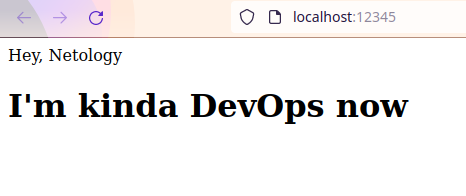

# Olga Ivanova, devops-10. Домашнее задание к занятию "5.3. Контейнеризация на примере Docker"

## Задача 1

Посмотрите на сценарий ниже и ответьте на вопрос:
"Подходит ли в этом сценарии использование докера? Или лучше подойдет виртуальная машина, физическая машина? Или возможны разные варианты?"

Детально опишите и обоснуйте свой выбор.

Ответ:  

Сценарий:

В целом, могу сказать, что под большинство задач подходит докер. Контейнеры проще разворачивать (т.к. под большинство нужд
уже есть готовые контейнеры, и фактически их остаётся только запустить с минимальными настройками), проще масштабировать,
они разделяют динамические библиотеки, что значительно экономит ресурсы, к ним можно монтировать volume для сохранности данных.

- Высоконагруженное монолитное java веб-приложение;
  - физический сервер. Если высоконагруженное, то требуется более быстрый доступ к ресурсам, производительность и скорость.
    А это лучше всего реализуется на физическом сервере, без прослоек (гипервизоров).
    Архитектура "монолит" тоже не очень подходит для докера. 
    В целом, можно использовать и виртуалку. В этом случае попроще будет развернуть несколько инстансов.
- Go-микросервис для генерации отчетов;
  - докер. Проще масштабировать, требуется меньше ресурсов для разворачивания и администрирования,
    нет жёстких требований к аппаратным ресурсам.
- Nodejs веб-приложение;
  - докер, по тем же причинам.
- Мобильное приложение c версиями для Android и iOS;
  - виртуалка. Докер для таких целей не предназначен, а в физической машине нет необходимости.
- База данных postgresql используемая, как кэш;
  - наверное, лучше физический сервер. Вероятно, здесь ключевое слово "кэш", т.е. база должна работать очень быстро. 
    А это достигается на физическом сервере.
- Шина данных на базе Apache Kafka;
  - зависит от контура. В dockerhub я не нашла официального образа или образа со значком Verified publisher. Если нужно для теста,
  то вполне подойдут контейнеры. А вот для прода думаю, что лучше поставить на виртуалку.
- Очередь для Logstash на базе Redis;
  - В [документации](https://docs.redis.com/latest/rs/getting-started/getting-started-docker/) Redis нашла фразу: 
    "Warning - Docker containers are currently only supported for development and testing environments, not for production.". 
    Получается, что если говорим про прод, докер отпадает. В таком случае используем виртуалку, если нет критичных требований по нагрузке
    и производительности.
- Elastic stack для реализации логирования продуктивного веб-приложения - три ноды elasticsearch, два logstash и две ноды kibana;
  - докер. На [сайте](https://www.elastic.co/blog/a-full-stack-in-one-command) Elastic даже есть инструкция о том, как поднимать этот стэк.
    За счёт того, что уже существуют настроенные образы, разворачивание сильно упрощается (фактически выполнить несколько команд). И контейнеры проще масштабировать.
    В принципе, можно и виртуалку использовать. Но усложнится установка и настройка.
- Мониторинг-стек на базе prometheus и grafana;
  - докер. Опять же, проще поднять, настроить, масштабировать. Необходимости в использовании физический машин нет.
- Mongodb, как основное хранилище данных для java-приложения;
  - Как я поняла из сайта Mongodb, они не поддерживают образ (поддержкой занимается комьюнити докера). И рекомендуют его использовать для тестирования,
    а для прода - MongoDB Enterprise Kubernetes Operator.
    Поэтому получается, что для тестирования можно развернуть Mongodb в контейнере и примонтировать к нему volume.
    Но для прода лучше использовать виртуалку.
- Jenkins-сервер.
  - докер подойдёт, т.к. здесь нет никаких специфических требований.

## Задача 2

Сценарий выполнения задачи:

- создайте свой репозиторий на докерхаб;
- выберете любой образ, который содержит апачи веб-сервер;
- создайте свой форк образа;
- реализуйте функциональность:
  запуск веб-сервера в фоне с индекс-страницей, содержащей HTML-код ниже:
```
<html>
<head>
Hey, Netology
</head>
<body>
<h1>I’m kinda DevOps now</h1>
</body>
</html>
```
Опубликуйте созданный форк в своем репозитории и предоставьте ответ в виде ссылки на докерхаб-репо.

Ответ:  
1) Регистрируемся, создаём репозиторий на https://hub.docker.com/repository/create?namespace=anguisa
   Добавляем access-token. Логинимся `docker login -u anguisa`
2) Загружаем версию latest образа `httpd`.
```bash
[olga@fedora ~]$ docker pull httpd
```
3) Запускаем контейнер:
```bash
[olga@fedora ~]$ docker run --name httpd01 -p 12345:80 -d httpd
f84c78689bbc70f044843b9b2016077b68039f9b88f84750f046867a30e49b24
```
  
4) Копируем файл index.html с локального компьютера внутрь контейнера:
```bash
[olga@fedora img]$ docker cp index.html httpd01:/usr/local/apache2/htdocs/index.html
[olga@fedora ~]$ docker exec -it httpd01 bash
root@f84c78689bbc:/usr/local/apache2# cd ./htdocs
root@f84c78689bbc:/usr/local/apache2/htdocs# cat index.html
<html>
<head>
Hey, Netology
</head>
<body>
<h1>I’m kinda DevOps now</h1>
</body>
</html>
```
  
5) Сохраняем контейнер с изменениями в виде образа:
```bash
[olga@fedora ~]$ docker commit httpd01 anguisa/devops10_0503
sha256:4cc4b9c45186c083fbd357a42c768cb3489031ebb059cabf77065211363f5ef9
[olga@fedora ~]$ docker images
   REPOSITORY                                   TAG       IMAGE ID       CREATED         SIZE
   anguisa/devops10_0503                        latest    4cc4b9c45186   6 seconds ago   138MB
   httpd                                        latest    c8ca530172a8   13 days ago     138MB
   hello-world                                  latest    d1165f221234   5 months ago    13.3kB
   testcontainersofficial/ryuk                  0.3.0     344c0229fe44   15 months ago   11.9MB
```
6) Останавливаем старый контейнер, пробуем создать из нового образа => получаем необходимый результат
```bash
[olga@fedora ~]$ docker stop httpd01
httpd01
[olga@fedora ~]$ docker rm httpd01
httpd01
[olga@fedora ~]$ docker run --name httpd01 -p 12345:80 -d anguisa/devops10_0503
2f75593b08567f0671559743f66d292b6755ec90d6505ee171ebab5f4eb01f4f
[olga@fedora ~]$ docker exec -it httpd01 bash
root@2f75593b0856:/usr/local/apache2# cat ./htdocs/index.html
<html>
<head>
Hey, Netology
</head>
<body>
<h1>I'm kinda DevOps now</h1>
</body>
</html>
```
7) Пушим образ в репозиторий. Итоговая ссылка: https://hub.docker.com/r/anguisa/devops10_0503/tags?page=1&ordering=last_updated
```bash
[olga@fedora ~]$ docker push anguisa/devops10_0503
Using default tag: latest
The push refers to repository [docker.io/anguisa/devops10_0503]
c22fa44b153c: Pushed 
c1d6519b2482: Mounted from library/httpd 
ef38b43e89e8: Mounted from library/httpd 
7182dd4dd207: Mounted from library/httpd 
d24d666b2229: Mounted from library/httpd 
f68ef921efae: Mounted from library/httpd 
latest: digest: sha256:54bb1d9fa62430652420684d4b3f71b4bd091a2de26efbe43dc9d9b61a4e0e9c size: 1573
```

## Задача 3

- Запустите первый контейнер из образа centos c любым тэгом в фоновом режиме, подключив папку info из текущей рабочей директории на хостовой машине в /share/info контейнера;
- Запустите второй контейнер из образа debian:latest в фоновом режиме, подключив папку info из текущей рабочей директории на хостовой машине в /info контейнера;
- Подключитесь к первому контейнеру с помощью exec и создайте текстовый файл любого содержания в /share/info ;
- Добавьте еще один файл в папку info на хостовой машине;
- Подключитесь во второй контейнер и отобразите листинг и содержание файлов в /info контейнера.

Ответ:  
1) Загружаем образы:  
```bash
[olga@fedora docs]$ docker pull centos
[olga@fedora docs]$ docker pull debian:latest
[olga@fedora docs]$ docker images
REPOSITORY                                   TAG       IMAGE ID       CREATED          SIZE
anguisa/devops10_0503                        latest    4cc4b9c45186   14 minutes ago   138MB
httpd                                        latest    c8ca530172a8   13 days ago      138MB
debian                                       latest    fe3c5de03486   2 weeks ago      124MB
hello-world                                  latest    d1165f221234   5 months ago     13.3kB
centos                                       latest    300e315adb2f   8 months ago     209MB
testcontainersofficial/ryuk                  0.3.0     344c0229fe44   15 months ago    11.9MB
```
2) Запускаем контейнеры:  
```bash
[olga@fedora docs]$ docker run --name centos01 -t -v /tmp/info:/share/info -d centos
fc79d66cefe67f95a4aa3af9683b0241f600f90b2f9c1436ebdc0d608049f643
[olga@fedora docs]$ docker run --name debian01 -t -v /tmp/info:/info -d debian
8be30dee838099374a419d4e883c58b04057685fb0636a29bb74163ceb15f612
[olga@fedora docs]$ docker ps -a
CONTAINER ID   IMAGE         COMMAND       CREATED          STATUS                   PORTS     NAMES
8be30dee8380   debian        "bash"        7 seconds ago    Up 6 seconds                       debian01
fc79d66cefe6   centos        "/bin/bash"   22 seconds ago   Up 21 seconds                      centos01
bbe3a89d46ab   hello-world   "/hello"      8 weeks ago      Exited (0) 8 weeks ago             reverent_wescoff
```
2) Создаём текстовый файл в контейнере centos01:
```bash
[olga@fedora docs]$ docker exec -it centos01 bash
[root@fc79d66cefe6 /]# cd /share/info
[root@fc79d66cefe6 info]# echo FROM_CENTOS > from_centos.txt
[root@fc79d66cefe6 info]# exit
```
3) Создаём файл на хостовой машине:  
```bash
[olga@fedora docs]$ echo FROM_HOST > /tmp/info/from_host.txt
```
4) Проверяем папку в контейнере debian01:
```bash
[olga@fedora docs]$ docker exec -it debian01 bash
root@8be30dee8380:/# cd /info
root@8be30dee8380:/info# ls
from_centos.txt  from_host.txt
root@8be30dee8380:/info# cat from_centos.txt
FROM_CENTOS
root@8be30dee8380:/info# cat from_host.txt
FROM_HOST
```