# Olga Ivanova, devops-10. Домашнее задание к занятию "5.4. Практические навыки работы с Docker"


## Задача 1

В данном задании вы научитесь изменять существующие Dockerfile, адаптируя их под нужный инфраструктурный стек.

Измените базовый образ предложенного Dockerfile на Arch Linux c сохранением его функциональности.

```text
FROM ubuntu:latest

RUN apt-get update && \
    apt-get install -y software-properties-common && \
    add-apt-repository ppa:vincent-c/ponysay && \
    apt-get update
 
RUN apt-get install -y ponysay

ENTRYPOINT ["/usr/bin/ponysay"]
CMD ["Hey, netology”]
```

### Ответ:  
См. [Dockerfile](file/Dockerfile_ponysay).  
Объединила в CMD, т.к. с ENTRYPOINT (как в задании) у пони появляется некорректная надпись (а именно - `< /bin/sh ["Hey, netology”] >`)

Сборка и запуск:  
```bash
[olga@fedora file]$ docker build -t anguisa/ponysay -f Dockerfile_ponysay .
[olga@fedora file]$ docker run -it --name ponysay anguisa/ponysay
```

Результат:  
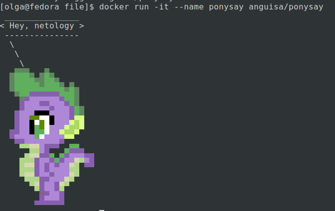

Сохранение в docker-hub:
```bash
[olga@fedora file]$ docker push anguisa/ponysay
```  
Ссылка - [https://hub.docker.com/repository/docker/anguisa/ponysay](https://hub.docker.com/repository/docker/anguisa/ponysay)

## Задача 2

В данной задаче вы составите несколько разных Dockerfile для проекта Jenkins, опубликуем образ в `dockerhub.io` и посмотрим логи этих контейнеров.

- Составьте 2 Dockerfile:

  - Общие моменты:
    - Образ должен запускать [Jenkins server](https://www.jenkins.io/download/)

  - Спецификация первого образа:
    - Базовый образ - [amazoncorreto](https://hub.docker.com/_/amazoncorretto)
    - Присвоить образу тэг `ver1`

  - Спецификация второго образа:
    - Базовый образ - [ubuntu:latest](https://hub.docker.com/_/ubuntu)
    - Присвоить образу тэг `ver2`

- Соберите 2 образа по полученным Dockerfile
- Запустите и проверьте их работоспособность
- Опубликуйте образы в своём dockerhub.io хранилище

### Ответ:  

#### Первый образ (amazoncorretto)
См. [Dockerfile](file/Dockerfile_jenkins_1)

Сборка и запуск:
```bash
[olga@fedora file]$ docker build -t anguisa/jenkins_1:ver1 -f Dockerfile_jenkins_1 .
[olga@fedora file]$ docker run -it -p 8456:8080 --name jenkins_1 anguisa/jenkins_1:ver1
```
Логи:  
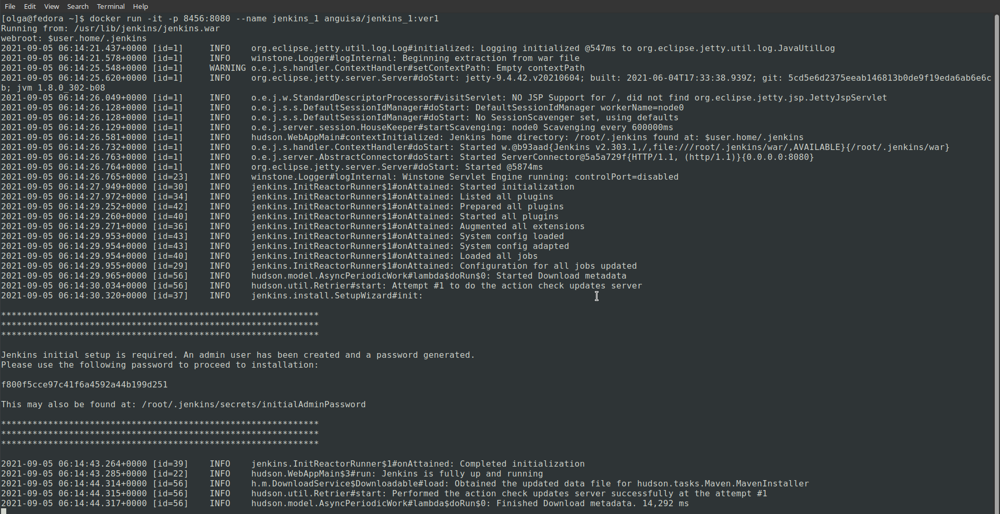  

Результат:  
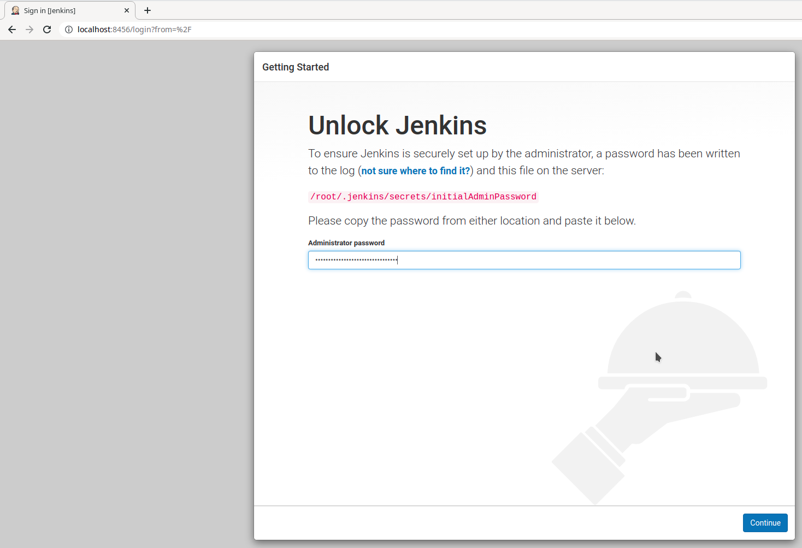  
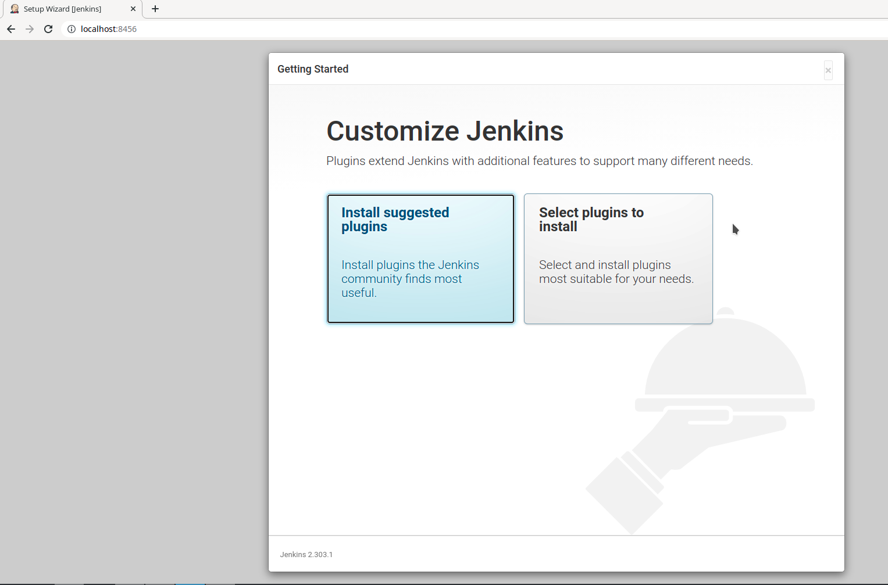  

Сохранение в docker-hub:
```bash
[olga@fedora file]$ docker push anguisa/jenkins_1:ver1
```  
Ссылка - [https://hub.docker.com/repository/docker/anguisa/jenkins_1](https://hub.docker.com/repository/docker/anguisa/jenkins_1)

#### Второй образ (ubuntu:latest)
См. [Dockerfile](file/Dockerfile_jenkins_2)

Сборка и запуск:
```bash
[olga@fedora file]$ docker build -t anguisa/jenkins_2:ver2 -f Dockerfile_jenkins_2 .
[olga@fedora file]$ docker run -it -p 8123:8080 --name jenkins_2 anguisa/jenkins_2:ver2
```
Логи:  
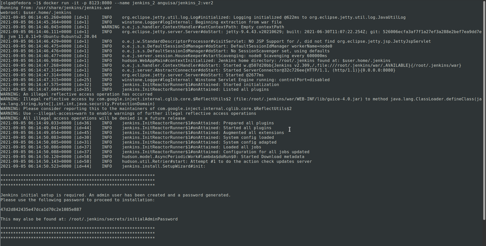

Результат:  
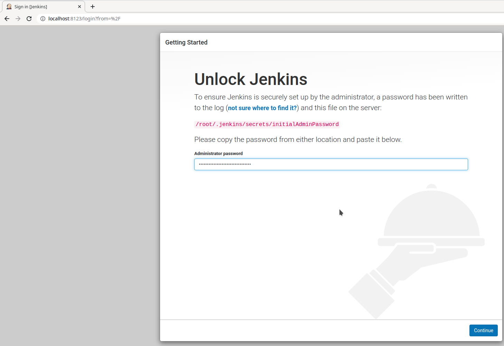  
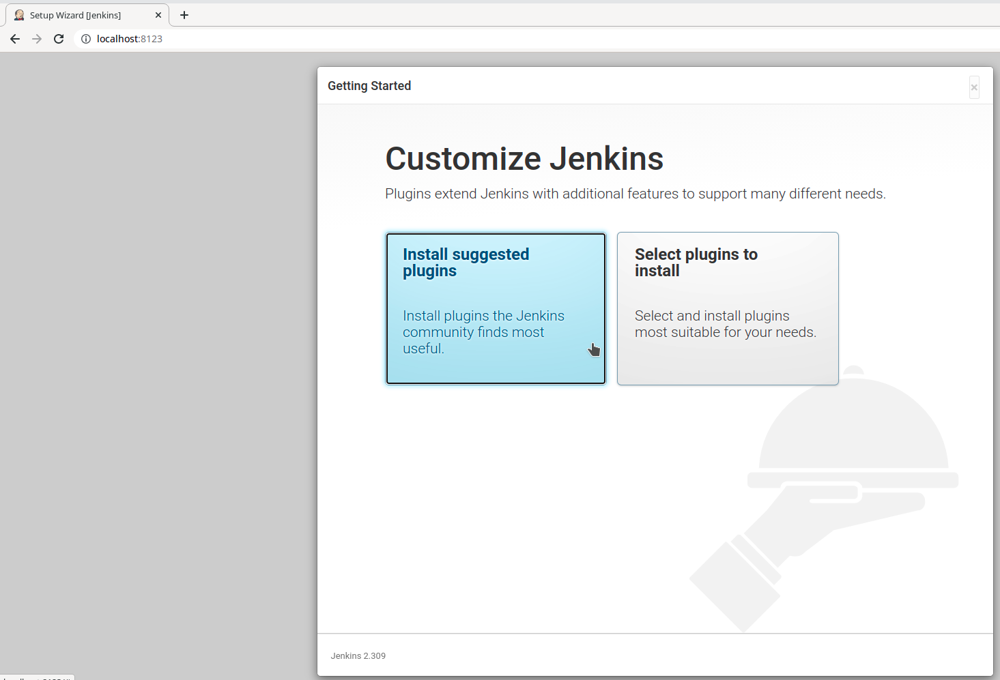

Сохранение в docker-hub:
```bash
[olga@fedora file]$ docker push anguisa/jenkins_2:ver2
```  
Ссылка - [https://hub.docker.com/repository/docker/anguisa/jenkins_2](https://hub.docker.com/repository/docker/anguisa/jenkins_2)

## Задача 3

В данном задании вы научитесь:
- объединять контейнеры в единую сеть
- исполнять команды "изнутри" контейнера

Для выполнения задания вам нужно:
- Написать Dockerfile:
  - Использовать образ https://hub.docker.com/_/node как базовый
  - Установить необходимые зависимые библиотеки для запуска npm приложения https://github.com/simplicitesoftware/nodejs-demo
  - Выставить у приложения (и контейнера) порт 3000 для прослушки входящих запросов
  - Соберите образ и запустите контейнер в фоновом режиме с публикацией порта

- Запустить второй контейнер из образа ubuntu:latest
- Создайте `docker network` и добавьте в нее оба запущенных контейнера
- Используя `docker exec` запустить командную строку контейнера `ubuntu` в интерактивном режиме
- Используя утилиту `curl` вызвать путь `/` контейнера с npm приложением

### Ответ:
См. [Dockerfile](file/Dockerfile_nodejs)

Сборка и запуск контейнера с nodejs-demo:
```bash
[olga@fedora file]$ docker build -t anguisa/nodejs -f Dockerfile_nodejs .
[olga@fedora file]$ docker run -d -it -p 8888:3000 --name nodejs anguisa/nodejs
```
Результат:  
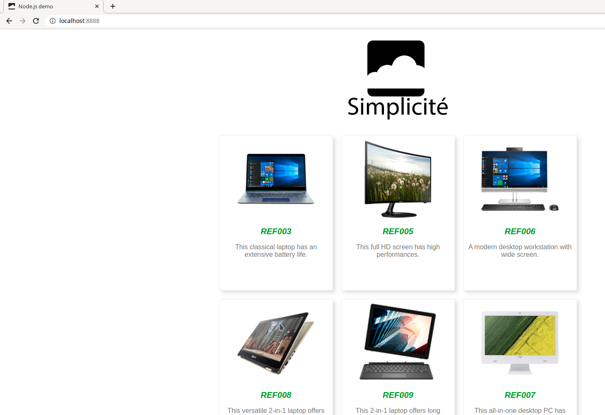

Запуск контейнера из образа ubuntu:latest:
```bash
[olga@fedora file]$ docker run -d -it --name ubuntu ubuntu:latest
```

Создание сети и добавление в неё контейнеров:  
```bash
[olga@fedora ~]$ docker network create nodejs-network
[olga@fedora ~]$ docker network connect nodejs-network nodejs
[olga@fedora ~]$ docker network connect nodejs-network ubuntu
[olga@fedora ~]$ docker network inspect nodejs-network
```  
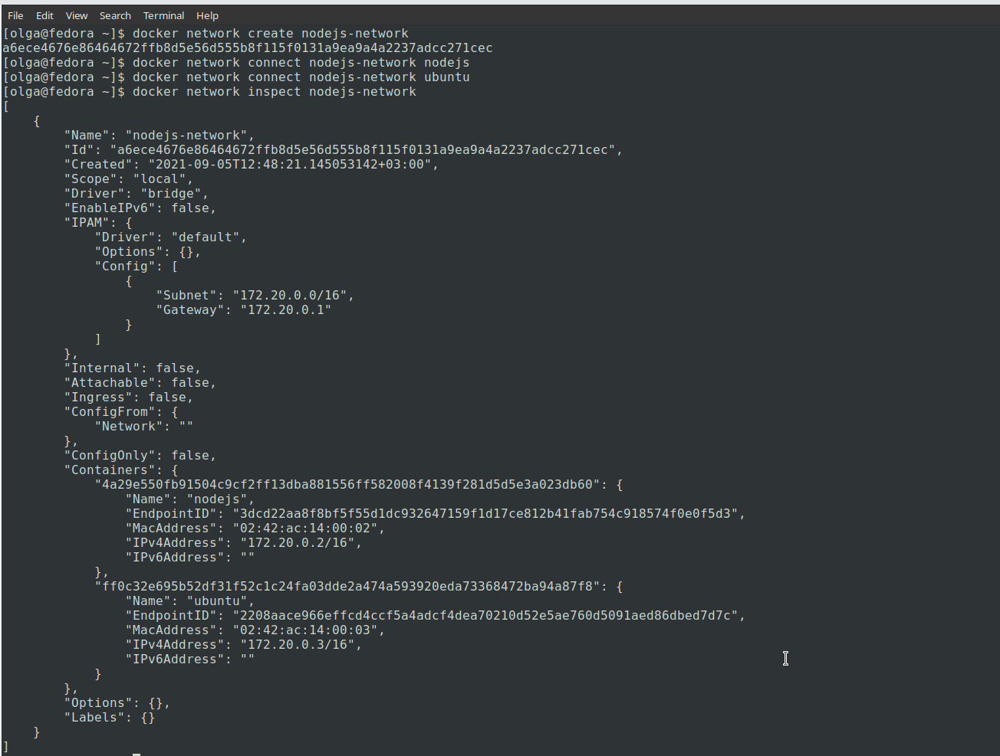

Проверяем сеть в контейнере `ubuntu`, в качестве адреса указываем IP-адрес из результата работы `inspect`:  
```bash
[olga@fedora ~]$ docker exec -it ubuntu bash
root@ff0c32e695b5:/# apt update -y
root@ff0c32e695b5:/# apt install curl -y
root@ff0c32e695b5:/# curl 172.20.0.2:3000
```  
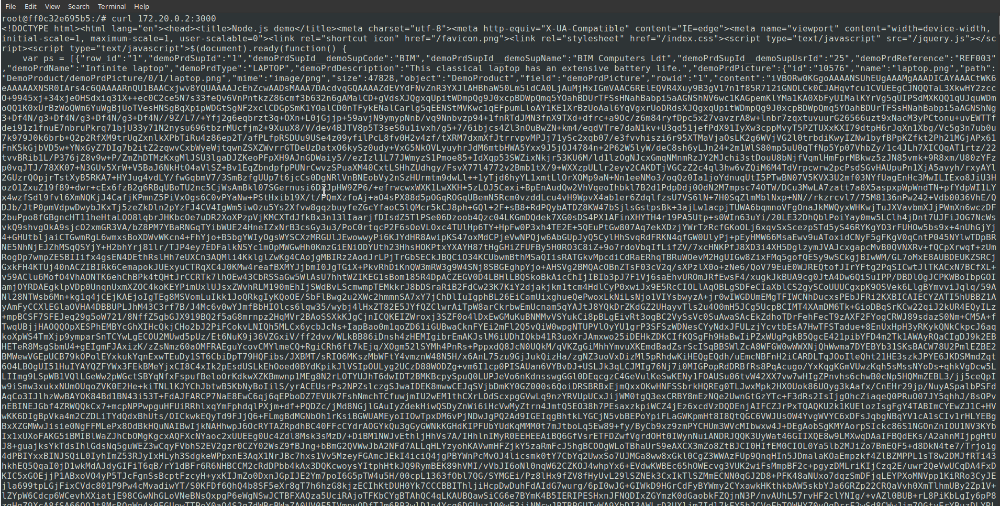  
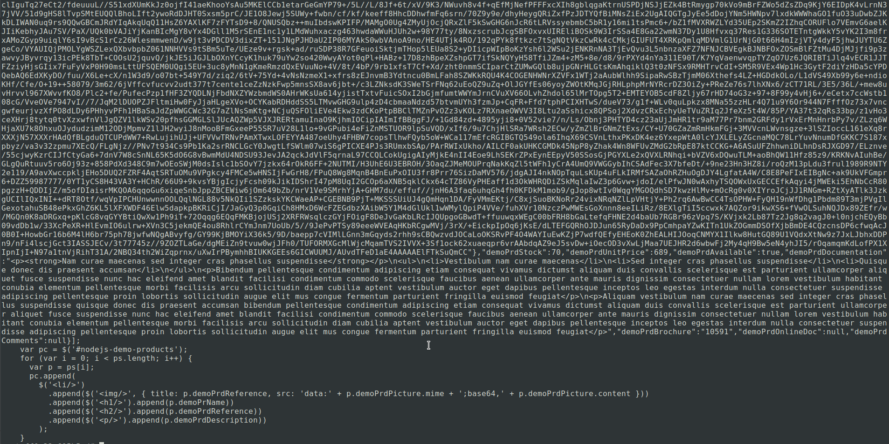  

Сохранение в docker-hub:
```bash
[olga@fedora file]$ docker push anguisa/nodejs
```  
Ссылка - [https://hub.docker.com/repository/docker/anguisa/nodejs](https://hub.docker.com/repository/docker/anguisa/nodejs)