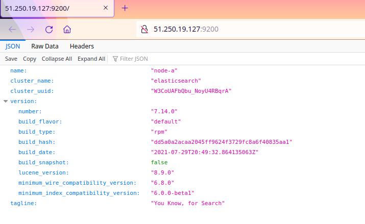
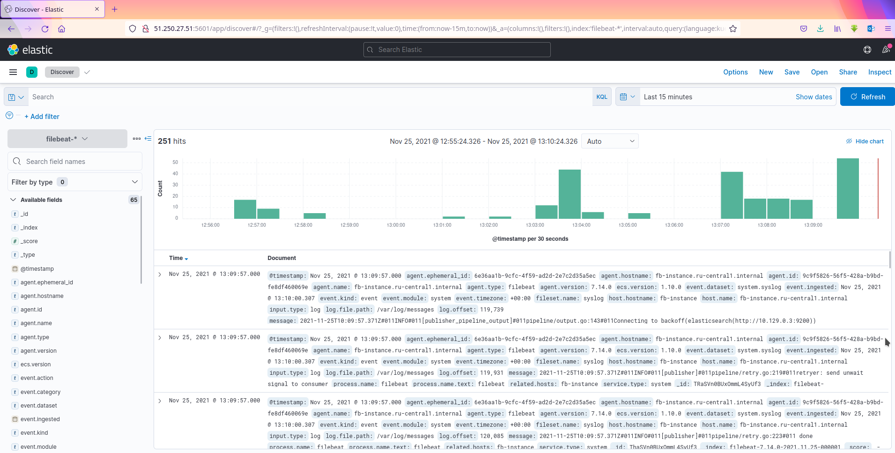
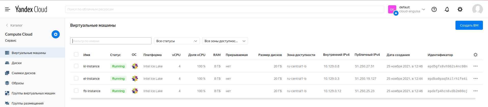

# Olga Ivanova, devops-10. Домашнее задание к занятию "08.03 Использование Yandex Cloud"

## Подготовка к выполнению
1. Создайте свой собственный (или используйте старый) публичный репозиторий на github с произвольным именем.
2. Скачайте [playbook](./playbook/) из репозитория с домашним заданием и перенесите его в свой репозиторий.

## Основная часть
1. Допишите playbook: нужно сделать ещё один play, который устанавливает и настраивает kibana.
2. При создании tasks рекомендую использовать модули: `get_url`, `template`, `yum`, `apt`.
3. Tasks должны: скачать нужной версии дистрибутив, выполнить распаковку в выбранную директорию, сгенерировать конфигурацию с параметрами.
4. Приготовьте свой собственный inventory файл `prod.yml`.
5. Запустите `ansible-lint site.yml` и исправьте ошибки, если они есть.
6. Попробуйте запустить playbook на этом окружении с флагом `--check`.
7. Запустите playbook на `prod.yml` окружении с флагом `--diff`. Убедитесь, что изменения на системе произведены.
8. Повторно запустите playbook с флагом `--diff` и убедитесь, что playbook идемпотентен.
9. Проделайте шаги с 1 до 8 для создания ещё одного play, который устанавливает и настраивает filebeat.
10. Подготовьте README.md файл по своему playbook. В нём должно быть описано: что делает playbook, какие у него есть параметры и теги.
11. Готовый playbook выложите в свой репозиторий, в ответ предоставьте ссылку на него.

## Выполненные действия
- Файл `elasticsearch.yml` переименован в [all.yml](./playbook/inventory/prod/group_vars/all.yml), т.к. переменная `elk_stack_version` нужна для всех этапов.
- Добавлены play `Install Kibana` и `Install filebeat` в [site.yml](./playbook/site.yml)
- Проставлены теги
- Добавлены шаблоны [kibana.yml.j2](./playbook/templates/kibana.yml.j2) и [filebeat.yml.j2](./playbook/templates/filebeat.yml.j2) с минимальным набором необходимых параметров
- После `ansible-lint` добавлены `mode: 0644`, т.к. было предупреждение `risky-file-permissions: File permissions unset or incorrect`
- В Yandex Cloud созданы 3 виртуальные машины со следующими настройками: Centos7, имена - el-instance / ki-instance / fb-instance, RAM — 8Гб, vCPU — 4, открытый SSH-ключ, логин olga 
- Скопированы IP созданных машин в [hosts.yml](./playbook/inventory/prod/hosts.yml) с указанием пользователя `olga` (как на домашней ОС). Также указан параметр `ansible_ssh_private_key_file` с путём к необходимому файлу `id_rsa`
- На все машины был выполнен вход ssh для fingerprint:  
```bash
[olga@fedora ~]$ ssh 51.250.19.127 -i .ssh/id_rsa_ya
[olga@fedora ~]$ ssh 51.250.27.51 -i .ssh/id_rsa_ya
[olga@fedora ~]$ ssh 51.250.25.23 -i .ssh/id_rsa_ya
```
- Запуск производился с помощью `ansible-playbook -i inventory/prod site.yml`
- Проверка:  
Elasticsearch:  
  
Kibana:  
  
  
Yandex Cloud:  
  

## Описание playbook

Устанавливает `Elasticsearch`, `Kibana` и `Filebeat`.  
Общие переменные:  
- `elk_stack_version` - версия ELK-стека

### Install Elasticsearch
Устанавливает Elasticsearch указанной версии на хосте `elasticsearch`.  
Тег - `elastic`

Шаблон - [playbook/templates/elasticsearch.yml.j2](playbook/templates/elasticsearch.yml.j2)

Выполняются следующие действия:
- Скачивание rpm Elasticsearch по указанному url
- Установка Elasticsearch из rpm
- Экспорт переменных окружения по шаблону, конфигурация Elasticsearch
- Установка и конфигурирование Elasticsearch вызывают обработчик, перезапускающий Elasticsearch

### Install Kibana
Устанавливает Kibana указанной версии на хосте `kibana`.  
Тег - `kibana`

Шаблон - [playbook/templates/kibana.yml.j2](playbook/templates/kibana.yml.j2)

Выполняются следующие действия:
- Скачивание rpm Kibana по указанному url
- Установка Kibana из rpm
- Экспорт переменных окружения по шаблону, конфигурация Kibana
- Установка и конфигурирование Kibana вызывают обработчик, перезапускающий Kibana

### Install filebeat
Устанавливает filebeat указанной версии на хосте `filebeat`.  
Тег - `filebeat`

Шаблон - [playbook/templates/filebeat.yml.j2](playbook/templates/filebeat.yml.j2)

Выполняются следующие действия:
- Скачивание rpm filebeat по указанному url
- Установка filebeat из rpm
- Экспорт переменных окружения по шаблону, конфигурация filebeat
- Установка и конфигурирование filebeat вызывают обработчик, перезапускающий Kibana
- Активация модуля `system`, который собирает и парсит системные логи
- Загрузка dashboard-ов Kibana
