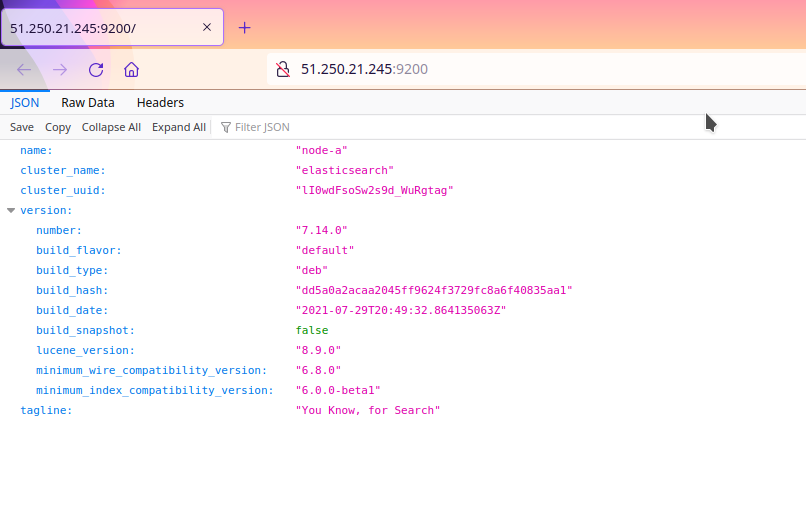
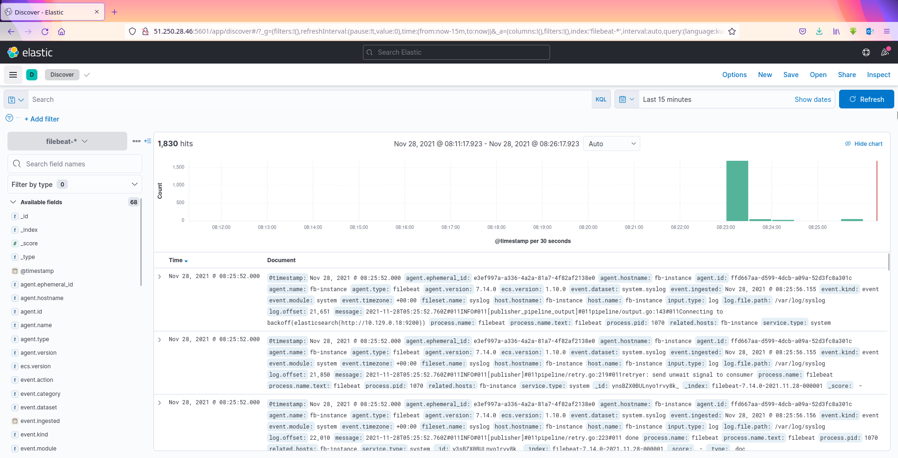
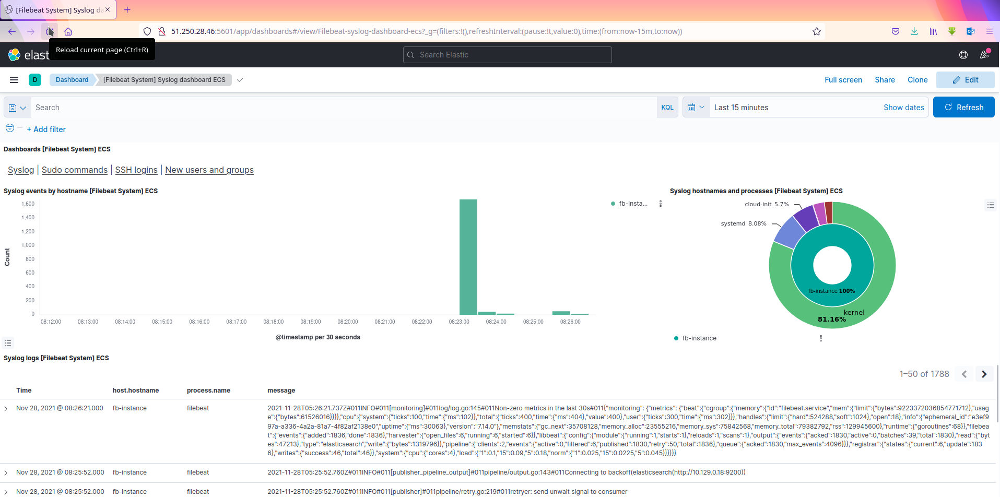
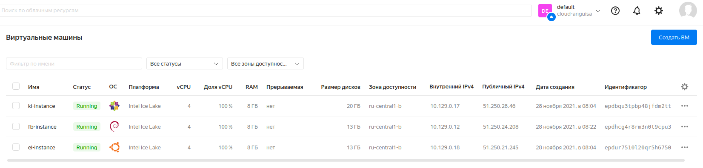

# Olga Ivanova, devops-10. Домашнее задание к занятию "8.4 Работа с Roles"

## Описание playbook

Устанавливает `Elasticsearch`, `Kibana` и `filebeat` с использованием ролей, описанных в [requirements.yml](./playbook/requirements.yml).  
Хосты созданы в Yandex Cloud с параметрами RAM — 8Гб, vCPU — 4, открытый SSH-ключ, логин olga.  
`Elasticsearch` - хост с `Ubuntu 20.04`, `Kibana` - с `Centos 7`, `filebeat` - c `Debian 10`.  

Переменные:
- `elk_stack_version` - версия ELK-стека
- `elasticsearch_version` - версия Elasticsearch (равна `elk_stack_version`)
- `kibana_version` - версия Kibana (равна `elk_stack_version`)
- `filebeat_version` - версия filebeat (равна `elk_stack_version`)

- Проверка:  
  Elasticsearch:  
    
  Kibana:  
    
    
  Yandex Cloud:  
  

***

## Подготовка к выполнению
1. Создайте два пустых публичных репозитория в любом своём проекте: kibana-role и filebeat-role.
2. Добавьте публичную часть своего ключа к своему профилю в github.

## Основная часть

Наша основная цель - разбить наш playbook на отдельные roles. Задача: сделать roles для elastic, kibana, filebeat и написать playbook для использования этих ролей. Ожидаемый результат: существуют два ваших репозитория с roles и один репозиторий с playbook.

1. Создать в старой версии playbook файл `requirements.yml` и заполнить его следующим содержимым:
   ```yaml
   ---
     - src: git@github.com:netology-code/mnt-homeworks-ansible.git
       scm: git
       version: "2.0.0"
       name: elastic 
   ```
2. При помощи `ansible-galaxy` скачать себе эту роль.

`ansible-galaxy install -r requirements.yml -p roles`    
Появляется директория `roles/elastic` с ролью

3. Создать новый каталог с ролью при помощи `ansible-galaxy role init kibana-role`.

```bash
[olga@fedora devops]$ git clone git@github.com:anguisa/kibana-role.git
[olga@fedora devops]$ ansible-galaxy role init kibana-role --force
```

4. На основе tasks из старого playbook заполните новую role. Разнесите переменные между `vars` и `default`. 
5. Перенести нужные шаблоны конфигов в `templates`.
6. Создать новый каталог с ролью при помощи `ansible-galaxy role init filebeat-role`.

```bash
[olga@fedora devops]$ git clone git@github.com:anguisa/filebeat-role.git
[olga@fedora devops]$ ansible-galaxy role init filebeat-role --force
```

7. На основе tasks из старого playbook заполните новую role. Разнесите переменные между `vars` и `default`. 
8. Перенести нужные шаблоны конфигов в `templates`.
9. Описать в `README.md` обе роли и их параметры.
10. Выложите все roles в репозитории. Проставьте тэги, используя семантическую нумерацию.

```bash
git add .
git commit -m "init kibana role"
git tag -a 1.0.0 -m "init kibana role"
git push
git push origin 1.0.0

git push origin --delete 1.0.0
git tag -d 1.0.0

git add .
git commit -m "init kibana role"
git push
git tag -a 1.0.0 -m "init kibana role"
git push origin 1.0.0
```

11. Добавьте roles в `requirements.yml` в playbook.
12. Переработайте playbook на использование roles.

Не забыть создать директорию [files](./playbook/files).


```bash
[olga@fedora playbook]$ ansible-galaxy install -r requirements.yml -p roles
[olga@fedora ~]$ xclip -selection clipboard < .ssh/id_rsa_ya.pub
[olga@fedora ~]$ ssh 51.250.28.46 -i .ssh/id_rsa_ya
[olga@fedora playbook]$ ansible-playbook -i inventory/prod site.yml
```

13. Выложите playbook в репозиторий.
14. В ответ приведите ссылки на оба репозитория с roles и одну ссылку на репозиторий с playbook.

## Необязательная часть

1. Проделайте схожие манипуляции для создания роли logstash.
2. Создайте дополнительный набор tasks, который позволяет обновлять стек ELK.
3. Убедитесь в работоспособности своего стека: установите logstash на свой хост с elasticsearch, настройте конфиги logstash и filebeat так, чтобы они взаимодействовали друг с другом и elasticsearch корректно.
4. Выложите logstash-role в репозиторий. В ответ приведите ссылку.

---

### Как оформить ДЗ?

Выполненное домашнее задание пришлите ссылкой на .md-файл в вашем репозитории.

---
