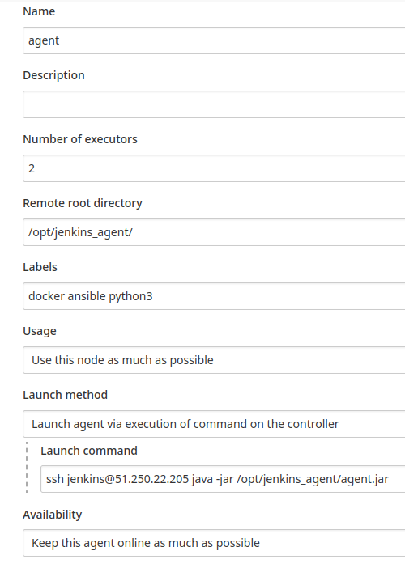
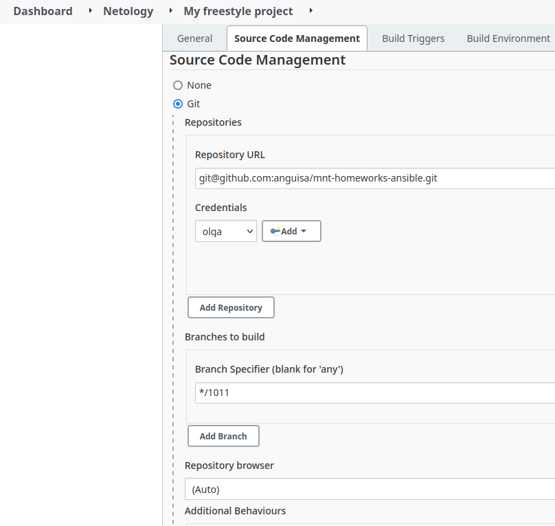
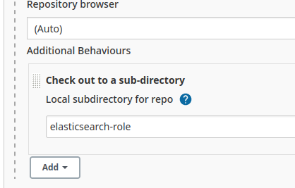
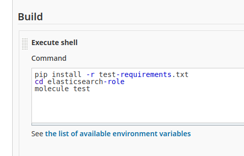
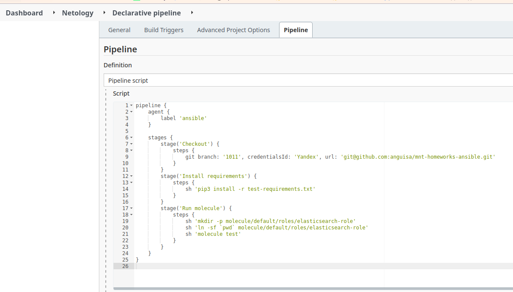
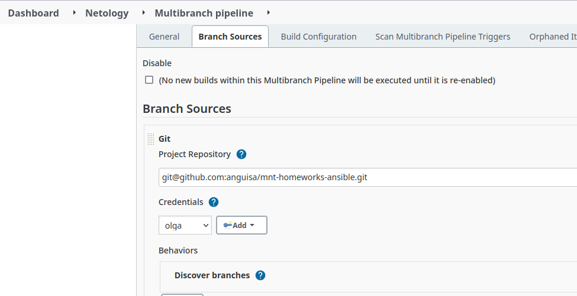
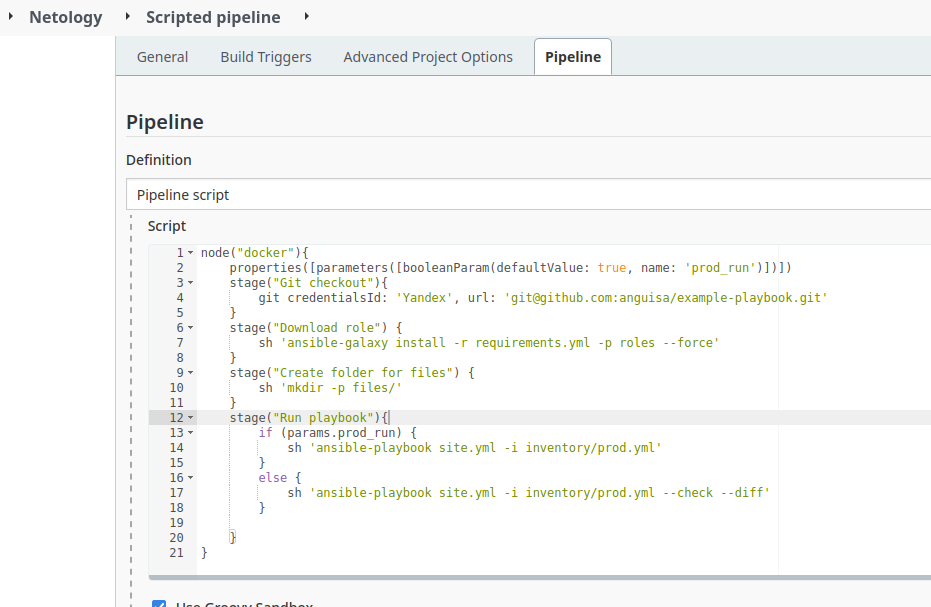
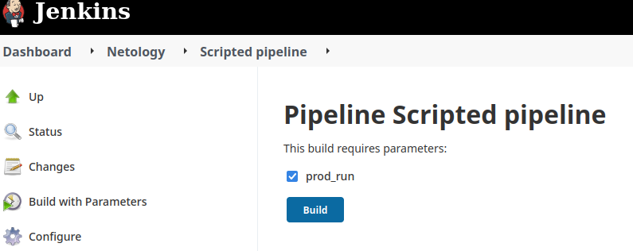
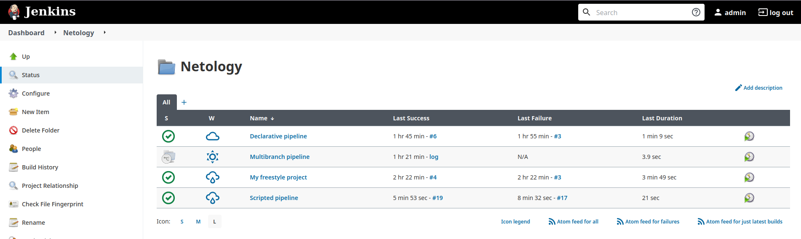

# Olga Ivanova, devops-10. Домашнее задание к занятию "09.04 Jenkins"

## Подготовка к выполнению

1. Создать 2 VM: для jenkins-master и jenkins-agent.

### Ответ
2CPU-4RAM, Centos7, публичный ssh-ключ id_rsa_ya.pub

2. Установить jenkins при помощи playbook'a.

### Ответ
```bash
[olga@fedora .ssh]$ ssh olga@51.250.26.35 -i id_rsa_ya
[olga@fedora .ssh]$ ssh olga@51.250.22.205 -i id_rsa_ya
[olga@fedora devops-netology-private]$ cd ./03-mnt7/09-ci-04-jenkins/infrastructure/
[olga@fedora infrastructure]$ ansible-playbook -i inventory/cicd site.yml
```

3. Запустить и проверить работоспособность.

### Ответ
`http://51.250.26.35:8080`

4. Сделать первоначальную настройку.

### Ответ
```bash
[olga@fedora .ssh]$ ssh olga@51.250.26.35 -i id_rsa_ya
[olga@jenkins-master ~]$ sudo cat /var/lib/jenkins/secrets/initialAdminPassword
e501f0f07384442eb2060af9cb65725f
```
Отключаем сборку на мастере (Nodes -> Built-In Node -> 0 executors)
Создаём агента (New node -> permanent agent)


## Основная часть

1. Сделать Freestyle Job, который будет запускать `molecule test` из любого вашего репозитория с ролью.

### Ответ
Создаём папку `Netology`, в ней - New Item -> `Freestyle job` с git repository url `git@github.com:anguisa/mnt-homeworks-ansible.git` и id_rsa.  
Check out to a sub-directory - `cd elasticsearch-role`.  
Branch specifier - `*/1011`.  
Execute shell:
```bash
pip install -r test-requirements.txt
cd elasticsearch-role
molecule test
```




2. Сделать Declarative Pipeline Job, который будет запускать `molecule test` из любого вашего репозитория с ролью.

### Ответ
New Item -> Pipeline
  
```bash
pipeline {
    agent {
        label 'ansible'
    }

    stages {
        stage('Checkout') {
            steps {
                git branch: '1011', credentialsId: 'Yandex', url: 'git@github.com:anguisa/mnt-homeworks-ansible.git'
            }
        }
        stage('Install requirements') {
            steps {
                sh 'pip3 install -r test-requirements.txt'
            }
        }
        stage('Run molecule') {
            steps {        
                sh 'mkdir -p molecule/default/roles/elasticsearch-role'
                sh 'ln -sf `pwd` molecule/default/roles/elasticsearch-role'
                sh 'molecule test'
            }
        }
    }
}
```

3. Перенести Declarative Pipeline в репозиторий в файл `Jenkinsfile`.

### Ответ
`https://github.com/anguisa/mnt-homeworks-ansible/blob/main/Jenkinsfile`

4. Создать Multibranch Pipeline на запуск `Jenkinsfile` из репозитория.

### Ответ
New Item -> Multibranch Pipeline 
  
Из других веток нужно удалить Jenkinsfile (или поменять на корректный)

5. Создать Scripted Pipeline, наполнить его скриптом из [pipeline](./pipeline).

### Ответ
New Item -> Pipeline  
Заполняем Pipeline script

6. Внести необходимые изменения, чтобы Pipeline запускал `ansible-playbook` без флагов `--check --diff`, 
если не установлен параметр при запуске джобы (prod_run = True), по умолчанию параметр имеет значение False 
и запускает прогон с флагами `--check --diff`.

### Ответ
Меняем в `https://github.com/anguisa/example-playbook` в requirements.txt ссылку на https git-а, чтобы не давать ключи.  
Нужно создавать папку files, куда скачивать.  
Также откорректировать файл sudoers, т.к. иначе Install Elasticsearch требует пароль от sudo.  
```bash
[root@jenkins-agent sudoers.d]# cat /etc/sudoers.d/90-cloud-init-users
# Created by cloud-init v. 19.4 on Sun, 26 Dec 2021 05:29:38 +0000

# User rules for olga
olga ALL=(ALL) NOPASSWD:ALL
jenkins ALL=(ALL) NOPASSWD:AL
```
При нажатии для сборки теперь появляется Build with parameters, где можно поставить или снять галочку у prod_run.  

7. Проверить работоспособность, исправить ошибки, исправленный Pipeline вложить в репозиторий в файл `ScriptedJenkinsfile`. Цель: получить собранный стек ELK в Ya.Cloud.

### Ответ
  
  
```bash
node("docker"){
    properties([parameters([booleanParam(defaultValue: true, name: 'prod_run')])])
    stage("Git checkout"){
        git credentialsId: 'Yandex', url: 'git@github.com:anguisa/example-playbook.git'
    }
    stage("Download role") {
        sh 'ansible-galaxy install -r requirements.yml -p roles --force'
    }
    stage("Create folder for files") {
        sh 'mkdir -p files/'
    }
    stage("Run playbook"){
        if (params.prod_run) {
            sh 'ansible-playbook site.yml -i inventory/prod.yml'
        }
        else {
            sh 'ansible-playbook site.yml -i inventory/prod.yml --check --diff'
        }

    }
}
```

Результат:  


8. Отправить две ссылки на репозитории в ответе: с ролью и Declarative Pipeline и c плейбукой и Scripted Pipeline.

### Ответ
[Declarative Pipeline](https://github.com/anguisa/mnt-homeworks-ansible/blob/main/Jenkinsfile)   
[Scripted Pipeline](https://github.com/anguisa/example-playbook/blob/master/ScriptedJenkinsfile)

## Необязательная часть

1. Создать скрипт на groovy, который будет собирать все Job, которые завершились хотя бы раз неуспешно. Добавить скрипт в репозиторий с решеним с названием `AllJobFailure.groovy`.
2. Дополнить Scripted Pipeline таким образом, чтобы он мог сначала запустить через Ya.Cloud CLI необходимое количество инстансов, прописать их в инвентори плейбука и после этого запускать плейбук. Тем самым, мы должны по нажатию кнопки получить готовую к использованию систему.

---

### Как оформить ДЗ?

Выполненное домашнее задание пришлите ссылкой на .md-файл в вашем репозитории.

---
