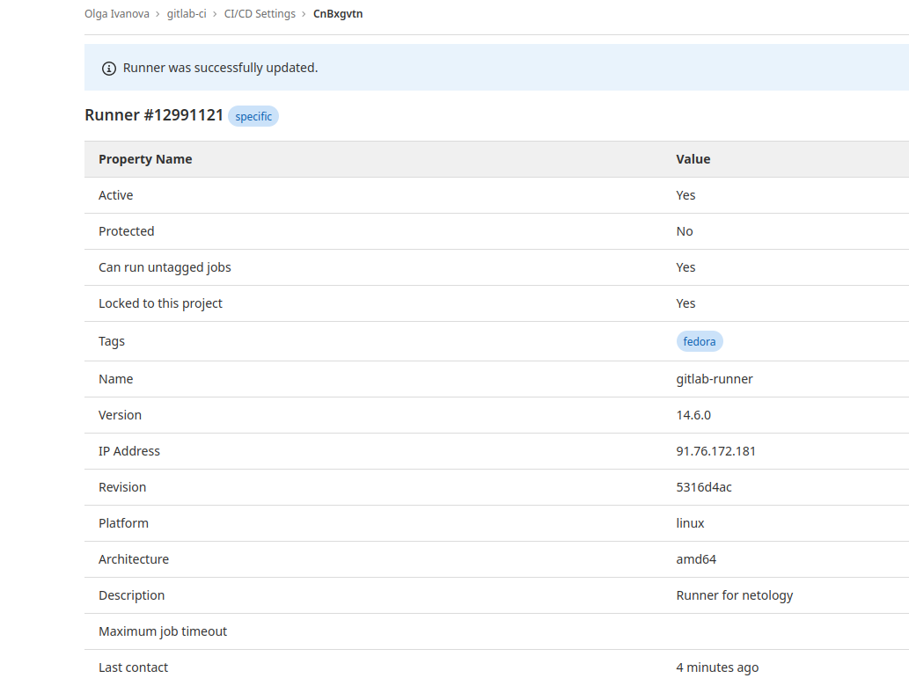
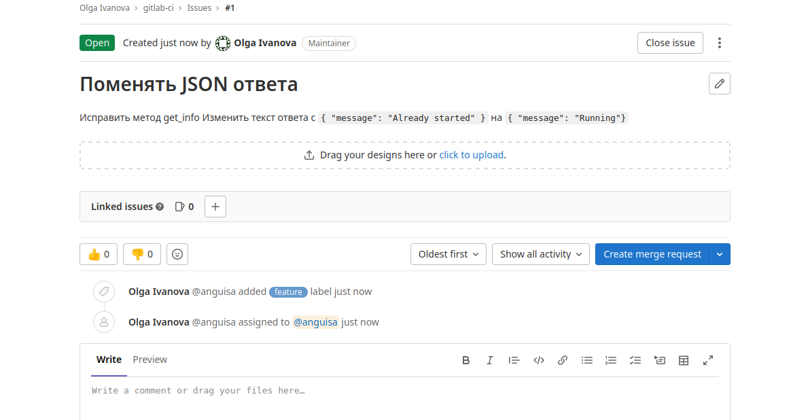
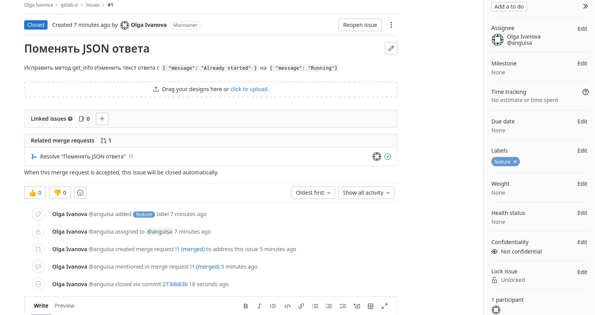
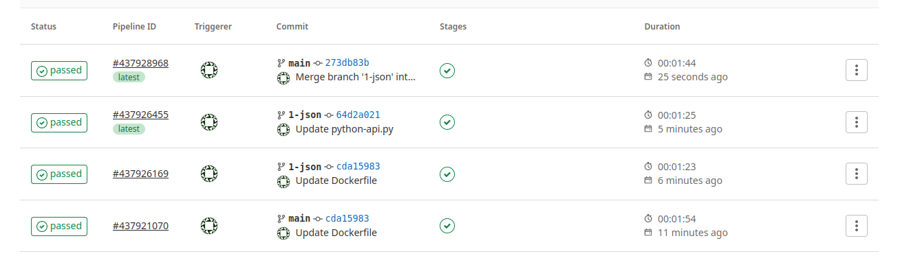
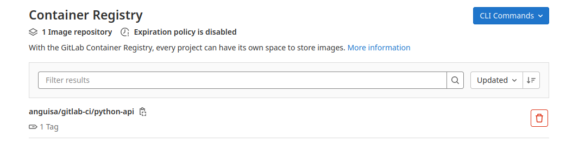
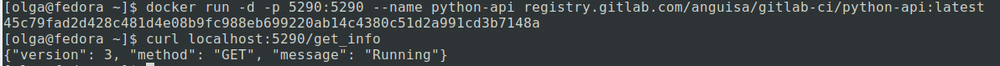

# Домашнее задание к занятию "09.06 Gitlab"

## Подготовка к выполнению

1. Необходимо [зарегистрироваться](https://about.gitlab.com/free-trial/)
2. Создайте свой новый проект
3. Создайте новый репозиторий в gitlab, наполните его [файлами](./repository)
4. Проект должен быть публичным, остальные настройки по желанию

#### Ответ
Create blank project -> public  
Редактируем в web IDE  

НЕ ПОЛУЧИЛОСЬ (пришлось вводить данные карты):  
Устанавливаем gitlab-runner и регистрируем его:
```bash
[olga@fedora ~]$ docker volume create gitlab-runner-config
[olga@fedora ~]$ docker run -d --name gitlab-runner --restart always \
    -v /var/run/docker.sock:/var/run/docker.sock \
    -v gitlab-runner-config:/etc/gitlab-runner \
    gitlab/gitlab-runner:latest
[olga@fedora ~]$ docker run --rm -it -v gitlab-runner-config:/etc/gitlab-runner gitlab/gitlab-runner:latest register
Runtime platform                                    arch=amd64 os=linux pid=7 revision=5316d4ac version=14.6.0
Running in system-mode.                            
                                                   
Enter the GitLab instance URL (for example, https://gitlab.com/):
https://gitlab.com/
Enter the registration token:
xscrypNsn_kzchvhLuUM
Enter a description for the runner:
[a68cb50f55c4]: Runner for netology
Enter tags for the runner (comma-separated):
fedora
Registering runner... succeeded                     runner=xscrypNs
Enter an executor: custom, docker-ssh, parallels, shell, virtualbox, docker+machine, docker, ssh, docker-ssh+machine, kubernetes:
docker
Enter the default Docker image (for example, ruby:2.6):
ruby:2.6
Runner registered successfully. Feel free to start it, but if it's running already the config should be automatically reloaded! 
```  
Исправляем в настройках runner: `Can run untagged jobs`  



## Основная часть

### DevOps

В репозитории содержится код проекта на python. Проект - RESTful API сервис. Ваша задача автоматизировать сборку образа с выполнением python-скрипта:
1. Образ собирается на основе [centos:7](https://hub.docker.com/_/centos?tab=tags&page=1&ordering=last_updated)
2. Python версии не ниже 3.7
3. Установлены зависимости: `flask` `flask-jsonpify` `flask-restful`
4. Создана директория `/python_api`
5. Скрипт из репозитория размещён в /python_api
6. Точка вызова: запуск скрипта
7. Если сборка происходит на ветке `master`: Образ должен пушится в docker registry вашего gitlab `python-api:latest`, иначе этот шаг нужно пропустить

#### Ответ
Делаем в web IDE, commit в main.  
См. [Dockerfile](project/Dockerfile), [requirements.txt](project/requirements.txt), [.gitlab-ci.yml](project/.gitlab-ci.yml)

### Product Owner

Вашему проекту нужна бизнесовая доработка: необходимо поменять JSON ответа на вызов метода GET `/rest/api/get_info`, необходимо создать Issue в котором указать:
1. Какой метод необходимо исправить
2. Текст с `{ "message": "Already started" }` на `{ "message": "Running"}`
3. Issue поставить label: feature

#### Ответ


### Developer

Вам пришел новый Issue на доработку, вам необходимо:
1. Создать отдельную ветку, связанную с этим issue
2. Внести изменения по тексту из задания
3. Подготовить Merge Requst, влить необходимые изменения в `master`, проверить, что сборка прошла успешно

#### Ответ
В Issue: Create merge request -> Open in Web ide -> меняем -> Mark merge request as ready -> merge -> Issue закрывается  


Pipelines:  


Registry:  


### Tester

Разработчики выполнили новый Issue, необходимо проверить валидность изменений:
1. Поднять докер-контейнер с образом `python-api:latest` и проверить возврат метода на корректность
2. Закрыть Issue с комментарием об успешности прохождения, указав желаемый результат и фактически достигнутый

#### Ответ
```bash
[olga@fedora ~]$ docker login registry.gitlab.com
[olga@fedora ~]$ docker pull registry.gitlab.com/anguisa/gitlab-ci/python-api
[olga@fedora ~]$ docker run -d -p 5290:5290 --name python-api registry.gitlab.com/anguisa/gitlab-ci/python-api:latest
[olga@fedora ~]$ curl localhost:5290/get_info
```



## Итог

После успешного прохождения всех ролей - отправьте ссылку на ваш проект в гитлаб, как решение домашнего задания

#### Ответ
[https://gitlab.com/anguisa/gitlab-ci](https://gitlab.com/anguisa/gitlab-ci)  
[https://gitlab.com/anguisa/gitlab-ci/-/issues?scope=all&state=all](https://gitlab.com/anguisa/gitlab-ci/-/issues?scope=all&state=all)  
[https://gitlab.com/anguisa/gitlab-ci/-/pipelines](https://gitlab.com/anguisa/gitlab-ci/-/pipelines)  
[https://gitlab.com/anguisa/gitlab-ci/container_registry](https://gitlab.com/anguisa/gitlab-ci/container_registry)

## Необязательная часть

Автомазируйте работу тестировщика, пусть у вас будет отдельный конвейер, который автоматически поднимает контейнер и выполняет проверку, например, при помощи curl. На основе вывода - будет приниматься решение об успешности прохождения тестирования

---

### Как оформить ДЗ?

Выполненное домашнее задание пришлите ссылкой на .md-файл в вашем репозитории.

---
