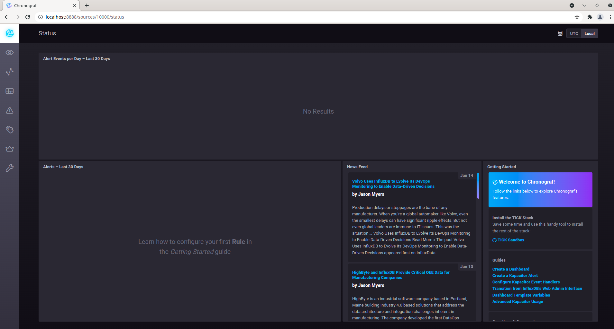
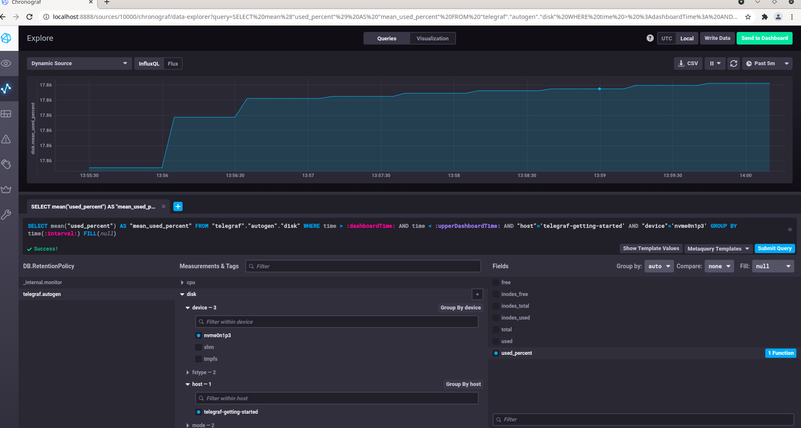
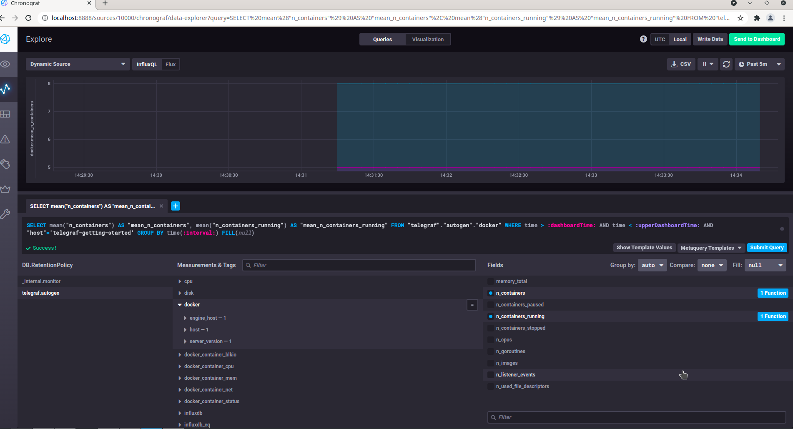

# Домашнее задание к занятию "10.02. Системы мониторинга"

## Обязательные задания

1. Опишите основные плюсы и минусы pull и push систем мониторинга.

### Ответ

Push - отправка данных с агентов в систему мониторинга:    
- проще настроить репликацию в разные системы
- проще получать метрики от короткоживущих job-ов
- обычно используют UDP, поэтому производительность может быть выше
- удобно для динамического окружения (не нужна дополнительная настройка, например, для докер-контейнеров)
- агент при старте сразу начинает отправлять сам метрики, без дополнительной настройки
- агенту не нужно состояние, т.к. отправлять метрики по мере их появления; обратная сторона медали - данные могут потеряться при недоступности системы мониторинга
- меньше настройки агентов - интервал отправки и адрес
- не знаем количество агентов, сложно оценить объём информации (это может решаться белыми списками серверов, откуда можем принимать информацию)
- из-за UDP нет гарантии доставки данных

Pull - сбор системой мониторинга данных с агентов:  
- проще контролировать аутентификацию, т.к. сервер сам инициирует соединение
- можем примерно оценить объём информации, т.к. знаем количество агентов, откуда их собираем
- более высокий контроль за источниками метрик
- проще шифровать трафик (например, единый прокси-сервер с TLS)
- удобно получать данные по запросу и для отладки (можно использовать TCP/HTTP)
- более надёжный способ (т.к. TCP), но может быть менее производительным
- есть проблемы с получением метрик, когда job-а работает меньше, чем `scrape`-период (период опроса агентов)
- для каждой новой машины нужно настраивать источник метрик (неудобно в случае динамического окружения, например, контейнеров)
- нагрузка повышается с увеличением количества агентов; сервер должен отправлять и валидировать запросы и ответы; агенты должны парсить и обрабатывать запросы
- агентам нужно иметь состояние, чтобы передать его по запросу
- более объёмная настройка - система должна иметь список агентов, как к ним получать доступ, что запрашивать

2. Какие из ниже перечисленных систем относятся к push модели, а какие к pull? А может есть гибридные?

### Ответ
- Prometheus: в его основе pull-метод. Дополнительно есть компонент Pushgateway, куда могут пушить метрики короткоживущие job-ы. 
Однако оттуда метрики забираются pull-методом, как и из обычных job-ов и exporter-ов.
- TICK: по умолчанию это push-модель. Telegraf собирает метрики и отправляет в TSDB. Однако Telegraf можно настроить для работы и 
в соответствии с pull-моделью.
- Zabbix: гибридная. Для этого там есть активные и пассивные проверки.
- VictoriaMetrics: гибридная. Согласно документации, можно настроить `vmagent` для работы как с push, так и с pull методом.
- Nagios: pull-модель. Он опрашивает агентов и забирает данные.

3. Склонируйте себе [репозиторий](https://github.com/influxdata/sandbox/tree/master) и запустите TICK-стэк, 
используя технологии docker и docker-compose.

В виде решения на это упражнение приведите выводы команд с вашего компьютера (виртуальной машины):

    - curl http://localhost:8086/ping
    - curl http://localhost:8888
    - curl http://localhost:9092/kapacitor/v1/ping

А также скриншот веб-интерфейса ПО chronograf (`http://localhost:8888`). 

P.S.: если при запуске некоторые контейнеры будут падать с ошибкой - проставьте им режим `Z`, например
`./data:/var/lib:Z`

### Ответ
```bash
[olga@fedora sandbox]$ ./sandbox up
```

Результат:  
```bash
[olga@fedora sandbox]$ curl http://localhost:8086/ping -v
*   Trying ::1:8086...
* Connected to localhost (::1) port 8086 (#0)
> GET /ping HTTP/1.1
> Host: localhost:8086
> User-Agent: curl/7.76.1
> Accept: */*
>
* Mark bundle as not supporting multiuse
  < HTTP/1.1 204 No Content
  < Content-Type: application/json
  < Request-Id: 9f7ce83c-784b-11ec-8026-0242ac120002
  < X-Influxdb-Build: OSS
  < X-Influxdb-Version: 1.8.10
  < X-Request-Id: 9f7ce83c-784b-11ec-8026-0242ac120002
  < Date: Tue, 18 Jan 2022 10:44:33 GMT
  <
* Connection #0 to host localhost left intact
```

```bash
[olga@fedora sandbox]$ curl http://localhost:8888 -v
*   Trying ::1:8888...
* Connected to localhost (::1) port 8888 (#0)
> GET / HTTP/1.1
> Host: localhost:8888
> User-Agent: curl/7.76.1
> Accept: */*
>
* Mark bundle as not supporting multiuse
  < HTTP/1.1 200 OK
  < Accept-Ranges: bytes
  < Cache-Control: public, max-age=3600
  < Content-Length: 336
  < Content-Security-Policy: script-src 'self'; object-src 'self'
  < Content-Type: text/html; charset=utf-8
  < Etag: "336820331"
  < Last-Modified: Fri, 08 Oct 2021 20:33:01 GMT
  < Vary: Accept-Encoding
  < X-Chronograf-Version: 1.9.1
  < X-Content-Type-Options: nosniff
  < X-Frame-Options: SAMEORIGIN
  < X-Xss-Protection: 1; mode=block
  < Date: Tue, 18 Jan 2022 10:45:16 GMT
  <
* Connection #0 to host localhost left intact
<!DOCTYPE html><html><head><meta http-equiv="Content-type" content="text/html; charset=utf-8"><title>Chronograf</title><link rel="icon shortcut" href="/favicon.fa749080.ico"><link rel="stylesheet" href="/src.3dbae016.css"></head><body> <div id="react-root" data-basepath=""></div> <script src="/src.fab22342.js"></script> </body></html>
```

```bash
[olga@fedora sandbox]$ curl http://localhost:9092/kapacitor/v1/ping -v
*   Trying ::1:9092...
* Connected to localhost (::1) port 9092 (#0)
> GET /kapacitor/v1/ping HTTP/1.1
> Host: localhost:9092
> User-Agent: curl/7.76.1
> Accept: */*
> 
* Mark bundle as not supporting multiuse
< HTTP/1.1 204 No Content
< Content-Type: application/json; charset=utf-8
< Request-Id: e014fc4c-784b-11ec-8030-000000000000
< X-Kapacitor-Version: 1.6.2
< Date: Tue, 18 Jan 2022 10:46:21 GMT
< 
* Connection #0 to host localhost left intact
```

Скриншот веб-интерфейса ПО chronograf (`http://localhost:8888`):  


4. Перейдите в веб-интерфейс Chronograf (`http://localhost:8888`) и откройте вкладку `Data explorer`.

    - Нажмите на кнопку `Add a query`
    - Изучите вывод интерфейса и выберите БД `telegraf.autogen`
    - В `measurements` выберите mem->host->telegraf_container_id , а в `fields` выберите used_percent. 
    Внизу появится график утилизации оперативной памяти в контейнере telegraf.
    - Вверху вы можете увидеть запрос, аналогичный SQL-синтаксису. 
    Поэкспериментируйте с запросом, попробуйте изменить группировку и интервал наблюдений.

Для выполнения задания приведите скриншот с отображением метрик утилизации места на диске 
(disk->host->telegraf_container_id) из веб-интерфейса.

### Ответ
Для добавления метрик утилизации места на диске потребовалось добавить в `telegraf.conf` строку `[[inputs.disk]]` и перезапустить.  
Скриншот:  


5. Изучите список [telegraf inputs](https://github.com/influxdata/telegraf/tree/master/plugins/inputs). 
Добавьте в конфигурацию telegraf следующий плагин - [docker](https://github.com/influxdata/telegraf/tree/master/plugins/inputs/docker):
```
[[inputs.docker]]
  endpoint = "unix:///var/run/docker.sock"
```

Дополнительно вам может потребоваться донастройка контейнера telegraf в `docker-compose.yml` дополнительного volume и 
режима privileged:
```
  telegraf:
    image: telegraf:1.4.0
    privileged: true
    volumes:
      - ./etc/telegraf.conf:/etc/telegraf/telegraf.conf:Z
      - /var/run/docker.sock:/var/run/docker.sock:Z
    links:
      - influxdb
    ports:
      - "8092:8092/udp"
      - "8094:8094"
      - "8125:8125/udp"
```

После настройки перезапустите telegraf, обновите веб интерфейс и приведите скриншотом список `measurements` в 
веб-интерфейсе базы telegraf.autogen . Там должны появиться метрики, связанные с docker.

Факультативно можете изучить какие метрики собирает telegraf после выполнения данного задания.

### Ответ
Также потребовалось добавить прав: `sudo chmod o+rw /var/run/docker.sock`, чтобы итоговая маска была такой: `srw-rw-rw-`.  



Итоговый [docker-compose](docker-compose.yml)  
Итоговый [telegraf.conf](telegraf.conf)  

## Дополнительное задание (со звездочкой*) - необязательно к выполнению

В веб-интерфейсе откройте вкладку `Dashboards`. Попробуйте создать свой dashboard с отображением:

    - утилизации ЦПУ
    - количества использованного RAM
    - утилизации пространства на дисках
    - количество поднятых контейнеров
    - аптайм
    - ...
    - фантазируйте)
    
    ---

### Как оформить ДЗ?

Выполненное домашнее задание пришлите ссылкой на .md-файл в вашем репозитории.

---

