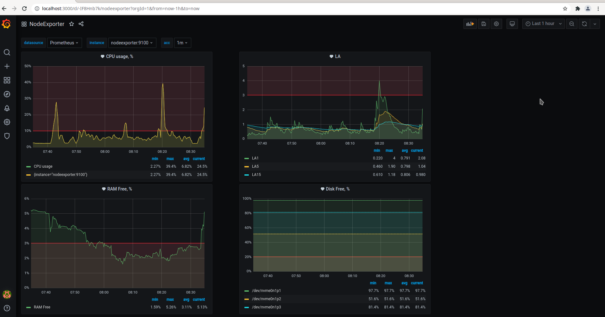

# Домашнее задание к занятию "10.03. Grafana"

## Задание повышенной сложности

**В части задания 1** не используйте директорию [help](./help) для сборки проекта, самостоятельно разверните grafana, где в 
роли источника данных будет выступать prometheus, а сборщиком данных node-exporter:
- grafana
- prometheus-server
- prometheus node-exporter

За дополнительными материалами, вы можете обратиться в официальную документацию grafana и prometheus.

В решении к домашнему заданию приведите также все конфигурации/скрипты/манифесты, которые вы 
использовали в процессе решения задания.

**В части задания 3** вы должны самостоятельно завести удобный для вас канал нотификации, например Telegram или Email
и отправить туда тестовые события.

В решении приведите скриншоты тестовых событий из каналов нотификаций.

## Обязательные задания

### Задание 1
Используя директорию [help](./help) внутри данного домашнего задания - запустите связку prometheus-grafana.

Зайдите в веб-интерфейс графана, используя авторизационные данные, указанные в манифесте docker-compose.

Подключите поднятый вами prometheus как источник данных.

Решение домашнего задания - скриншот веб-интерфейса grafana со списком подключенных Datasource.

#### Ответ

Т.к. потребуется заходить в `prometheus` для просмотра метрик, в `docker-compose` файл добавлено:
```
    ports:
      - 9090:9090
```
Теперь сможем использовать ссылку `http://localhost:9090/`

Запускаем:  
```bash
[olga@fedora help]$ docker-compose up -d
```

Заходим в графану по `localhost:3000` с логином `admin` и паролем `admin`, меняем пароль на новый.

Настраиваем источник данных: Configuration -> Datasources -> Prometheus -> `http://prometheus:9090/`.  


 
## Задание 2
Изучите самостоятельно ресурсы:
- [promql-for-humans](https://timber.io/blog/promql-for-humans/#cpu-usage-by-instance)
- [understanding prometheus cpu metrics](https://www.robustperception.io/understanding-machine-cpu-usage)

Создайте Dashboard и в ней создайте следующие Panels:
- Утилизация CPU для nodeexporter (в процентах, 100-idle)
- CPULA 1/5/15
- Количество свободной оперативной памяти
- Количество места на файловой системе

Для решения данного ДЗ приведите promql запросы для выдачи этих метрик, а также скриншот получившейся Dashboard.

#### Ответ
Дополнительно добавлены переменные с источником данных, экземпляром и точностью.  
- Утилизация CPU для nodeexporter (в процентах, 100-idle):  
`100 * (1 - avg by (instance) (rate(node_cpu_seconds_total{job="nodeexporter",mode="idle",instance=~"$instance"}[$acc])))`
- CPULA 1/5/15:  
`node_load1{instance=~"$instance", job="nodeexporter"}`  
`node_load5{instance=~"$instance", job="nodeexporter"}`  
`node_load15{instance=~"$instance", job="nodeexporter"}`  
- Количество свободной оперативной памяти:  
`node_memory_MemFree_bytes{instance=~"$instance",job="nodeexporter"}/node_memory_MemTotal_bytes{instance=~"$instance",job="nodeexporter"}`
- Количество места на файловой системе:  
`100 * sum(node_filesystem_avail_bytes{instance=~"$instance",job="nodeexporter",device!~"rootfs|tmpfs|jetbrains-toolbox"}) by (device) / sum(node_filesystem_size_bytes{instance=~"$instance",job="nodeexporter",device!~"rootfs|tmpfs|jetbrains-toolbox"}) by (device)`

Скриншот:  
  

Переменные:  


## Задание 3
Создайте для каждой Dashboard подходящее правило alert (можно обратиться к первой лекции в блоке "Мониторинг").

Для решения ДЗ - приведите скриншот вашей итоговой Dashboard.

#### Ответ
Из-за того, что alert-ы не поддерживают переменные шаблонов, были добавлены дополнительные невидимые запросы с конкретными значениями `instance` и `acc`.  

Скриншот:  


## Задание 4
Сохраните ваш Dashboard.

Для этого перейдите в настройки Dashboard, выберите в боковом меню "JSON MODEL".

Далее скопируйте отображаемое json-содержимое в отдельный файл и сохраните его.

В решении задания - приведите листинг этого файла.

#### Ответ
Файл - [grafana.json](grafana.json)