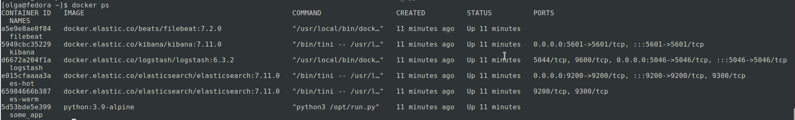
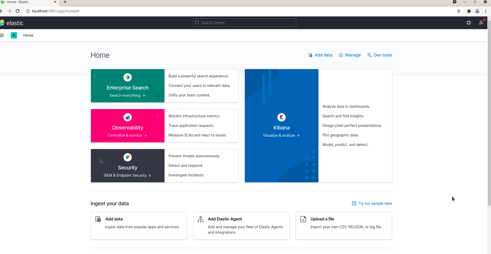
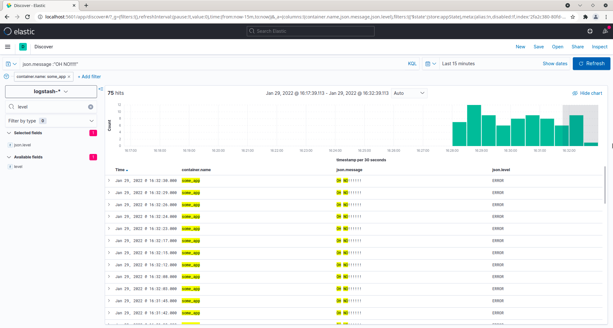
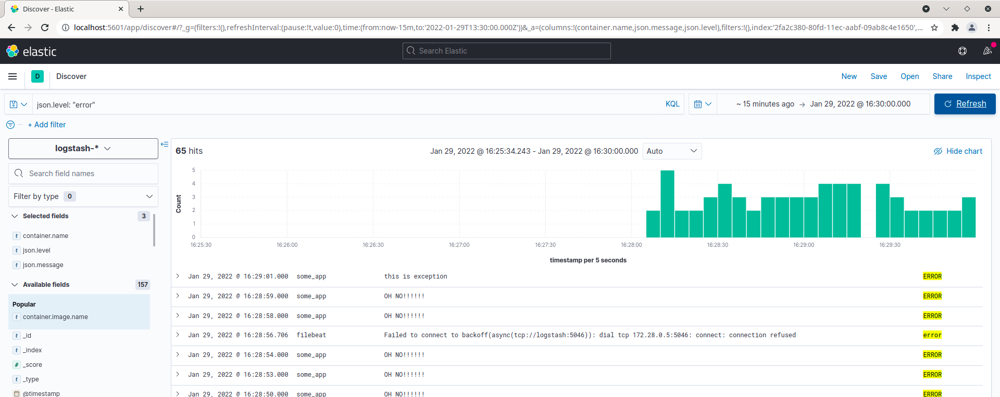

# Домашнее задание к занятию "10.04. ELK"

## Дополнительные ссылки

При выполнении задания пользуйтесь вспомогательными ресурсами:

- [поднимаем elk в докер](https://www.elastic.co/guide/en/elastic-stack-get-started/current/get-started-docker.html)
- [поднимаем elk в докер с filebeat и докер логами](https://www.sarulabs.com/post/5/2019-08-12/sending-docker-logs-to-elasticsearch-and-kibana-with-filebeat.html)
- [конфигурируем logstash](https://www.elastic.co/guide/en/logstash/current/configuration.html)
- [плагины filter для logstash](https://www.elastic.co/guide/en/logstash/current/filter-plugins.html)
- [конфигурируем filebeat](https://www.elastic.co/guide/en/beats/libbeat/5.3/config-file-format.html)
- [привязываем индексы из elastic в kibana](https://www.elastic.co/guide/en/kibana/current/index-patterns.html)
- [как просматривать логи в kibana](https://www.elastic.co/guide/en/kibana/current/discover.html)
- [решение ошибки increase vm.max_map_count elasticsearch](https://stackoverflow.com/questions/42889241/how-to-increase-vm-max-map-count)

В процессе выполнения задания могут возникнуть также не указанные тут проблемы в зависимости от системы.

Используйте output stdout filebeat/kibana и api elasticsearch для изучения корня проблемы и ее устранения.

## Задание повышенной сложности

Не используйте директорию [help](./help) при выполнении домашнего задания.

## Задание 1

Вам необходимо поднять в докере:
- elasticsearch(hot и warm ноды)
- logstash
- kibana
- filebeat

и связать их между собой.

Logstash следует сконфигурировать для приёма по tcp json сообщений.

Filebeat следует сконфигурировать для отправки логов docker вашей системы в logstash.

В директории [help](./help) находится манифест docker-compose и конфигурации filebeat/logstash для быстрого 
выполнения данного задания.

Результатом выполнения данного задания должны быть:
- скриншот `docker ps` через 5 минут после старта всех контейнеров (их должно быть 5)
- скриншот интерфейса kibana
- docker-compose манифест (если вы не использовали директорию help)
- ваши yml конфигурации для стека (если вы не использовали директорию help)

### Ответ
Для выполнения задания использована директория help.  

- Перед запуском выполнено: `sudo sysctl -w vm.max_map_count=262144`.  
- Также потребовалось добавить прав: `sudo chmod o+rw /var/run/docker.sock`, чтобы итоговая маска была такой: `srw-rw-rw-`.  
- Filebeat выводил ошибку `Exiting: error loading config file: config file ("filebeat.yml") must be owned by the user identifier (uid=0) or root`.  
Проблема решена: `sudo chown root configs/filebeat.yml`  
- Затем Filebeat выводил другую ошибку `Exiting: error loading config file: config file ("filebeat.yml") can only be writable 
by the owner but the permissions are "-rw-rw-r--" (to fix the permissions use: 'chmod go-w /usr/share/filebeat/filebeat.yml')`.  
Проблема решена: `sudo chmod go-w configs/filebeat.yml`
- В логах Filebeat следующая ошибка: `{"level":"warn","timestamp":"2022-01-29T04:41:53.792Z","caller":"transport/tcp.go:53","message":"DNS lookup failure \"logstash\": lookup logstash: no such host"}`.  
Для решения в [docker-compose](help/docker-compose.yml) для `filebeat` добавлено:
```
    networks:
      - elastic
```
- В конфиге [logstash](help/configs/logstash.conf) input `tcp` заменён на `beats`:  
```
input {
  beats {
    port => 5046
    codec => json
  }
}
```
- Оказалось, что logstash использует другой конфиг (`/usr/share/logstash/pipeline/logstash.conf`), а `etc/logstash/conf.d` игнорирует, 
поэтому в [docker-compose](help/docker-compose.yml) для logstash внесены изменения:   
```
    volumes:
      - ./configs/logstash.conf:/usr/share/logstash/pipeline/logstash.conf:Z
      - ./configs/logstash.yml:/usr/share/logstash/config/logstash.yml:Z
```
- Скорректирован фильтр в конфиге [logstash.conf](help/configs/logstash.conf): добавлена строка `source => "json"`
(название соответствует тому, что указано в [filebeat.yml](help/configs/filebeat.yml) в `processors.decode_json_fields.target`), 
а также поле `indexDate`, которое потом используется в `output`:  
```
filter {
  mutate { add_field => { "[@metadata][indexDate]" => "%{+YYYY.MM.dd}" } }
  json {
    source => "json"
  }
}
```
- В приложении [python](help/pinger/run.py) добавлен соответствующий формат логов:  
```
logging.basicConfig(format='{\"level\":\"%(levelname)s\",\"message\":\"%(message)s\",\"timestamp\":\"%(asctime)s\"}', datefmt='%Y-%m-%dT%H:%M:%S.000Z')
```

Скриншот `docker ps`:  
  

Скриншот kibana:  
  

Исправленные файлы размещены в директории [help](help).  

## Задание 2

Перейдите в меню [создания index-patterns  в kibana](http://localhost:5601/app/management/kibana/indexPatterns/create)
и создайте несколько index-patterns из имеющихся.

Перейдите в меню просмотра логов в kibana (Discover) и самостоятельно изучите, как отображаются логи и как производить 
поиск по логам.

В манифесте директории help также приведено dummy приложение, которое генерирует рандомные события в stdout контейнера.
Данные логи должны порождать индекс logstash-* в elasticsearch. Если данного индекса нет - воспользуйтесь советами 
и источниками из раздела "Дополнительные ссылки" данного ДЗ.

### Ответ
Примеры поиска по индексам (по дате, имени контейнера, сообщению, уровню логирования):  
  


---

### Как оформить ДЗ?

Выполненное домашнее задание пришлите ссылкой на .md-файл в вашем репозитории.

---

 
