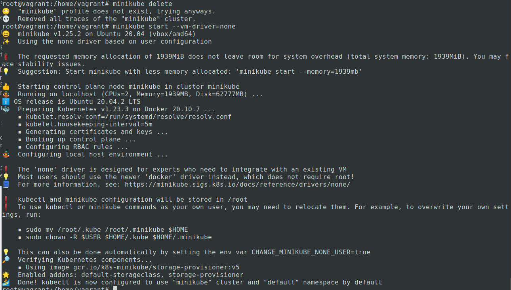
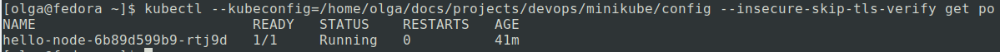
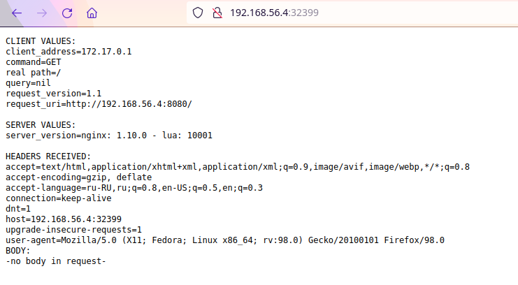

# Домашнее задание к занятию "12.1 Компоненты Kubernetes"

Вы DevOps инженер в крупной компании с большим парком сервисов. Ваша задача — разворачивать эти продукты в корпоративном кластере.

## Задача 1: Установить Minikube

Для экспериментов и валидации ваших решений вам нужно подготовить тестовую среду для работы с Kubernetes. Оптимальное решение — развернуть на рабочей машине Minikube.

### Как поставить на AWS:
- создать EC2 виртуальную машину (Ubuntu Server 20.04 LTS (HVM), SSD Volume Type) с типом **t3.small**. Для работы потребуется настроить Security Group для доступа по ssh. Не забудьте указать keypair, он потребуется для подключения.
- подключитесь к серверу по ssh (ssh ubuntu@<ipv4_public_ip> -i <keypair>.pem)
- установите миникуб и докер следующими командами:
    - curl -LO https://storage.googleapis.com/kubernetes-release/release/`curl -s https://storage.googleapis.com/kubernetes-release/release/stable.txt`/bin/linux/amd64/kubectl
    - chmod +x ./kubectl
    - sudo mv ./kubectl /usr/local/bin/kubectl
    - sudo apt-get update && sudo apt-get install docker.io conntrack -y
    - curl -Lo minikube https://storage.googleapis.com/minikube/releases/latest/minikube-linux-amd64 && chmod +x minikube && sudo mv minikube /usr/local/bin/
- проверить версию можно командой minikube version
- переключаемся на root и запускаем миникуб: minikube start --vm-driver=none
- после запуска стоит проверить статус: minikube status
- запущенные служебные компоненты можно увидеть командой: kubectl get pods --namespace=kube-system

### Для сброса кластера стоит удалить кластер и создать заново:
- minikube delete
- minikube start --vm-driver=none

Возможно, для повторного запуска потребуется выполнить команду: sudo sysctl fs.protected_regular=0

Инструкция по установке Minikube - [ссылка](https://kubernetes.io/ru/docs/tasks/tools/install-minikube/)

**Важно**: t3.small не входит во free tier, следите за бюджетом аккаунта и удаляйте виртуалку.

### Ответ

Установка производилась в vagrant (см. [Vagrantfile](./Vagrantfile)). Памяти должно быть больше 1900 для Kubernetes, 
private_network - для доступа по этому IP с хостовой машины к виртуалке.  
Пришлось поднять версию VirtualBox -> vagrant init -> vagrant up -> vagrant ssh -> vagrant reload.  
См. vagrant3

Выполнены следующие действия:
```bash
vagrant@vagrant:~$ curl -LO https://storage.googleapis.com/kubernetes-release/release/`curl -s https://storage.googleapis.com/kubernetes-release/release/stable.txt`/bin/linux/amd64/kubectl
vagrant@vagrant:~$ chmod +x ./kubectl
vagrant@vagrant:~$ sudo mv ./kubectl /usr/local/bin/kubectl
vagrant@vagrant:~$ sudo apt-get update && sudo apt-get install docker.io conntrack -y
vagrant@vagrant:~$ curl -Lo minikube https://storage.googleapis.com/minikube/releases/latest/minikube-linux-amd64 && chmod +x minikube && sudo mv minikube /usr/local/bin/
vagrant@vagrant:~$ minikube version
minikube version: v1.25.2
commit: 362d5fdc0a3dbee389b3d3f1034e8023e72bd3a7
vagrant@vagrant:~$ sudo su
root@vagrant:/home/vagrant# minikube start --vm-driver=none
```

  

Проверка:  
```bash
root@vagrant:/home/vagrant# minikube status
minikube
type: Control Plane
host: Running
kubelet: Running
apiserver: Running
kubeconfig: Configured
root@vagrant:/home/vagrant# kubectl get pods --namespace=kube-system
NAME                              READY   STATUS    RESTARTS      AGE
coredns-64897985d-2q9wk           1/1     Running   0             20m
etcd-vagrant                      1/1     Running   5             20m
kube-apiserver-vagrant            1/1     Running   5             21m
kube-controller-manager-vagrant   1/1     Running   7 (21m ago)   22m
kube-proxy-nzs8x                  1/1     Running   0             20m
kube-scheduler-vagrant            1/1     Running   5             21m
storage-provisioner               1/1     Running   0             20m
```

## Задача 2: Запуск Hello World
После установки Minikube требуется его проверить. Для этого подойдет стандартное приложение hello world. А для доступа к нему потребуется ingress.

- развернуть через Minikube тестовое приложение по [туториалу](https://kubernetes.io/ru/docs/tutorials/hello-minikube/#%D1%81%D0%BE%D0%B7%D0%B4%D0%B0%D0%BD%D0%B8%D0%B5-%D0%BA%D0%BB%D0%B0%D1%81%D1%82%D0%B5%D1%80%D0%B0-minikube)
- установить аддоны ingress и dashboard

### Ответ
Также были использованы материалы из [туториала](https://kubernetes.io/ru/docs/setup/learning-environment/minikube/)

Создание deployment:  
```bash
root@vagrant:/home/vagrant# kubectl create deployment hello-node --image=k8s.gcr.io/echoserver:1.4
deployment.apps/hello-node created
root@vagrant:/home/vagrant# kubectl get deployments
NAME         READY   UP-TO-DATE   AVAILABLE   AGE
hello-node   1/1     1            1           18s
root@vagrant:/home/vagrant# kubectl get pods
NAME                          READY   STATUS    RESTARTS   AGE
hello-node-6b89d599b9-rtj9d   1/1     Running   0          45s
```

Дополнительно можно посмотреть информацию о событиях кластера `kubectl get events` и конфигурацию `kubectl`: `kubectl config view`.  

Создание сервиса:
```bash
root@vagrant:/home/vagrant# kubectl expose deployment hello-node --type=LoadBalancer --port=8080
service/hello-node exposed
root@vagrant:/home/vagrant# kubectl get services
NAME         TYPE           CLUSTER-IP       EXTERNAL-IP   PORT(S)          AGE
hello-node   LoadBalancer   10.105.126.163   <pending>     8080:32399/TCP   5s
kubernetes   ClusterIP      10.96.0.1        <none>        443/TCP          26m
root@vagrant:/home/vagrant# minikube service hello-node --url
http://10.0.2.15:32399
```

Добавление дополнений:
```bash
root@vagrant:/home/vagrant# minikube addons list
root@vagrant:/home/vagrant# minikube addons enable ingress
root@vagrant:/home/vagrant# minikube addons enable dashboard
```

## Задача 3: Установить kubectl

Подготовить рабочую машину для управления корпоративным кластером. Установить клиентское приложение kubectl.
- подключиться к minikube
- проверить работу приложения из задания 2, запустив port-forward до кластера

### Ответ

Выполнено `kubectl config view` для просмотра конфига, скопирован конфиг и сертификаты на хостовую машину.  
Итоговый [конфиг](./config)  
Проверка kubectl:  
```bash
[olga@fedora ~]$ kubectl --kubeconfig=/home/olga/docs/projects/devops/minikube/config --insecure-skip-tls-verify get po
NAME                          READY   STATUS    RESTARTS   AGE
hello-node-6b89d599b9-rtj9d   1/1     Running   0          41m
```


Проверка:  


## Задача 4 (*): собрать через ansible (необязательное)

Профессионалы не делают одну и ту же задачу два раза. Давайте закрепим полученные навыки, автоматизировав выполнение заданий  ansible-скриптами. При выполнении задания обратите внимание на доступные модули для k8s под ansible.
- собрать роль для установки minikube на aws сервисе (с установкой ingress)
- собрать роль для запуска в кластере hello world

  ---

### Как оформить ДЗ?

Выполненное домашнее задание пришлите ссылкой на .md-файл в вашем репозитории.

---
