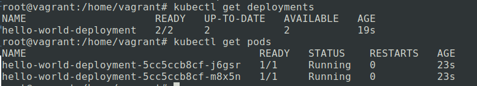
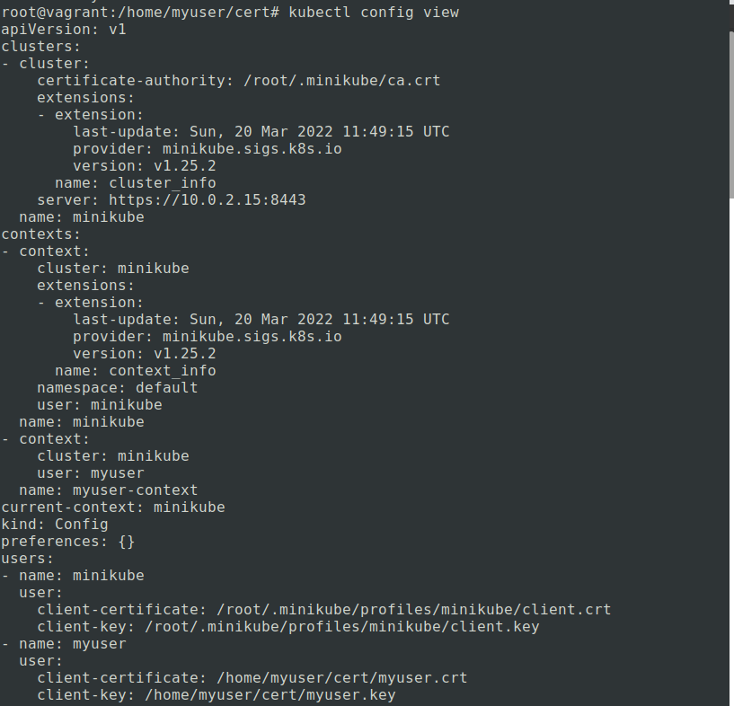
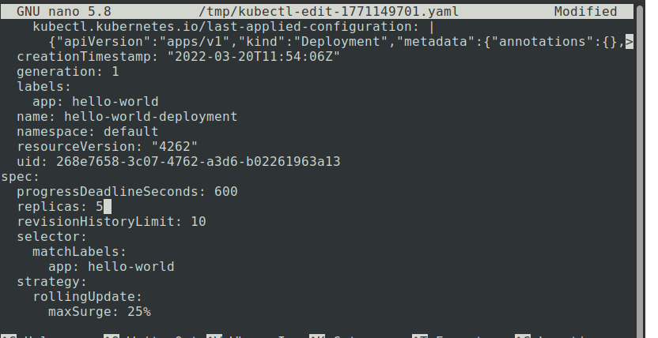
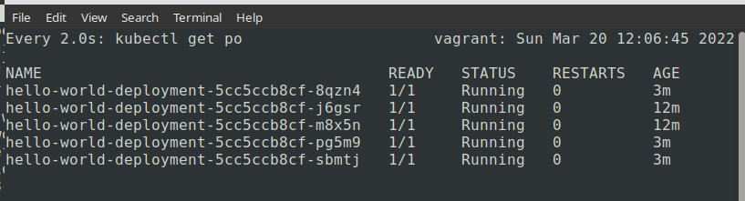

# Домашнее задание к занятию "12.2 Команды для работы с Kubernetes"
Кластер — это сложная система, с которой крайне редко работает один человек. Квалифицированный devops умеет наладить работу всей команды, занимающейся каким-либо сервисом.
После знакомства с кластером вас попросили выдать доступ нескольким разработчикам. Помимо этого требуется служебный аккаунт для просмотра логов.

## Задание 1: Запуск пода из образа в деплойменте
Для начала следует разобраться с прямым запуском приложений из консоли. Такой подход поможет быстро развернуть инструменты отладки в кластере. 
Требуется запустить деплоймент на основе образа из hello world уже через deployment. Сразу стоит запустить 2 копии приложения (replicas=2). 

Требования:
 * пример из hello world запущен в качестве deployment
 * количество реплик в deployment установлено в 2
 * наличие deployment можно проверить командой kubectl get deployment
 * наличие подов можно проверить командой kubectl get pods

### Ответ
[Файл деплоймент](hello-world-deployment.yml)  
Команды:  
```bash
kubectl apply -f hello-world-deployment.yml
kubectl get deployments
kubectl get pods
```

Проверка:  


## Задание 2: Просмотр логов для разработки
Разработчикам крайне важно получать обратную связь от штатно работающего приложения и, еще важнее, об ошибках в его работе. 
Требуется создать пользователя и выдать ему доступ на чтение конфигурации и логов подов в app-namespace.

Требования: 
 * создан новый токен доступа для пользователя
 * пользователь прописан в локальный конфиг (~/.kube/config, блок users)
 * пользователь может просматривать логи подов и их конфигурацию (kubectl logs pod <pod_id>, kubectl describe pod <pod_id>)

### Ответ
Были использованы ресурсы [kubernetes for beginners](https://github.com/aak74/kubernetes-for-beginners/tree/master/authentication/rbac), 
[сайт medium](https://medium.com/@HoussemDellai/rbac-with-kubernetes-in-minikube-4deed658ea7b) и [документация](https://kubernetes.io/docs/reference/access-authn-authz/rbac/).  

- Создан пользователь  
```bash
root@vagrant:/home/vagrant# useradd myuser && cd /home/myuser && mkdir cert && cd cert
```
- Создан ключ  
```bash
root@vagrant:/home/myuser/cert# openssl req -new -key myuser.key
```
- Создан запрос на подпись сертификата (CSR - certificate signing request); в данном случае без группы
```bash
root@vagrant:/home/myuser/cert# openssl req -new -key myuser.key -out myuser.csr -subj "/CN=myuser"
```
- Сгенерирован сертификат (CRT) сроком 500 дней, используя ключ из ~/.minikube  
```bash
root@vagrant:/home/myuser/cert# openssl x509 -req -in myuser.csr -CA ~/.minikube/ca.crt -CAkey ~/.minikube/ca.key -CAcreateserial -out myuser.crt -days 500
Signature ok
subject=CN = myuser
Getting CA Private Key
```
- Создан пользователь и контекст в kubeconfig  
```bash
root@vagrant:/home/myuser/cert# kubectl config set-credentials myuser --client-certificate=myuser.crt --client-key=myuser.key
User "myuser" set.
root@vagrant:/home/myuser/cert# kubectl config set-context myuser-context --cluster=minikube --user=myuser
Context "myuser-context" created.
```
В результате в конфиге `kubectl config view` появляется запись с новым пользователем и контекстом:  
  
Изначально у пользователя нет прав:  
```bash
root@vagrant:/home/myuser# kubectl config use-context myuser-context
Switched to context "myuser-context".
root@vagrant:/home/myuser# kubectl get po
Error from server (Forbidden): pods is forbidden: User "myuser" cannot list resource "pods" in API group "" in the namespace "default"
```
- Даны необходимые права пользователю (используя контекст `minikube`) - созданы роль с помощью файла [role.yml](role.yml) и привязка пользователя к роли
с помощью файла [role-binding.yml](role-binding.yml)
```bash
root@vagrant:/home/myuser# kubectl config use-context minikube
Switched to context "minikube".
root@vagrant:/home/myuser# kubectl apply -f role.yml
role.rbac.authorization.k8s.io/pod-reader created
root@vagrant:/home/myuser# kubectl apply -f role-binding.yml
rolebinding.rbac.authorization.k8s.io/read-pods created
root@vagrant:/home/myuser# kubectl get roles
NAME         CREATED AT
pod-reader   2022-03-20T12:27:33Z
root@vagrant:/home/myuser# kubectl get rolebindings
NAME        ROLE              AGE
read-pods   Role/pod-reader   21s
```
- Для проверки использован контекст пользователя
```bash
root@vagrant:/home/myuser# kubectl config use-context myuser-context
Switched to context "myuser-context".
root@vagrant:/home/myuser# kubectl get po
NAME                                      READY   STATUS    RESTARTS   AGE
hello-world-deployment-5cc5ccb8cf-8qzn4   1/1     Running   0          27m
hello-world-deployment-5cc5ccb8cf-j6gsr   1/1     Running   0          37m
...
root@vagrant:/home/myuser# kubectl describe po hello-world-deployment-5cc5ccb8cf-8qzn4
Name:         hello-world-deployment-5cc5ccb8cf-8qzn4
Namespace:    default
Priority:     0
Node:         vagrant/10.0.2.15
...
root@vagrant:/home/myuser# kubectl logs hello-world-deployment-5cc5ccb8cf-8qzn4
...
```

## Задание 3: Изменение количества реплик 
Поработав с приложением, вы получили запрос на увеличение количества реплик приложения для нагрузки. Необходимо изменить запущенный deployment, увеличив количество реплик до 5. Посмотрите статус запущенных подов после увеличения реплик. 

Требования:
 * в deployment из задания 1 изменено количество реплик на 5
 * проверить что все поды перешли в статус running (kubectl get pods)
 
### Ответ
Вызываем `watch kubectl get po`, мониторим изменения.  

Выполняем команду редактирования, меняем значение replicas на 5:   
```bash
kubectl edit deploy hello-world-deployment
```



Результат `watch`:  
