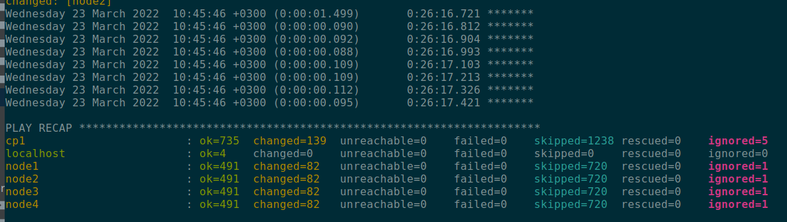
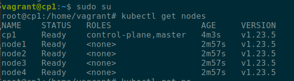
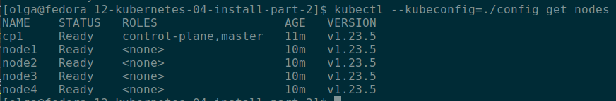

# Домашнее задание к занятию "12.4 Развертывание кластера на собственных серверах, лекция 2"
Новые проекты пошли стабильным потоком. Каждый проект требует себе несколько кластеров: под тесты и продуктив. Делать все руками — не вариант, поэтому стоит автоматизировать подготовку новых кластеров.

## Задание 1: Подготовить инвентарь kubespray
Новые тестовые кластеры требуют типичных простых настроек. Нужно подготовить инвентарь и проверить его работу. Требования к инвентарю:
* подготовка работы кластера из 5 нод: 1 мастер и 4 рабочие ноды;
* в качестве CRI — containerd;
* запуск etcd производить на мастере.

### Ответ

С помощью [Vagrantfile](Vagrantfile) сгенерированы виртуальные машины - 1 мастер-нода и 4 рабочих ноды. Изначально в рабочих 
нодах был указан 1Гб памяти, но этого не хватило, поэтому повысила до 1500 Мб.  
Также скопирован путь к ssh ключам из вывода команды `vagrant ssh-config` (впоследствии используется в `hosts.yaml`).  
```bash
vagrant init
vagrant up
vagrant ssh-config | grep IdentityFile
```

Склонирован репозиторий `https://github.com/kubernetes-sigs/kubespray`, создано виртуальное окружение, установлены зависимости, 
создан новый `inventory`, сгенерирован `hosts.yml` сначала со случайными адресами (редактирование впоследствии осуществлено вручную.)
```bash
[olga@fedora devops]$ git clone https://github.com/kubernetes-sigs/kubespray.git
[olga@fedora devops]$ cd ./kubespray
[olga@fedora kubespray]$ python3 -m venv venv_kuber
[olga@fedora kubespray]$ . venv_kuber/bin/activate
(venv_kuber) [olga@fedora kubespray]$ pip3 install -r requirements.txt
(venv_kuber) [olga@fedora kubespray]$ cp -rfp inventory/sample inventory/mycluster
(venv_kuber) [olga@fedora kubespray]$ declare -a IPS=(10.10.1.3 10.10.1.4 10.10.1.5)
CONFIG_FILE=inventory/mycluster/hosts.yaml python3 contrib/inventory_builder/inventory.py ${IPS[@]}
```

Выполнено редактирование [hosts.yaml](mycluster/hosts.yaml) - добавлены пути к приватным ssh-ключам, ip-адреса, 
определено, что относится к `kube_control_plane`, а что - к `kube_node`. `etcd` развёрнут на `cp1`, т.е. мастере (согласно заданию).  

В [all.yml](mycluster/group_vars/all/all.yml) добавлен loadbalancer с ip-адресом мастер-ноды:  
```yaml
loadbalancer_apiserver:
  address: 192.168.56.50
  port: 6443
```  
Это нужно для того, чтобы потом можно было обратиться с хостовой машины к кластеру. Иначе возникает ошибка, что сертификат выписан только 
на внутренние адреса.  

В [k8s-cluster.yml](mycluster/group_vars/k8s_cluster/k8s-cluster.yml) выбран containerd в качестве CRI (это и так было по умолчанию):  
```yaml
container_manager: containerd
```  

Там же скорректированы подсети (в `kube_pods_subnet` `10.233.64.0/18` заменено на `10.244.64.0/18`). Иначе в конце установки возникала ошибка `callico`.
```yaml
# Kubernetes internal network for services, unused block of space.
kube_service_addresses: 10.233.0.0/18

# internal network. When used, it will assign IP
# addresses from this range to individual pods.
# This network must be unused in your network infrastructure!
kube_pods_subnet: 10.244.64.0/18
```  

После ошибок установки приходилось делать reset командой `ansible-playbook -i inventory/mycluster/hosts.yaml  --become --become-user=root reset.yml`, а 
при редактировании подсетей - пересоздавать виртуалки.   

Итоговый запуск для создания кластера:  
```bash
[olga@fedora kubespray]$ ansible-playbook -i inventory/mycluster/hosts.yaml  --become --become-user=root cluster.yml -vvv
```

Результат работы `playbook`:  


Проверка на мастер-ноде:  
```bash
[olga@fedora vagrant4-kubernetes]$ vagrant ssh cp1
vagrant@cp1:~$ sudo su
root@cp1:/home/vagrant# kubectl get nodes
NAME    STATUS   ROLES                  AGE     VERSION
cp1     Ready    control-plane,master   4m3s    v1.23.5
node1   Ready    <none>                 2m57s   v1.23.5
node2   Ready    <none>                 2m57s   v1.23.5
node3   Ready    <none>                 2m57s   v1.23.5
node4   Ready    <none>                 2m57s   v1.23.5
```


С мастер-ноды скопирован [конфиг](config):  
```bash
root@cp1:/home/vagrant# cat /etc/kubernetes/admin.conf
```
В нём `server: https://lb-apiserver.kubernetes.local:6443` заменено на `server: https://192.168.56.50:6443`.  
Результат вызова на хостовой машине:  
```bash
[olga@fedora 12-kubernetes-04-install-part-2]$ kubectl --kubeconfig=./config get nodes
NAME    STATUS   ROLES                  AGE   VERSION
cp1     Ready    control-plane,master   11m   v1.23.5
node1   Ready    <none>                 10m   v1.23.5
node2   Ready    <none>                 10m   v1.23.5
node3   Ready    <none>                 10m   v1.23.5
node4   Ready    <none>                 10m   v1.23.5
```


После окончания работы выполнено `deactivate` для виртуального окружения и `vagrant suspend`.


## Задание 2 (*): подготовить и проверить инвентарь для кластера в AWS
Часть новых проектов хотят запускать на мощностях AWS. Требования похожи:
* разворачивать 5 нод: 1 мастер и 4 рабочие ноды;
* работать должны на минимально допустимых EC2 — t3.small.


