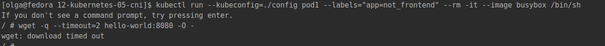

# Домашнее задание к занятию "12.5 Сетевые решения CNI"
После работы с Flannel появилась необходимость обеспечить безопасность для приложения. Для этого лучше всего подойдет Calico.

## Задание 1: установить в кластер CNI плагин Calico
Для проверки других сетевых решений стоит поставить отличный от Flannel плагин — например, Calico. Требования:
* установка производится через ansible/kubespray;
* после применения следует настроить политику доступа к hello-world извне. Инструкции [kubernetes.io](https://kubernetes.io/docs/concepts/services-networking/network-policies/), [Calico](https://docs.projectcalico.org/about/about-network-policy)

### Ответ
Установка кластера произведена в [прошлом ДЗ](../12-kubernetes-04-install-part-2/README.md), плагин по умолчанию был calico
(см. [k8s-cluster.yml](../12-kubernetes-04-install-part-2/mycluster/group_vars/k8s_cluster/k8s-cluster.yml) строку `kube_network_plugin: calico`). 
[Конфиг](../12-kubernetes-04-install-part-2/config) используем тот же.  

Для п.2 (настройка политики доступа) использованы также материалы из [20-network-policy](https://github.com/aak74/kubernetes-for-beginners/tree/master/16-networking/20-network-policy) 
и [туториала](https://docs.projectcalico.org/security/tutorials/kubernetes-policy-basic)

Создаём неймспейс `test`:  
```bash
[olga@fedora 12-kubernetes-05-cni]$ kubectl --kubeconfig=./config create ns test
namespace/test created
[olga@fedora 12-kubernetes-05-cni]$ kubectl --kubeconfig=./config config set-context --current --namespace=test
Context "kubernetes-admin@cluster.local" modified.
```

Разворачиваем 2 деплоймента с сервисами - `hello-world` (на основе образа `k8s.gcr.io/echoserver:1.4` - из ДЗ 12.01) 
и `frontend` (для тестирования доступа к `hello-world`, на основе образа `praqma/network-multitool:alpine-extra`).  
См. [hello-world.yml](./basic/hello-world.yml) и [frontend.yml](./basic/frontend.yml).  
```bash
[olga@fedora 12-kubernetes-05-cni]$ kubectl --kubeconfig=./config apply -f ./basic/
deployment.apps/frontend created
service/frontend created
deployment.apps/hello-world created
service/hello-world created
[olga@fedora 12-kubernetes-05-cni]$ kubectl --kubeconfig=./config get po -o wide
NAME                          READY   STATUS    RESTARTS   AGE    IP             NODE    NOMINATED NODE   READINESS GATES
frontend-8645d9cb9c-j5h27     1/1     Running   0          17m     10.244.105.1   node4   <none>           <none>
hello-world-bd79c8b9f-7kwtv   1/1     Running   0          4m25s   10.244.96.1    node2   <none>           <none>
```


Первичная проверка доступности между подами (без настроек политики доступа):  
```bash
[olga@fedora 12-kubernetes-05-cni]$ kubectl --kubeconfig=./config exec frontend-8645d9cb9c-j5h27 -- curl -s -m 1 hello-world:8080
[olga@fedora 12-kubernetes-05-cni]$ kubectl --kubeconfig=./config exec -it hello-world-bd79c8b9f-7kwtv -- /bin/bash
root@hello-world-bd79c8b9f-7kwtv:/# curl frontend
Praqma Network MultiTool (with NGINX) - frontend-8645d9cb9c-j5h27 - 10.244.105.1
```


Таким образом, все поды доступны.  

Теперь применяем [политики доступа](./network-policy).  
Сначала включаем режим `deny all` (см. [1-default.yml](./network-policy/1-default.yml)), т.е. запрещаем все входящие соединения для всех подов. 
```bash
[olga@fedora 12-kubernetes-05-cni]$ kubectl --kubeconfig=./config apply -f network-policy/1-default.yml
networkpolicy.networking.k8s.io/default-deny-ingress created
```

Проверяем доступность тем же способом - доступов нет:


Теперь применяем сетевые политики - см. [2-frontend.yml](./network-policy/2-frontend.yml) и [3-hello-world.yml](./network-policy/3-hello-world.yml).  
```bash
[olga@fedora 12-kubernetes-05-cni]$ kubectl --kubeconfig=./config apply -f network-policy/
networkpolicy.networking.k8s.io/default-deny-ingress unchanged
networkpolicy.networking.k8s.io/frontend created
networkpolicy.networking.k8s.io/hello-world created
[olga@fedora 12-kubernetes-05-cni]$ kubectl --kubeconfig=./config get networkpolicies
NAME                   POD-SELECTOR      AGE
default-deny-ingress   <none>            10m
frontend               app=frontend      21s
hello-world            app=hello-world   21s
```

Проверяем доступность, доступ из `frontend` в `hello-world` есть:  
  

Пробуем запустить поды с метками `app`:`frontend` и `app`:`not_frontend` - из первого доступ к `hello-world` есть, из второго - нет:  
```bash
[olga@fedora 12-kubernetes-05-cni]$ kubectl run --kubeconfig=./config pod1 --labels="app=frontend" --rm -it --image busybox /bin/sh
If you don't see a command prompt, try pressing enter.
/ # wget -q --timeout=2 hello-world:8080 -O -
CLIENT VALUES:
client_address=10.244.90.6
[olga@fedora 12-kubernetes-05-cni]$ kubectl run --kubeconfig=./config pod1 --labels="app=not_frontend" --rm -it --image busybox /bin/sh
If you don't see a command prompt, try pressing enter.
/ # wget -q --timeout=2 hello-world:8080 -O -
wget: download timed out
```

  
  

## Задание 2: изучить, что запущено по умолчанию
Самый простой способ — проверить командой calicoctl get <type>. Для проверки стоит получить список нод, ipPool и profile.
Требования:
* установить утилиту calicoctl;
* получить 3 вышеописанных типа в консоли.

### Ответ
На [сайте](https://projectcalico.docs.tigera.io/maintenance/clis/calicoctl/install) было несколько вариантов установки 
`calicoctl`. Я выбрала установку как Kubernetes pod. В `kubespray/roles/kubespray-defaults/defaults/main.yaml` прописан `calico_datastore: "kdd"`.  
Поэтому использовался файл `https://projectcalico.docs.tigera.io/manifests/calicoctl.yaml`. Однако пришлось понять версию `image: calico/ctl:v3.21.4`, иначе не работало. 
Итоговый файл - [calicoctl.yaml](calicoctl.yaml)
```bash
[olga@fedora 12-kubernetes-05-cni]$ kubectl --kubeconfig=./config apply -f calicoctl.yaml
serviceaccount/calicoctl created
pod/calicoctl created
clusterrole.rbac.authorization.k8s.io/calicoctl created
clusterrolebinding.rbac.authorization.k8s.io/calicoctl created
[olga@fedora 12-kubernetes-05-cni]$ kubectl --kubeconfig=./config -n kube-system get po -o wide | grep calicoctl
calicoctl                                  1/1     Running   0          94s    192.168.56.51   node1   <none>           <none>
[olga@fedora 12-kubernetes-05-cni]$ kubectl --kubeconfig=./config exec -it -n kube-system calicoctl -- /calicoctl get profiles -o wide
NAME                                                 LABELS                                                                                         
projectcalico-default-allow                                                                                                                         
kns.default                                          pcns.kubernetes.io/metadata.name=default,pcns.projectcalico.org/name=default                   
kns.kube-node-lease                                  pcns.kubernetes.io/metadata.name=kube-node-lease,pcns.projectcalico.org/name=kube-node-lease   
kns.kube-public                                      pcns.kubernetes.io/metadata.name=kube-public,pcns.projectcalico.org/name=kube-public           
kns.kube-system                                      pcns.kubernetes.io/metadata.name=kube-system,pcns.projectcalico.org/name=kube-system           
kns.test                                             pcns.kubernetes.io/metadata.name=test,pcns.projectcalico.org/name=test      
...
[olga@fedora 12-kubernetes-05-cni]$ kubectl --kubeconfig=./config exec -it -n kube-system calicoctl -- /calicoctl get nodes -o wide
NAME    ASN       IPV4               IPV6   
cp1     (64512)   192.168.56.50/24          
node1   (64512)   192.168.56.51/24          
node2   (64512)   192.168.56.52/24          
node3   (64512)   192.168.56.53/24          
node4   (64512)   192.168.56.54/24   

[olga@fedora 12-kubernetes-05-cni]$ kubectl --kubeconfig=./config exec -it -n kube-system calicoctl -- /calicoctl get ipPool -o wide
NAME           CIDR             NAT    IPIPMODE   VXLANMODE   DISABLED   DISABLEBGPEXPORT   SELECTOR   
default-pool   10.244.64.0/18   true   Never      Always      false      false              all()    
```  

  
  
