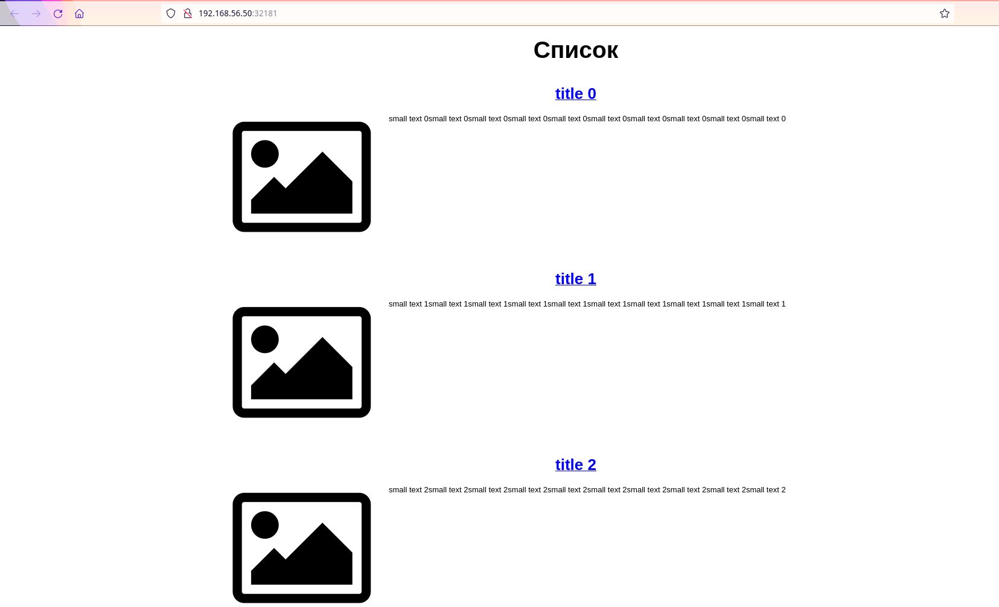
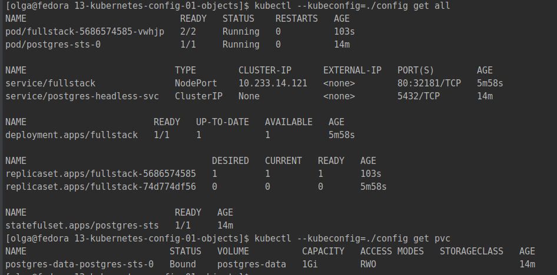
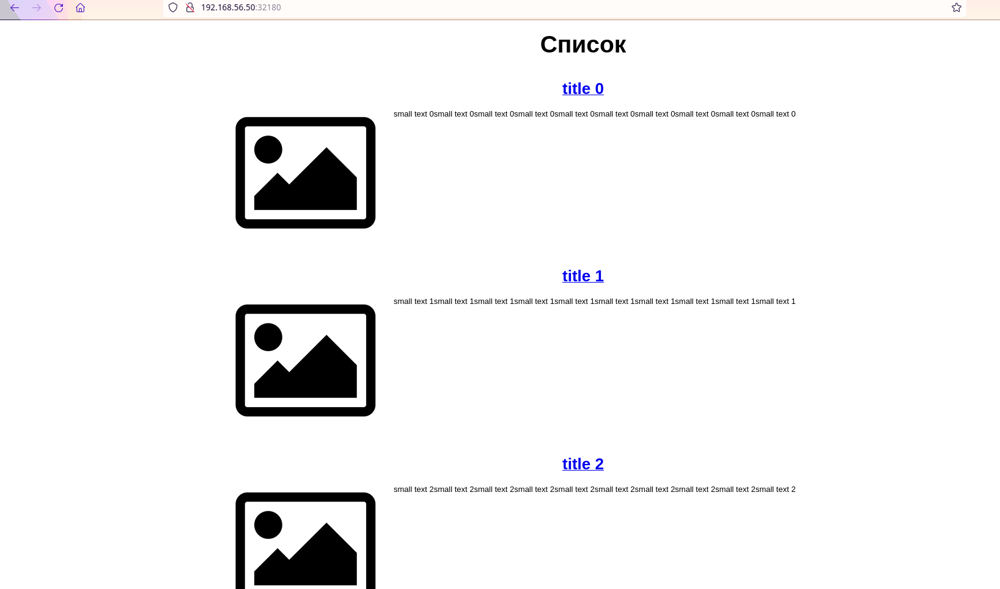
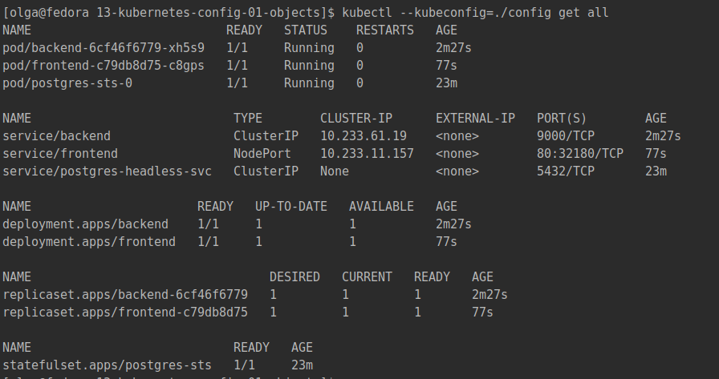

# Домашнее задание к занятию "13.1 контейнеры, поды, deployment, statefulset, services, endpoints"
Настроив кластер, подготовьте приложение к запуску в нём. Приложение стандартное: бекенд, фронтенд, база данных. Его можно найти в папке 13-kubernetes-config.

## Задание 1: подготовить тестовый конфиг для запуска приложения
Для начала следует подготовить запуск приложения в stage окружении с простыми настройками. Требования:
* под содержит в себе 2 контейнера — фронтенд, бекенд;
* регулируется с помощью deployment фронтенд и бекенд;
* база данных — через statefulset.

### Ответ

Использовался кластер Kubernetes, установленный в прошлых ДЗ. Предварительно из него были удалены все объекты, в т.ч. NetworkPolicy. 
Оставлены 2 рабочих ноды и 1 мастер нода (остальные закомментированы в vagrant). [Конфиг](config) для `kubectl` на хосте.

##### Образы для приложения

Использовано приложение из [13-kubernetes-config](../13-kubernetes-config), но с некоторыми модификациями во frontend:
- конфиг для `nginx` сделан шаблоном, куда будет подставлен адрес backend из переменных окружения: 
в файле [demo.conf](../13-kubernetes-config/frontend/demo.conf) добавлено:  
```text
upstream backend_service {
    server ${BACKEND_HOST};
}
server {
...
    location /api {
        proxy_pass http://backend_service/api;
    }
}
```
Таким образом, `BACKEND_HOST` - это переменная с адресом бекенда.  
web-страницу мы отдаём клиенту, а оттуда не должно быть доступа напрямую к бекенду. Поэтому запрос с web-страницы будем делать 
на `nginx`, а затем проксировать изнутри контейнера с фронтендом в бекенд. Все запросы к бекенду начинаются на `api`, для него 
добавляем соответствующий `proxy_pass`.
- в связи с п.1 переменная `BASE_URL` из файла [.env](../13-kubernetes-config/frontend/.env) по факту не требуется,
поэтому будет равна пустой строке (чтобы не нарушать логику приложения).
- в [Dockerfile](../13-kubernetes-config/frontend/Dockerfile) заменена последняя строка на `ADD demo.conf /etc/nginx/templates/default.conf.conf`. 
Т.е. наш конфиг добавляем в специальную папку с шаблонами. 
Согласно [сайту](https://stackoverflow.com/questions/56649582/substitute-environment-variables-in-nginx-config-from-docker-compose/62844707#62844707), 
шаблон нужно положить в эту папку, прописать потом в переменных окружения `NGINX_ENVSUBST_TEMPLATE_SUFFIX` (`.conf` - дополнительный суффикс для файла с шаблоном). 
Тогда при старте `nginx` обрабатывает файл, подставляет переменные окружения и копирует созданный конфиг в `/etc/nginx/conf.d/default.conf`.

Далее собраны образы на основе `Dockerfile` и запушены в docker-hub.
```bash
[olga@fedora backend]$ docker build -t backend .
[olga@fedora frontend]$ docker build -t frontend .
[olga@fedora frontend]$ docker push anguisa/backend
[olga@fedora frontend]$ docker push anguisa/frontend
```
Образы - [frontend](https://hub.docker.com/repository/docker/anguisa/frontend) и [backend](https://hub.docker.com/repository/docker/anguisa/backend).  

##### База данных

Для обоих заданий база разворачивается одинаково. Использована [статья](https://devopscube.com/deploy-postgresql-statefulset/).  
Для базы созданы объекты: `PersistentVolume`, `StatefulSet` с `livenessProbe` и `readinessProbe`, `Service`.  
Доступ к базе - через сервис типа `ClusterIP`.  
Файл для деплоя - [postgres.yml](postgres.yml).  

```bash
[olga@fedora 13-kubernetes-config-01-objects]$ kubectl --kubeconfig=./config apply -f postgres.yml
persistentvolume/postgres-data created
statefulset.apps/postgres-sts created
service/postgres-headless-svc created
[olga@fedora 13-kubernetes-config-01-objects]$ kubectl --kubeconfig=./config get pvc
NAME                           STATUS   VOLUME          CAPACITY   ACCESS MODES   STORAGECLASS   AGE
postgres-data-postgres-sts-0   Bound    postgres-data   1Gi        RWO                           5s
[olga@fedora 13-kubernetes-config-01-objects]$ kubectl --kubeconfig=./config get svc
NAME                    TYPE        CLUSTER-IP   EXTERNAL-IP   PORT(S)    AGE
postgres-headless-svc   ClusterIP   None         <none>        5432/TCP   17s
[olga@fedora 13-kubernetes-config-01-objects]$ kubectl --kubeconfig=./config get po
NAME             READY   STATUS    RESTARTS   AGE
postgres-sts-0   1/1     Running   0          23s
```

##### Fullstack

Файл для деплоя пода с 2 контейнерами (бекенд и фронтенд) - [fullstack.yml](stage/fullstack.yml).  
Доступ к бекенду из фронтенда будет по `BACKEND_HOST`==`localhost:9000` через `nginx`. В данном случае контейнеры в одном поде, 
поэтому видят друг друга через `localhost`.  
Доступ к фронтенду - через сервис типа `NodePort`.  
Запуск: `kubectl --kubeconfig=./config apply -f stage/fullstack.yml`  

Проверка доступа по ссылке [http://192.168.56.50:32181/](http://192.168.56.50:32181/):  


Объекты Kubernetes:  
```bash
[olga@fedora 13-kubernetes-config-01-objects]$ kubectl --kubeconfig=./config get all 
NAME                             READY   STATUS    RESTARTS   AGE
pod/fullstack-5686574585-vwhjp   2/2     Running   0          103s
pod/postgres-sts-0               1/1     Running   0          14m

NAME                            TYPE        CLUSTER-IP      EXTERNAL-IP   PORT(S)        AGE
service/fullstack               NodePort    10.233.14.121   <none>        80:32181/TCP   5m58s
service/postgres-headless-svc   ClusterIP   None            <none>        5432/TCP       14m

NAME                        READY   UP-TO-DATE   AVAILABLE   AGE
deployment.apps/fullstack   1/1     1            1           5m58s

NAME                                   DESIRED   CURRENT   READY   AGE
replicaset.apps/fullstack-5686574585   1         1         1       103s
replicaset.apps/fullstack-74d774df56   0         0         0       5m58s

NAME                            READY   AGE
statefulset.apps/postgres-sts   1/1     14m
[olga@fedora 13-kubernetes-config-01-objects]$ kubectl --kubeconfig=./config get pvc
NAME                           STATUS   VOLUME          CAPACITY   ACCESS MODES   STORAGECLASS   AGE
postgres-data-postgres-sts-0   Bound    postgres-data   1Gi        RWO                           14m
```

Скрин:  


## Задание 2: подготовить конфиг для production окружения
Следующим шагом будет запуск приложения в production окружении. Требования сложнее:
* каждый компонент (база, бекенд, фронтенд) запускаются в своем поде, регулируются отдельными deployment’ами;
* для связи используются service (у каждого компонента свой);
* в окружении фронта прописан адрес сервиса бекенда;
* в окружении бекенда прописан адрес сервиса базы данных.

### Ответ

Образы и настройки базы те же. Меняется только деплой фронтенда и бекенда.

##### Бекенд
Файл для деплоя - [backend.yml](prod/backend.yml).  
Доступ к базе - через сервис по `DATABASE_URL`.  
Доступ к бекенду - через сервис типа `ClusterIP`.  
Запуск: `kubectl --kubeconfig=./config apply -f prod/backend.yml`

##### Фротенд
Файл для деплоя - [frontend.yml](prod/frontend.yml).  
Доступ к бекенду - через сервис по `BACKEND_HOST`.  
Доступ к фронтенду - через сервис типа `NodePort`.  
Запуск: `kubectl --kubeconfig=./config apply -f prod/frontend.yml`  

Проверка доступа по ссылке [http://192.168.56.50:32180/](http://192.168.56.50:32180/):  
  

Объекты Kubernetes:
```bash
[olga@fedora 13-kubernetes-config-01-objects]$ kubectl --kubeconfig=./config get all 
NAME                           READY   STATUS    RESTARTS   AGE
pod/backend-6cf46f6779-xh5s9   1/1     Running   0          2m27s
pod/frontend-c79db8d75-c8gps   1/1     Running   0          77s
pod/postgres-sts-0             1/1     Running   0          23m

NAME                            TYPE        CLUSTER-IP      EXTERNAL-IP   PORT(S)        AGE
service/backend                 ClusterIP   10.233.61.19    <none>        9000/TCP       2m27s
service/frontend                NodePort    10.233.11.157   <none>        80:32180/TCP   77s
service/postgres-headless-svc   ClusterIP   None            <none>        5432/TCP       23m

NAME                       READY   UP-TO-DATE   AVAILABLE   AGE
deployment.apps/backend    1/1     1            1           2m27s
deployment.apps/frontend   1/1     1            1           77s

NAME                                 DESIRED   CURRENT   READY   AGE
replicaset.apps/backend-6cf46f6779   1         1         1       2m27s
replicaset.apps/frontend-c79db8d75   1         1         1       77s

NAME                            READY   AGE
statefulset.apps/postgres-sts   1/1     23m
```

Скрин:  



## Задание 3 (*): добавить endpoint на внешний ресурс api
Приложению потребовалось внешнее api, и для его использования лучше добавить endpoint в кластер, направленный на это api. Требования:
* добавлен endpoint до внешнего api (например, геокодер).

---

### Как оформить ДЗ?

Выполненное домашнее задание пришлите ссылкой на .md-файл в вашем репозитории.

В качестве решения прикрепите к ДЗ конфиг файлы для деплоя. Прикрепите скриншоты вывода команды kubectl со списком запущенных объектов каждого типа (pods, deployments, statefulset, service) или скриншот из самого Kubernetes, что сервисы подняты и работают.

---
