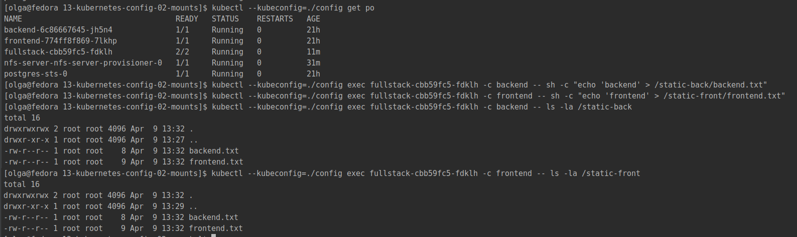
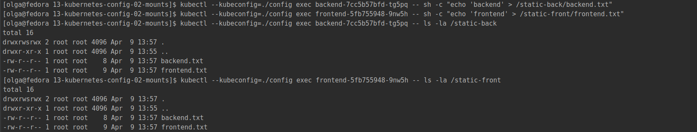
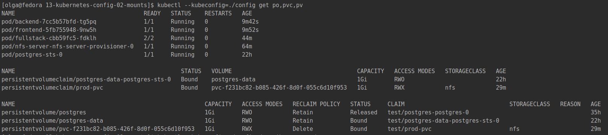
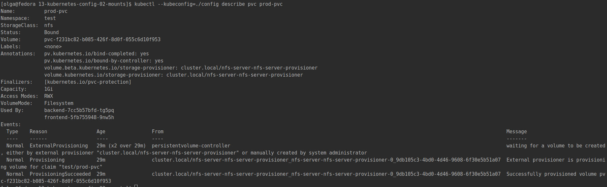

# Домашнее задание к занятию "13.2 разделы и монтирование"
Приложение запущено и работает, но время от времени появляется необходимость передавать между бекендами данные. А сам бекенд генерирует статику для фронта. Нужно оптимизировать это.
Для настройки NFS сервера можно воспользоваться следующей инструкцией (производить под пользователем на сервере, у которого есть доступ до kubectl):
* установить helm: curl https://raw.githubusercontent.com/helm/helm/master/scripts/get-helm-3 | bash
* добавить репозиторий чартов: helm repo add stable https://charts.helm.sh/stable && helm repo update
* установить nfs-server через helm: helm install nfs-server stable/nfs-server-provisioner

В конце установки будет выдан пример создания PVC для этого сервера.

### Настройка NFS
Установка и проверка успешности:  
```bash
[olga@fedora ~]$ curl https://raw.githubusercontent.com/helm/helm/master/scripts/get-helm-3 | bash
[olga@fedora 13-kubernetes-config-02-mounts]$ helm repo add stable https://charts.helm.sh/stable && helm repo update
[olga@fedora 13-kubernetes-config-02-mounts]$ helm install nfs-server stable/nfs-server-provisioner --kubeconfig ./config
WARNING: Kubernetes configuration file is group-readable. This is insecure. Location: ./config
WARNING: Kubernetes configuration file is world-readable. This is insecure. Location: ./config
WARNING: This chart is deprecated
NAME: nfs-server
LAST DEPLOYED: Sat Apr  9 16:00:51 2022
NAMESPACE: test
STATUS: deployed
REVISION: 1
TEST SUITE: None
NOTES:
The NFS Provisioner service has now been installed.

A storage class named 'nfs' has now been created
and is available to provision dynamic volumes.

You can use this storageclass by creating a `PersistentVolumeClaim` with the
correct storageClassName attribute. For example:

    ---
    kind: PersistentVolumeClaim
    apiVersion: v1
    metadata:
      name: test-dynamic-volume-claim
    spec:
      storageClassName: "nfs"
      accessModes:
        - ReadWriteOnce
      resources:
        requests:
          storage: 100Mi
[olga@fedora 13-kubernetes-config-02-mounts]$ kubectl --kubeconfig=./config get po,svc,sts
NAME                                      READY   STATUS    RESTARTS   AGE
pod/backend-6c86667645-jh5n4              1/1     Running   0          21h
pod/frontend-774ff8f869-7lkhp             1/1     Running   0          21h
pod/fullstack-5799b95669-fjrrr            2/2     Running   0          21h
pod/nfs-server-nfs-server-provisioner-0   1/1     Running   0          2m34s
pod/postgres-sts-0                        1/1     Running   0          21h

NAME                                        TYPE        CLUSTER-IP      EXTERNAL-IP   PORT(S)                                                                                                     AGE
service/backend                             ClusterIP   10.233.19.216   <none>        9000/TCP                                                                                                    21h
service/frontend                            NodePort    10.233.35.116   <none>        80:32180/TCP                                                                                                21h
service/fullstack                           NodePort    10.233.14.86    <none>        80:32181/TCP                                                                                                21h
service/nfs-server-nfs-server-provisioner   ClusterIP   10.233.41.139   <none>        2049/TCP,2049/UDP,32803/TCP,32803/UDP,20048/TCP,20048/UDP,875/TCP,875/UDP,111/TCP,111/UDP,662/TCP,662/UDP   2m34s
service/postgres-headless-svc               ClusterIP   None            <none>        5432/TCP                                                                                                    21h

NAME                                                 READY   AGE
statefulset.apps/nfs-server-nfs-server-provisioner   1/1     2m34s
statefulset.apps/postgres-sts                        1/1     21h
```

Дополнительно заходим на все ноды и устанавливаем там `nfs-common`:  
```bash
vagrant@node1:~$ sudo apt install nfs-common
```

Для выполнения заданий использованы 2 варианта приложения, которые подняты в ДЗ [13-kubernetes-config-01-objects](../13-kubernetes-config-01-objects).  
В настройки базы изменения не вносились.

## Задание 1: подключить для тестового конфига общую папку
В stage окружении часто возникает необходимость отдавать статику бекенда сразу фронтом. Проще всего сделать это через общую папку. Требования:
* в поде подключена общая папка между контейнерами (например, /static);
* после записи чего-либо в контейнере с беком файлы можно получить из контейнера с фронтом.

### Ответ
Для stage будет использован обычный volume типа emptyDir. После перезапуска том будет пустым.
Для этого внесены следующие изменения в deployment [fullstack.yml](./stage/fullstack.yml):
- добавлен блок `volumes`:
```yaml
      volumes:
        - name: stage-volume
          emptyDir: {}
```
- в каждый контейнер добавлен блок `volumeMounts` (пути для демонстрации сделаны разные):  

в фронт:  
```yaml
          volumeMounts:
            - mountPath: "/static-front"
              name: stage-volume
```  
и в бэк:
```yaml
          volumeMounts:
            - mountPath: "/static-back"
              name: stage-volume
```

Проверка:  
```bash
kubectl --kubeconfig=./config apply -f stage/fullstack.yml

# Создаем файл в контейнере backend 
kubectl --kubeconfig=./config exec fullstack-cbb59fc5-fdklh -c backend -- sh -c "echo 'backend' > /static-back/backend.txt"

# Создаем файл в контейнере frontend 
kubectl --kubeconfig=./config exec fullstack-cbb59fc5-fdklh -c frontend -- sh -c "echo 'frontend' > /static-front/frontend.txt"

# Проверяем файлы в контейнере backend 
kubectl --kubeconfig=./config exec fullstack-cbb59fc5-fdklh -c backend -- ls -la /static-back

# Проверяем файлы в контейнере frontend 
kubectl --kubeconfig=./config exec fullstack-cbb59fc5-fdklh -c frontend -- ls -la /static-front
```

Скрин:  


## Задание 2: подключить общую папку для прода
Поработав на stage, доработки нужно отправить на прод. В продуктиве у нас контейнеры крутятся в разных подах, поэтому потребуется PV и связь через PVC. Сам PV должен быть связан с NFS сервером. Требования:
* все бекенды подключаются к одному PV в режиме ReadWriteMany;
* фронтенды тоже подключаются к этому же PV с таким же режимом;
* файлы, созданные бекендом, должны быть доступны фронту.

### Ответ
Для прода создан манифест для PVC - [prod-pvc.yml](prod/prod-pvc.yml) - с указанием nfs в storageClassName и ReadWriteMany в accessModes, 
а также внесены следующие изменения:  

в deployment [backend.yml](./prod/backend.yml):
- добавлен блок `volumes`:
```yaml
      volumes:
        - name: prod-backend-volume
          persistentVolumeClaim:
            claimName: prod-pvc
```
- в контейнер добавлен блок `volumeMounts`:
```yaml
          volumeMounts:
            - mountPath: "/static-back"
              name: prod-backend-volume
```  

в deployment [frontend.yml](./prod/frontend.yml):
- добавлен блок `volumes`:
```yaml
      volumes:
        - name: prod-frontend-volume
          persistentVolumeClaim:
            claimName: prod-pvc
```
- в контейнер добавлен блок `volumeMounts`:
```yaml
          volumeMounts:
            - mountPath: "/static-front"
              name: prod-frontend-volume
```  

В данном случае достаточно создания PVC, т.к. PV создаётся автоматически.  

Проверка:
```bash
kubectl --kubeconfig=./config apply -f prod/prod-pvc.yml
kubectl --kubeconfig=./config apply -f prod/backend.yml
kubectl --kubeconfig=./config apply -f prod/frontend.yml

# Создаем файл в контейнере backend 
kubectl --kubeconfig=./config exec backend-7cc5b57bfd-tg5pq -- sh -c "echo 'backend' > /static-back/backend.txt"

# Создаем файл в контейнере frontend 
kubectl --kubeconfig=./config exec frontend-5fb755948-9nw5h -- sh -c "echo 'frontend' > /static-front/frontend.txt"

# Проверяем файлы в контейнере backend 
kubectl --kubeconfig=./config exec backend-7cc5b57bfd-tg5pq -- ls -la /static-back

# Проверяем файлы в контейнере frontend 
kubectl --kubeconfig=./config exec frontend-5fb755948-9nw5h -- ls -la /static-front
```

При перезапуске данные сохраняются.  

Скрин команд:  


Скрин объектов и описания PVC, где видно, кем он используется:  
  

---

### Как оформить ДЗ?

Выполненное домашнее задание пришлите ссылкой на .md-файл в вашем репозитории.

---
