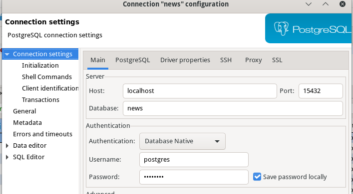

# Домашнее задание к занятию "13.3 работа с kubectl"
## Задание 1: проверить работоспособность каждого компонента
Для проверки работы можно использовать 2 способа: port-forward и exec. Используя оба способа, проверьте каждый компонент:
* сделайте запросы к бекенду;
* сделайте запросы к фронту;
* подключитесь к базе данных.

### Ответ
Предварительно устанавливаем переменную окружения KUBECONFIG: `export KUBECONFIG=./config`.  

Для port-forward `kubectl port-forward` и проверка выполняются в разных сессиях терминала.

#### port-forward, backend
Через деплоймент:  
```bash
[olga@fedora ~]$ kubectl port-forward deploy/backend 19000:9000
Forwarding from 127.0.0.1:19000 -> 9000
Forwarding from [::1]:19000 -> 9000
Handling connection for 19000
```
```bash
[olga@fedora ~]$ curl localhost:19000/api/news/1
{"id":1,"title":"title 0","short_description":"small text 0small text 0small text 0small text 0small text 0small text 0small text 0small text 0small text 0small text 0","description":"0 some more text, 0 some more text, 0 some more text, 0 some more text, 0 some more text, 0 some more text, 0 some more text, 0 some more text, 0 some more text, 0 some more text, 0 some more text, 0 some more text, 0 some more text, 0 some more text, 0 some more text, 0 some more text, 0 some more text, 0 some more text, 0 some more text, 0 some more text, 0 some more text, 0 some more text, 0 some more text, 0 some more text, 0 some more text, 0 some more text, 0 some more text, 0 some more text, 0 some more text, 0 some more text, 0 some more text, 0 some more text, 0 some more text, 0 some more text, 0 some more text, 0 some more text, 0 some more text, 0 some more text, 0 some more text, 0 some more text, 0 some more text, 0 some more text, 0 some more text, 0 some more text, 0 some more text, 0 some more text, 0 some more text, 0 some more text, 0 some more text, 0 some more text, 0 some more text, 0 some more text, 0 some more text, 0 some more text, 0 some more text, 0 some more text, 0 some more text, 0 some more text, 0 some more text, 0 some more text, 0 some more text, 0 some more text, 0 some more text, 0 some more text, 0 some more text, 0 some more text, 0 some more text, 0 some more text, 0 some more text, 0 some more text, 0 some more text, 0 some more text, 0 some more text, 0 some more text, 0 some more text, 0 some more text, 0 some more text, 0 some more text, 0 some more text, 0 some more text, 0 some more text, 0 some more text, 0 some more text, 0 some more text, 0 some more text, 0 some more text, 0 some more text, 0 some more text, 0 some more text, 0 some more text, 0 some more text, 0 some more text, 0 some more text, 0 some more text, 0 some more text, 0 some more text, 0 some more text, 0 some more text, 0 some more text, 0 some more text, ","preview":"/static/image.png"}
```

#### port-forward, frontend
Через сервис:  
```bash
[olga@fedora 13-kubernetes-config-03-kubectl]$ kubectl port-forward service/frontend 18000:80
Forwarding from 127.0.0.1:18000 -> 80
Forwarding from [::1]:18000 -> 80
Handling connection for 18000
```
```bash
[olga@fedora ~]$ curl localhost:18000
<!DOCTYPE html>
<html lang="ru">
<head>
    <title>Список</title>
    <meta charset="UTF-8">
    <meta name="viewport" content="width=device-width, initial-scale=1.0">
    <link href="/build/main.css" rel="stylesheet">
</head>
<body>
    <main class="b-page">
        <h1 class="b-page__title">Список</h1>
        <div class="b-page__content b-items js-list"></div>
    </main>
    <script src="/build/main.js"></script>
</body>
</html>
```

#### port-forward, БД
Через сервис:
```bash
[olga@fedora 13-kubernetes-config-03-kubectl]$ kubectl port-forward service/postgres-headless-svc 15432:5432
Forwarding from 127.0.0.1:15432 -> 5432
Forwarding from [::1]:15432 -> 5432
Handling connection for 15432
Handling connection for 15432
Handling connection for 15432
Handling connection for 15432
```
Подключение и запрос таблицы `news` через DBeaver:  



#### exec, backend
Заходим внутрь контейнера в `bash`, выполняем там `curl`:  
```bash
[olga@fedora 13-kubernetes-config-03-kubectl]$ kubectl exec -it backend-7cc5b57bfd-tg5pq -c backend -- bash
root@backend-7cc5b57bfd-tg5pq:/app# curl localhost:9000/api/news/1
{"id":1,"title":"title 0","short_description":"small text 0small text 0small text 0small text 0small text 0small text 0small text 0small text 0small text 0small text 0","description":"0 some more text, 0 some more text, 0 some more text, 0 some more text, 0 some more text, 0 some more text, 0 some more text, 0 some more text, 0 some more text, 0 some more text, 0 some more text, 0 some more text, 0 some more text, 0 some more text, 0 some more text, 0 some more text, 0 some more text, 0 some more text, 0 some more text, 0 some more text, 0 some more text, 0 some more text, 0 some more text, 0 some more text, 0 some more text, 0 some more text, 0 some more text, 0 some more text, 0 some more text, 0 some more text, 0 some more text, 0 some more text, 0 some more text, 0 some more text, 0 some more text, 0 some more text, 0 some more text, 0 some more text, 0 some more text, 0 some more text, 0 some more text, 0 some more text, 0 some more text, 0 some more text, 0 some more text, 0 some more text, 0 some more text, 0 some more text, 0 some more text, 0 some more text, 0 some more text, 0 some more text, 0 some more text, 0 some more text, 0 some more text, 0 some more text, 0 some more text, 0 some more text, 0 some more text, 0 some more text, 0 some more text, 0 some more text, 0 some more text, 0 some more text, 0 some more text, 0 some more text, 0 some more text, 0 some more text, 0 some more text, 0 some more text, 0 some more text, 0 some more text, 0 some more text, 0 some more text, 0 some more text, 0 some more text, 0 some more text, 0 some more text, 0 some more text, 0 some more text, 0 some more text, 0 some more text, 0 some more text, 0 some more text, 0 some more text, 0 some more text, 0 some more text, 0 some more text, 0 some more text, 0 some more text, 0 some more text, 0 some more text, 0 some more text, 0 some more text, 0 some more text, 0 some more text, 0 some more text, 0 some more text, 0 some more text, 0 some more text, ","preview":"/static/image.png"}
```

#### exec, frontend
Выполняем команду, не заходя внутрь контейнера:
```bash
[olga@fedora 13-kubernetes-config-03-kubectl]$ kubectl exec frontend-5fb755948-9nw5h -- bash -c 'curl localhost:80'
  % Total    % Received % Xferd  Average Speed   Time    Time     Time  Current
                                 Dload  Upload   Total   Spent    Left  Speed
100   448  100   448    0     0  74666      0 --:--:-- --:--:-- --:--:-- 74666
<!DOCTYPE html>
<html lang="ru">
<head>
    <title>Список</title>
    <meta charset="UTF-8">
    <meta name="viewport" content="width=device-width, initial-scale=1.0">
    <link href="/build/main.css" rel="stylesheet">
</head>
<body>
    <main class="b-page">
        <h1 class="b-page__title">Список</h1>
        <div class="b-page__content b-items js-list"></div>
    </main>
    <script src="/build/main.js"></script>
</body>
</html>
```

#### exec, БД
Заходим внутрь контейнера в `psql`:  
```bash
[olga@fedora 13-kubernetes-config-03-kubectl]$ kubectl exec -it postgres-sts-0 -- psql -U "postgres"
psql (13.6)
Type "help" for help.

postgres=# \c news
You are now connected to database "news" as user "postgres".
news-# \d news
                                       Table "public.news"
      Column       |       Type        | Collation | Nullable |             Default              
-------------------+-------------------+-----------+----------+----------------------------------
 id                | integer           |           | not null | nextval('news_id_seq'::regclass)
 title             | character varying |           |          | 
 short_description | character varying |           |          | 
 description       | character varying |           |          | 
 preview           | character varying |           |          | 
Indexes:
    "news_pkey" PRIMARY KEY, btree (id)
news-# \q
```

## Задание 2: ручное масштабирование
При работе с приложением иногда может потребоваться вручную добавить пару копий. 
Используя команду kubectl scale, попробуйте увеличить количество бекенда и фронта до 3. 
Проверьте, на каких нодах оказались копии после каждого действия (kubectl describe, kubectl get pods -o wide). 
После уменьшите количество копий до 1.

### Ответ
Увеличение количества копий:  
```bash
[olga@fedora 13-kubernetes-config-03-kubectl]$ kubectl scale --replicas=3 deploy backend
deployment.apps/backend scaled
[olga@fedora 13-kubernetes-config-03-kubectl]$ kubectl scale --replicas=3 deploy frontend
deployment.apps/frontend scaled
[olga@fedora 13-kubernetes-config-03-kubectl]$ kubectl get pods -o wide
NAME                                  READY   STATUS    RESTARTS       AGE    IP             NODE    NOMINATED NODE   READINESS GATES
backend-7cc5b57bfd-g2wqm              1/1     Running   0              15s    10.244.90.52   node1   <none>           <none>
backend-7cc5b57bfd-tg5pq              1/1     Running   0              4d3h   10.244.96.44   node2   <none>           <none>
backend-7cc5b57bfd-tvbpw              1/1     Running   0              15s    10.244.92.5    node3   <none>           <none>
frontend-5fb755948-9nw5h              1/1     Running   0              4d3h   10.244.105.3   node4   <none>           <none>
frontend-5fb755948-fdm7h              1/1     Running   0              10s    10.244.92.6    node3   <none>           <none>
frontend-5fb755948-fxq5r              1/1     Running   0              10s    10.244.96.45   node2   <none>           <none>
fullstack-cbb59fc5-fdklh              2/2     Running   0              4d3h   10.244.105.2   node4   <none>           <none>
nfs-server-nfs-server-provisioner-0   1/1     Running   2 (4d3h ago)   4d4h   10.244.92.2    node3   <none>           <none>
postgres-sts-0                        1/1     Running   0              5d1h   10.244.90.50   node1   <none>           <none>
[olga@fedora 13-kubernetes-config-03-kubectl]$ kubectl describe deploy/backend
...
Events:
  Type    Reason             Age   From                   Message
  ----    ------             ----  ----                   -------
  Normal  ScalingReplicaSet  4d3h  deployment-controller  Scaled up replica set backend-7cc5b57bfd to 1
  Normal  ScalingReplicaSet  70s   deployment-controller  Scaled up replica set backend-7cc5b57bfd to 3
[olga@fedora 13-kubernetes-config-03-kubectl]$ kubectl describe po backend-7cc5b57bfd-g2wqm
...
Events:
  Type    Reason     Age   From               Message
  ----    ------     ----  ----               -------
  Normal  Scheduled  110s  default-scheduler  Successfully assigned test/backend-7cc5b57bfd-g2wqm to node1
  Normal  Pulled     108s  kubelet            Container image "anguisa/backend:latest" already present on machine
  Normal  Created    108s  kubelet            Created container backend
  Normal  Started    108s  kubelet            Started container backend
```

Также команда `kubectl describe nodes` показывает, в том числе, какие поды запущены на каждой ноде.  

Скрин:  
  

Уменьшение количества копий:  
```bash
[olga@fedora 13-kubernetes-config-03-kubectl]$ kubectl scale --replicas=1 deploy frontend
deployment.apps/frontend scaled
[olga@fedora 13-kubernetes-config-03-kubectl]$ kubectl scale --replicas=1 deploy backend
deployment.apps/backend scaled
[olga@fedora 13-kubernetes-config-03-kubectl]$ kubectl get pods -o wide
NAME                                  READY   STATUS    RESTARTS       AGE    IP             NODE    NOMINATED NODE   READINESS GATES
backend-7cc5b57bfd-tg5pq              1/1     Running   0              4d3h   10.244.96.44   node2   <none>           <none>
frontend-5fb755948-9nw5h              1/1     Running   0              4d3h   10.244.105.3   node4   <none>           <none>
fullstack-cbb59fc5-fdklh              2/2     Running   0              4d4h   10.244.105.2   node4   <none>           <none>
nfs-server-nfs-server-provisioner-0   1/1     Running   2 (4d3h ago)   4d4h   10.244.92.2    node3   <none>           <none>
postgres-sts-0                        1/1     Running   0              5d1h   10.244.90.50   node1   <none>           <none>
```