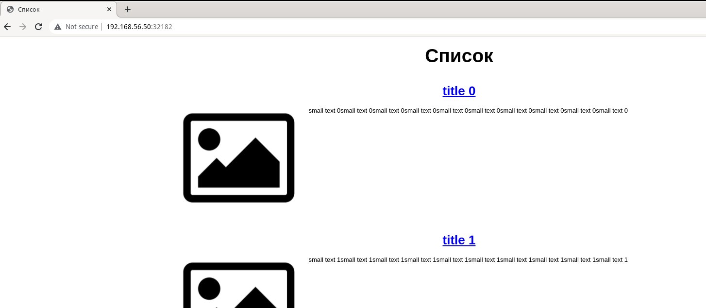
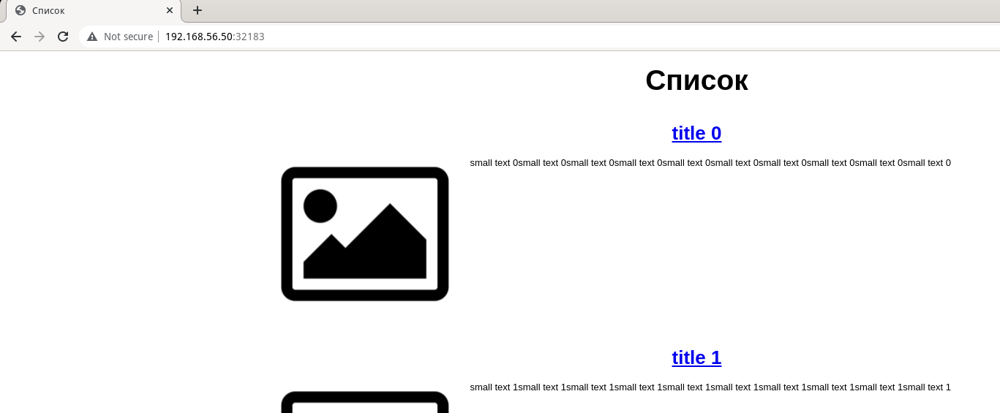
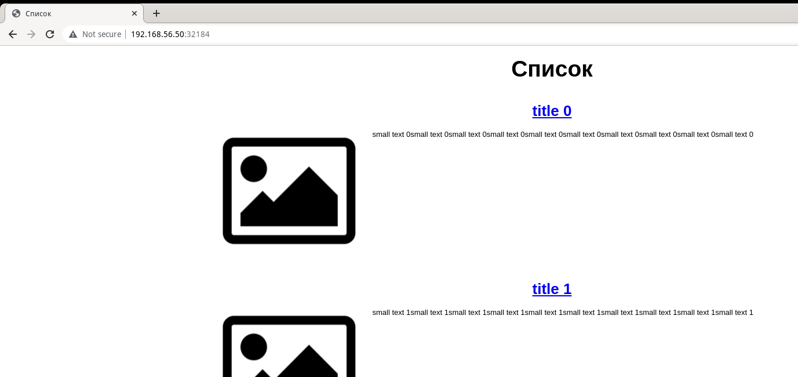

# Домашнее задание к занятию "13.4 инструменты для упрощения написания конфигурационных файлов. Helm и Jsonnet"
В работе часто приходится применять системы автоматической генерации конфигураций. Для изучения нюансов использования разных инструментов нужно попробовать упаковать приложение каждым из них.

## Задание 1: подготовить helm чарт для приложения
Необходимо упаковать приложение в чарт для деплоя в разные окружения. Требования:
* каждый компонент приложения деплоится отдельным deployment’ом/statefulset’ом;
* в переменных чарта измените образ приложения для изменения версии.

### Ответ
Предварительно устанавливаем переменную окружения KUBECONFIG: `export KUBECONFIG=./config`.  

Создан чарт `myapp`, выполнен `lint`, а также сборка шаблонов для окружения [prod](charts/prod.yml) и [stage](charts/stage.yml) (с переопределением параметра).  
```bash
[olga@fedora charts]$ helm create myapp
Creating myapp
[olga@fedora charts]$ helm lint myapp
==> Linting myapp
[INFO] Chart.yaml: icon is recommended

1 chart(s) linted, 0 chart(s) failed
[olga@fedora charts]$ helm template myapp > prod.yml
[olga@fedora charts]$ helm template myapp --set app.env=stage > stage.yml
```

Дополнительно потребовалось добавить для backend init-containers, т.к. иначе не успевал стартовать сервис с базой, и backend не инициализировался.

Итоговый чарт [myapp](charts/myapp).  

## Задание 2: запустить 2 версии в разных неймспейсах
Подготовив чарт, необходимо его проверить. Попробуйте запустить несколько копий приложения:
* одну версию в namespace=app1;
* вторую версию в том же неймспейсе;
* третью версию в namespace=app2.

### Ответ
Создаём неймспейсы и вносим изменения в [конфиг](./config) (добавляем контексты):  
```bash
[olga@fedora 13-kubernetes-config-04-helm]$ kubectl create ns app1
namespace/app1 created
[olga@fedora 13-kubernetes-config-04-helm]$ kubectl create ns app2
namespace/app2 created
[olga@fedora 13-kubernetes-config-04-helm]$ kubectl config get-contexts
CURRENT   NAME                             CLUSTER         AUTHINFO           NAMESPACE
          app1                             cluster.local   kubernetes-admin   app1
          app2                             cluster.local   kubernetes-admin   app2
*         kubernetes-admin@cluster.local   cluster.local   kubernetes-admin   test
```

PersistentVolume нужно либо создавать каждый раз новый (меняя его имя в Values), либо создать отдельно от helm.  
Иначе возникает ошибка, что PV с таким именем уже существует и пересоздать в другом чарте его нельзя.

Деплой в app1 (prod-окружения):
```bash
[olga@fedora 13-kubernetes-config-04-helm]$ helm upgrade --install myapp-release --namespace app1 charts/myapp
Release "myapp-release" does not exist. Installing it now.
NAME: myapp-release
LAST DEPLOYED: Sun Apr 17 15:28:18 2022
NAMESPACE: app1
STATUS: deployed
REVISION: 1
TEST SUITE: None
NOTES:
---------------------

NOTES.txt:
Chart deployed to prod environment.

---------------------
```

Деплой в app2 (stage-окружения):
```bash
[olga@fedora 13-kubernetes-config-04-helm]$ helm upgrade --install myapp-release-2 --set app.env=stage,database.pv.name=postgres-data-volume-2,frontend.backendUrl=localhost:9000 --namespace app2 charts/myapp
Release "myapp-release-2" has been upgraded. Happy Helming!
NAME: myapp-release-2
LAST DEPLOYED: Sun Apr 17 15:35:47 2022
NAMESPACE: app2
STATUS: deployed
REVISION: 2
TEST SUITE: None
NOTES:
---------------------

NOTES.txt:
Chart deployed to stage environment.

---------------------
```

Деплой в default (prod-окружения):
```bash
[olga@fedora 13-kubernetes-config-04-helm]$ helm upgrade --install myapp-release-def --set database.pv.name=postgres-data-volume-def,frontend.service.nodePort=32184 --namespace default charts/myapp
Release "myapp-release-def" has been upgraded. Happy Helming!
NAME: myapp-release-def
LAST DEPLOYED: Sun Apr 17 15:38:29 2022
NAMESPACE: default
STATUS: deployed
REVISION: 3
TEST SUITE: None
NOTES:
---------------------

NOTES.txt:
Chart deployed to prod environment.

---------------------
```

Во время отладки приходилось выполнять `helm uninstall myapp-release`, а также вручную удалять pvc `kubectl delete pvc postgres-data-volume-postgres-sts-0`.  

Результаты:  

```bash
[olga@fedora 13-kubernetes-config-04-helm]$ kubectl -n app1 get all
NAME                           READY   STATUS    RESTARTS   AGE
pod/backend-578cf6cdb7-hcv48   1/1     Running   0          10m
pod/frontend-5fb755948-bz4lk   1/1     Running   0          10m
pod/postgres-sts-0             1/1     Running   0          10m

NAME                            TYPE        CLUSTER-IP      EXTERNAL-IP   PORT(S)        AGE
service/backend                 ClusterIP   10.233.45.228   <none>        9000/TCP       10m
service/frontend                NodePort    10.233.40.90    <none>        80:32182/TCP   10m
service/postgres-headless-svc   ClusterIP   None            <none>        5432/TCP       10m

NAME                       READY   UP-TO-DATE   AVAILABLE   AGE
deployment.apps/backend    1/1     1            1           10m
deployment.apps/frontend   1/1     1            1           10m

NAME                                 DESIRED   CURRENT   READY   AGE
replicaset.apps/backend-578cf6cdb7   1         1         1       10m
replicaset.apps/frontend-5fb755948   1         1         1       10m

NAME                            READY   AGE
statefulset.apps/postgres-sts   1/1     10m
[olga@fedora 13-kubernetes-config-04-helm]$ kubectl -n app2 get all
NAME                            READY   STATUS    RESTARTS   AGE
pod/fullstack-c5b6c9dbb-s6bqh   2/2     Running   0          3m27s
pod/postgres-sts-0              1/1     Running   0          5m51s

NAME                            TYPE        CLUSTER-IP    EXTERNAL-IP   PORT(S)        AGE
service/fullstack               NodePort    10.233.8.23   <none>        80:32183/TCP   5m51s
service/postgres-headless-svc   ClusterIP   None          <none>        5432/TCP       5m51s

NAME                        READY   UP-TO-DATE   AVAILABLE   AGE
deployment.apps/fullstack   1/1     1            1           5m51s

NAME                                   DESIRED   CURRENT   READY   AGE
replicaset.apps/fullstack-6c6cf7bc85   0         0         0       5m51s
replicaset.apps/fullstack-c5b6c9dbb    1         1         1       3m27s

NAME                            READY   AGE
statefulset.apps/postgres-sts   1/1     5m51s
[olga@fedora 13-kubernetes-config-04-helm]$ kubectl -n default get all
NAME                           READY   STATUS    RESTARTS   AGE
pod/backend-578cf6cdb7-s4c49   1/1     Running   0          88s
pod/frontend-5fb755948-nkw5s   1/1     Running   0          88s
pod/postgres-sts-0             1/1     Running   0          49s

NAME                            TYPE        CLUSTER-IP     EXTERNAL-IP   PORT(S)        AGE
service/backend                 ClusterIP   10.233.37.16   <none>        9000/TCP       88s
service/frontend                NodePort    10.233.35.15   <none>        80:32184/TCP   49s
service/kubernetes              ClusterIP   10.233.0.1     <none>        443/TCP        25d
service/postgres-headless-svc   ClusterIP   None           <none>        5432/TCP       88s

NAME                       READY   UP-TO-DATE   AVAILABLE   AGE
deployment.apps/backend    1/1     1            1           88s
deployment.apps/frontend   1/1     1            1           88s

NAME                                 DESIRED   CURRENT   READY   AGE
replicaset.apps/backend-578cf6cdb7   1         1         1       88s
replicaset.apps/frontend-5fb755948   1         1         1       88s

NAME                            READY   AGE
statefulset.apps/postgres-sts   1/1     49s
[olga@fedora 13-kubernetes-config-04-helm]$ kubectl get pvc -n app1
NAME                                  STATUS   VOLUME                                     CAPACITY   ACCESS MODES   STORAGECLASS   AGE
postgres-data-volume-postgres-sts-0   Bound    postgres-data-volume                       1Gi        RWO                           11m
prod-pvc                              Bound    pvc-e138874e-9dca-400d-8201-2c63624e1c55   1Gi        RWX            nfs            11m
[olga@fedora 13-kubernetes-config-04-helm]$ kubectl get pvc -n app2
NAME                                  STATUS   VOLUME                   CAPACITY   ACCESS MODES   STORAGECLASS   AGE
postgres-data-volume-postgres-sts-0   Bound    postgres-data-volume-2   1Gi        RWO                           6m15s
[olga@fedora 13-kubernetes-config-04-helm]$ kubectl get pvc -n default
NAME                                  STATUS   VOLUME                                     CAPACITY   ACCESS MODES   STORAGECLASS   AGE
postgres-data-volume-postgres-sts-0   Bound    postgres-data-volume-def                   1Gi        RWO                           75s
prod-pvc                              Bound    pvc-9dacc8a7-e546-4d6c-8a22-5f50f58a9e0f   1Gi        RWX            nfs            114s
[olga@fedora 13-kubernetes-config-04-helm]$ kubectl get pv
NAME                                       CAPACITY   ACCESS MODES   RECLAIM POLICY   STATUS     CLAIM                                         STORAGECLASS   REASON   AGE
postgres                                   1Gi        RWO            Retain           Released   test/postgres-postgres-0                                              9d
postgres-data                              1Gi        RWO            Retain           Bound      test/postgres-data-postgres-sts-0                                     8d
postgres-data-volume                       1Gi        RWO            Retain           Bound      app1/postgres-data-volume-postgres-sts-0                              11m
postgres-data-volume-2                     1Gi        RWO            Retain           Bound      app2/postgres-data-volume-postgres-sts-0                              6m29s
postgres-data-volume-def                   1Gi        RWO            Retain           Bound      default/postgres-data-volume-postgres-sts-0                           2m1s
pvc-9dacc8a7-e546-4d6c-8a22-5f50f58a9e0f   1Gi        RWX            Delete           Bound      default/prod-pvc                              nfs                     2m1s
pvc-e138874e-9dca-400d-8201-2c63624e1c55   1Gi        RWX            Delete           Bound      app1/prod-pvc                                 nfs                     11m
pvc-f231bc82-b085-426f-8d0f-055c6d10f953   1Gi        RWX            Delete           Bound      test/prod-pvc                                 nfs                     7d23h
[olga@fedora 13-kubernetes-config-04-helm]$ helm list -n app1
NAME            NAMESPACE       REVISION        UPDATED                                 STATUS          CHART           APP VERSION
myapp-release   app1            1               2022-04-17 15:28:18.252077058 +0300 MSK deployed        myapp-0.0.1     1.0.0      
[olga@fedora 13-kubernetes-config-04-helm]$ helm list -n app2
NAME            NAMESPACE       REVISION        UPDATED                                 STATUS          CHART           APP VERSION
myapp-release-2 app2            2               2022-04-17 15:35:47.756755515 +0300 MSK deployed        myapp-0.0.1     1.0.0      
[olga@fedora 13-kubernetes-config-04-helm]$ helm list -n default
NAME                    NAMESPACE       REVISION        UPDATED                                 STATUS          CHART           APP VERSION
myapp-release-def       default         3               2022-04-17 15:38:29.910353468 +0300 MSK deployed        myapp-0.0.1     1.0.0   
```

Скрины:  

  
  


## Задание 3 (*): повторить упаковку на jsonnet
Для изучения другого инструмента стоит попробовать повторить опыт упаковки из задания 1, только теперь с помощью инструмента jsonnet.

