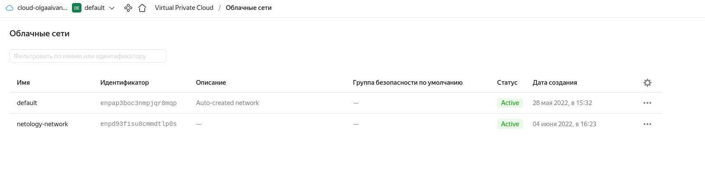
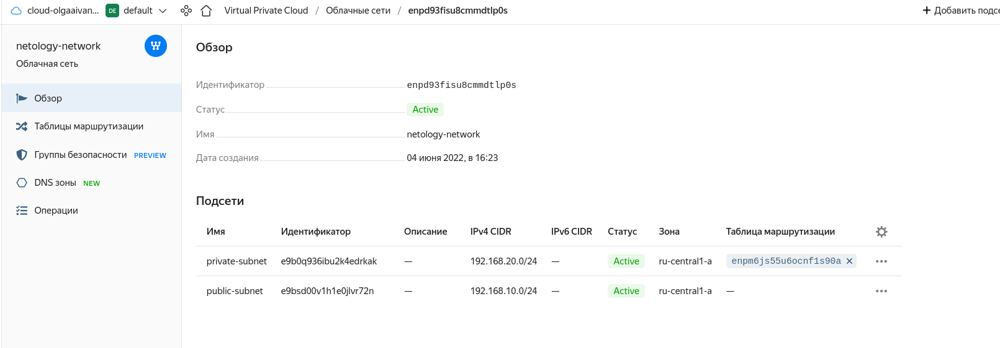
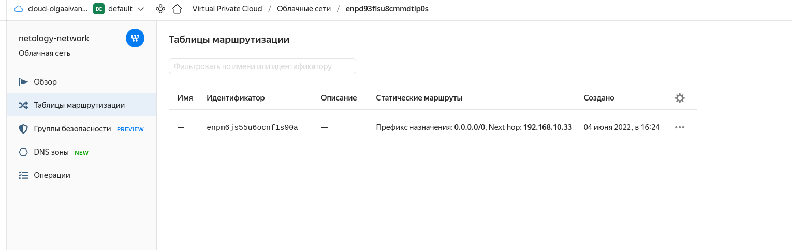
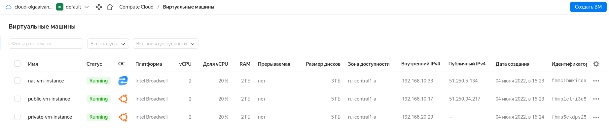

# Домашнее задание к занятию "15.1. Организация сети"

Домашнее задание будет состоять из обязательной части, которую необходимо выполнить на провайдере Яндекс.Облако и дополнительной части в AWS по желанию. Все домашние задания в 15 блоке связаны друг с другом и в конце представляют пример законченной инфраструктуры.  
Все задания требуется выполнить с помощью Terraform, результатом выполненного домашнего задания будет код в репозитории. 

Перед началом работ следует настроить доступ до облачных ресурсов из Terraform используя материалы прошлых лекций и [ДЗ](https://github.com/netology-code/virt-homeworks/tree/master/07-terraform-02-syntax ). А также заранее выбрать регион (в случае AWS) и зону.

---
## Задание 1. Яндекс.Облако (обязательное к выполнению)

1. Создать VPC.
- Создать пустую VPC. Выбрать зону.
2. Публичная подсеть.
- Создать в vpc subnet с названием public, сетью 192.168.10.0/24.
- Создать в этой подсети NAT-инстанс, присвоив ему адрес 192.168.10.254. В качестве image_id использовать fd80mrhj8fl2oe87o4e1
- Создать в этой публичной подсети виртуалку с публичным IP и подключиться к ней, убедиться что есть доступ к интернету.
3. Приватная подсеть.
- Создать в vpc subnet с названием private, сетью 192.168.20.0/24.
- Создать route table. Добавить статический маршрут, направляющий весь исходящий трафик private сети в NAT-инстанс
- Создать в этой приватной подсети виртуалку с внутренним IP, подключиться к ней через виртуалку, созданную ранее и убедиться что есть доступ к интернету

Resource terraform для ЯО
- [VPC subnet](https://registry.terraform.io/providers/yandex-cloud/yandex/latest/docs/resources/vpc_subnet)
- [Route table](https://registry.terraform.io/providers/yandex-cloud/yandex/latest/docs/resources/vpc_route_table)
- [Compute Instance](https://registry.terraform.io/providers/yandex-cloud/yandex/latest/docs/resources/compute_instance)
---

## Решение

### Подготовительные действия

- Установить terraform
- [Документация](https://cloud.yandex.ru/docs/tutorials/infrastructure-management/terraform-quickstart)
- Отредактировать (или создать) файл `nano ~/.terraformrc`:
```bash
provider_installation {
  network_mirror {
    url = "https://terraform-mirror.yandexcloud.net/"
    include = ["registry.terraform.io/*/*"]
  }
  direct {
    exclude = ["registry.terraform.io/*/*"]
  }
}
```
- Директория с main.tf [cloud-terraform](../../cloud-terraform)
- Добавить туда [.gitignore](../../cloud-terraform/.gitignore)
- Получить OAuth-token [ссылка](https://cloud.yandex.ru/docs/iam/concepts/authorization/oauth-token)
- Выполнить в консоли `export YC_TOKEN=...`
- Посмотреть id облака (cloud_id) [ссылка](https://console.cloud.yandex.ru/cloud)
- Посмотреть id каталога (folder_id): облако -> подпапка (default) -> id из url [ссылка](https://console.cloud.yandex.ru/folders/b1gcefcbnh0ok32bkvif)
- Выбрать зону доступности по умолчанию (zone)

- Необходимый image_id можно найти, зайдя в Compute cloud -> создать VM -> найти -> открыть страницу -> внизу будет image_id

Проверка конфигурации: `terraform validate`
Форматирование: `terraform fmt`
Планирование: `terraform plan`
Применение: `terraform apply` -> `yes`
Удаление: `terraform destroy` -> `yes`

### Ответ
Файл конфигурации - [main.tf](../../cloud-terraform/main.tf)  

Выполнены действия:
```bash
[olga@manjaro cloud-terraform]$ export YC_TOKEN=...
[olga@manjaro cloud-terraform]$ terraform validate
[olga@manjaro cloud-terraform]$ terraform plan
[olga@manjaro cloud-terraform]$ terraform apply
```

На `public-vm` по публичному IP скопирован ssh-ключ (для доступа на `private-vm`): `scp -i ~/.ssh/id_rsa_ya ~/.ssh/id_rsa_ya ubuntu@51.250.94.217:~/.ssh`  

Затем выполнены проверки (зашла на `public-vm` по публичному IP, посмотрела внутренний IP и попробовала выйти в интернет; 
оттуда зашла на `private-vm` по внутреннему IP, посмотрела внутренний IP, попробовала выйти в интернет):
```bash
[olga@manjaro ~]$ ssh -i ~/.ssh/id_rsa_ya ubuntu@51.250.94.217
Welcome to Ubuntu 20.04.4 LTS (GNU/Linux 5.4.0-113-generic x86_64)

ubuntu@fhmp1clri3e5deeuh5qt:~$ ping google.ru
PING google.ru (173.194.73.94) 56(84) bytes of data.
64 bytes from lq-in-f94.1e100.net (173.194.73.94): icmp_seq=1 ttl=61 time=20.8 ms
64 bytes from lq-in-f94.1e100.net (173.194.73.94): icmp_seq=2 ttl=61 time=20.7 ms
64 bytes from lq-in-f94.1e100.net (173.194.73.94): icmp_seq=3 ttl=61 time=20.8 ms
^Z
[1]+  Stopped                 ping google.ru
ubuntu@fhmp1clri3e5deeuh5qt:~$ ip a
1: lo: <LOOPBACK,UP,LOWER_UP> mtu 65536 qdisc noqueue state UNKNOWN group default qlen 1000
    link/loopback 00:00:00:00:00:00 brd 00:00:00:00:00:00
    inet 127.0.0.1/8 scope host lo
       valid_lft forever preferred_lft forever
    inet6 ::1/128 scope host 
       valid_lft forever preferred_lft forever
2: eth0: <BROADCAST,MULTICAST,UP,LOWER_UP> mtu 1500 qdisc mq state UP group default qlen 1000
    link/ether d0:0d:19:0b:2b:b9 brd ff:ff:ff:ff:ff:ff
    inet 192.168.10.17/24 brd 192.168.10.255 scope global eth0
       valid_lft forever preferred_lft forever
    inet6 fe80::d20d:19ff:fe0b:2bb9/64 scope link 
       valid_lft forever preferred_lft forever
ubuntu@fhmp1clri3e5deeuh5qt:~$ ping 192.168.20.29
PING 192.168.20.29 (192.168.20.29) 56(84) bytes of data.
64 bytes from 192.168.20.29: icmp_seq=1 ttl=63 time=1.11 ms
^Z
[2]+  Stopped                 ping 192.168.20.29
ubuntu@fhmp1clri3e5deeuh5qt:~$ ssh -i ~/.ssh/id_rsa_ya ubuntu@192.168.20.29
Welcome to Ubuntu 20.04.4 LTS (GNU/Linux 5.4.0-113-generic x86_64)

ubuntu@fhms5ckdps25ui0s7mgf:~$ ping google.ru
PING google.ru (173.194.222.94) 56(84) bytes of data.
64 bytes from lo-in-f94.1e100.net (173.194.222.94): icmp_seq=1 ttl=59 time=22.7 ms
64 bytes from lo-in-f94.1e100.net (173.194.222.94): icmp_seq=2 ttl=59 time=21.8 ms
^Z
[1]+  Stopped                 ping google.ru
ubuntu@fhms5ckdps25ui0s7mgf:~$ ip a
1: lo: <LOOPBACK,UP,LOWER_UP> mtu 65536 qdisc noqueue state UNKNOWN group default qlen 1000
    link/loopback 00:00:00:00:00:00 brd 00:00:00:00:00:00
    inet 127.0.0.1/8 scope host lo
       valid_lft forever preferred_lft forever
    inet6 ::1/128 scope host 
       valid_lft forever preferred_lft forever
2: eth0: <BROADCAST,MULTICAST,UP,LOWER_UP> mtu 1500 qdisc mq state UP group default qlen 1000
    link/ether d0:0d:1c:2b:28:dc brd ff:ff:ff:ff:ff:ff
    inet 192.168.20.29/24 brd 192.168.20.255 scope global eth0
       valid_lft forever preferred_lft forever
    inet6 fe80::d20d:1cff:fe2b:28dc/64 scope link 
       valid_lft forever preferred_lft forever
```

Скрины:  
  
  
  
  

## Задание 2*. AWS (необязательное к выполнению)

1. Создать VPC.
- Cоздать пустую VPC с подсетью 10.10.0.0/16.
2. Публичная подсеть.
- Создать в vpc subnet с названием public, сетью 10.10.1.0/24
- Разрешить в данной subnet присвоение public IP по-умолчанию. 
- Создать Internet gateway 
- Добавить в таблицу маршрутизации маршрут, направляющий весь исходящий трафик в Internet gateway.
- Создать security group с разрешающими правилами на SSH и ICMP. Привязать данную security-group на все создаваемые в данном ДЗ виртуалки
- Создать в этой подсети виртуалку и убедиться, что инстанс имеет публичный IP. Подключиться к ней, убедиться что есть доступ к интернету.
- Добавить NAT gateway в public subnet.
3. Приватная подсеть.
- Создать в vpc subnet с названием private, сетью 10.10.2.0/24
- Создать отдельную таблицу маршрутизации и привязать ее к private-подсети
- Добавить Route, направляющий весь исходящий трафик private сети в NAT.
- Создать виртуалку в приватной сети.
- Подключиться к ней по SSH по приватному IP через виртуалку, созданную ранее в публичной подсети и убедиться, что с виртуалки есть выход в интернет.

Resource terraform
- [VPC](https://registry.terraform.io/providers/hashicorp/aws/latest/docs/resources/vpc)
- [Subnet](https://registry.terraform.io/providers/hashicorp/aws/latest/docs/resources/subnet)
- [Internet Gateway](https://registry.terraform.io/providers/hashicorp/aws/latest/docs/resources/internet_gateway)
