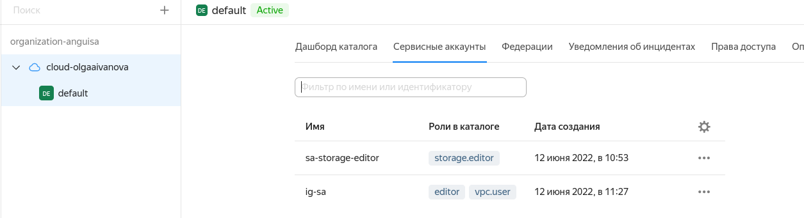
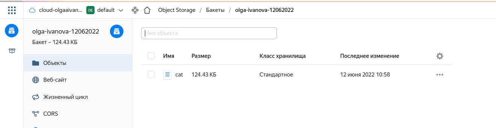
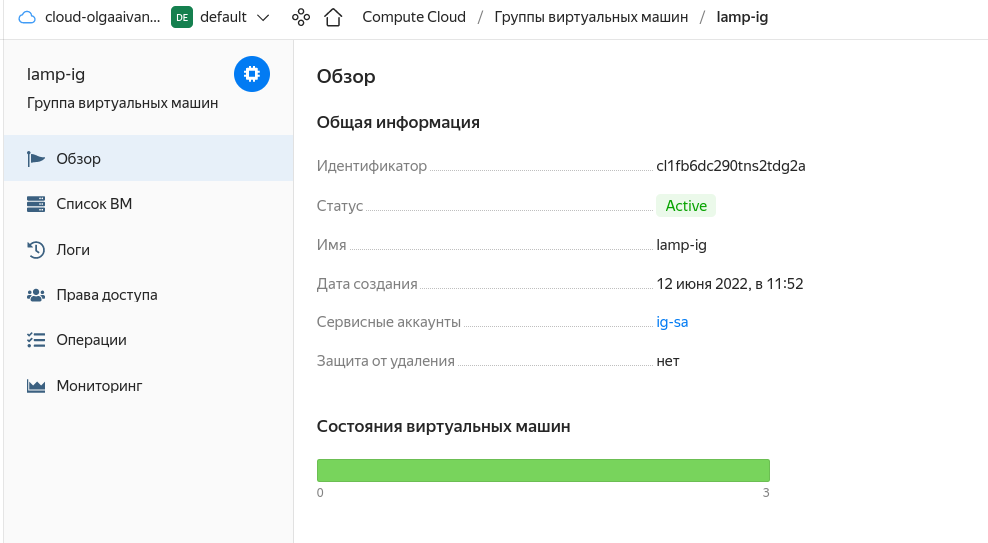
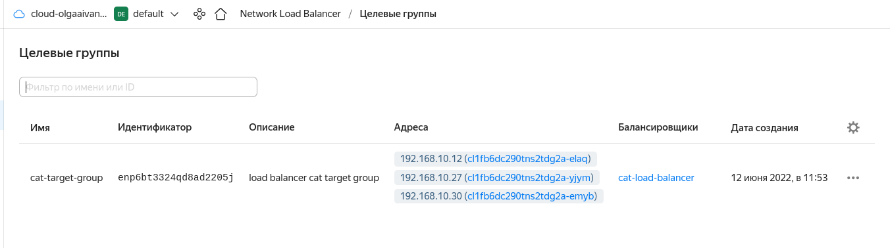
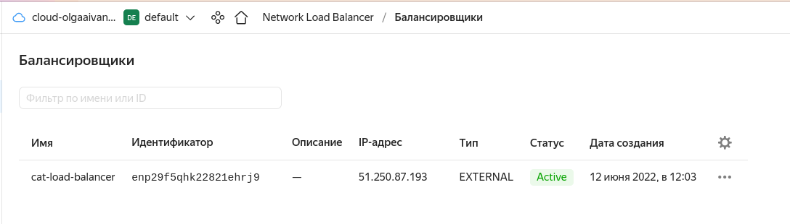
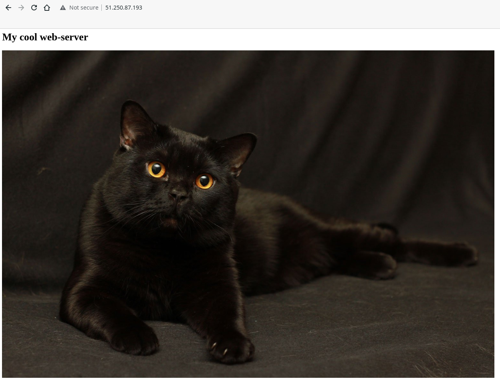
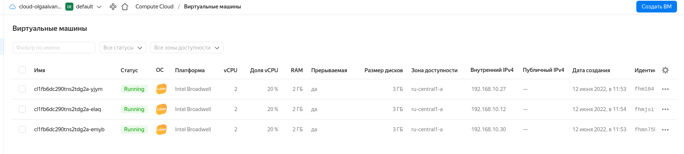
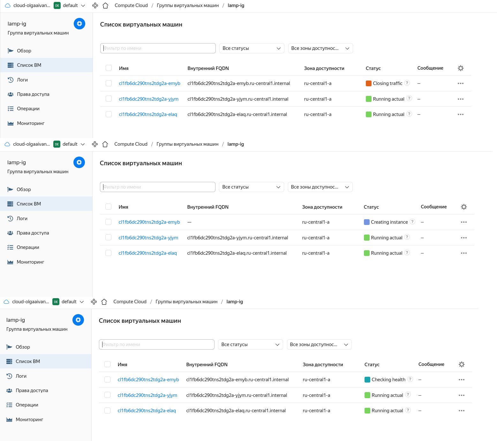
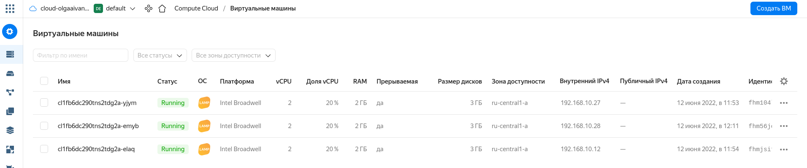

# Домашнее задание к занятию 15.2 "Вычислительные мощности. Балансировщики нагрузки".
Домашнее задание будет состоять из обязательной части, которую необходимо выполнить на провайдере Яндекс.Облако, и дополнительной части в AWS (можно выполнить по желанию). Все домашние задания в 15 блоке связаны друг с другом и в конце представляют пример законченной инфраструктуры.
Все задания требуется выполнить с помощью Terraform, результатом выполненного домашнего задания будет код в репозитории. Перед началом работ следует настроить доступ до облачных ресурсов из Terraform, используя материалы прошлых лекций и ДЗ.

---
## Задание 1. Яндекс.Облако (обязательное к выполнению)

1. Создать bucket Object Storage и разместить там файл с картинкой:
- Создать bucket в Object Storage с произвольным именем (например, _имя_студента_дата_);
- Положить в bucket файл с картинкой;
- Сделать файл доступным из Интернет.
2. Создать группу ВМ в public подсети фиксированного размера с шаблоном LAMP и web-страничкой, содержащей ссылку на картинку из bucket:
- Создать Instance Group с 3 ВМ и шаблоном LAMP. Для LAMP рекомендуется использовать `image_id = fd827b91d99psvq5fjit`;
- Для создания стартовой веб-страницы рекомендуется использовать раздел `user_data` в [meta_data](https://cloud.yandex.ru/docs/compute/concepts/vm-metadata);
- Разместить в стартовой веб-странице шаблонной ВМ ссылку на картинку из bucket;
- Настроить проверку состояния ВМ.
3. Подключить группу к сетевому балансировщику:
- Создать сетевой балансировщик;
- Проверить работоспособность, удалив одну или несколько ВМ.
4. *Создать Application Load Balancer с использованием Instance group и проверкой состояния.

Документация
- [Compute instance group](https://registry.terraform.io/providers/yandex-cloud/yandex/latest/docs/resources/compute_instance_group)
- [Network Load Balancer](https://registry.terraform.io/providers/yandex-cloud/yandex/latest/docs/resources/lb_network_load_balancer)
- [Группа ВМ с сетевым балансировщиком](https://cloud.yandex.ru/docs/compute/operations/instance-groups/create-with-balancer)
---

## Ответ

1. Создан сервисный аккаунт `sa` для работы с бакетом, ему выданы права, создан ключ `sa-static-key` - [iam.tf](../../cloud-terraform/iam.tf)  
  
2. Создан бакет с `sa-static-key` в качестве `access_key` и `secret_key` - [bucket.tf](../../cloud-terraform/bucket.tf)
3. В бакет добавлена картинка с теми же ключами и публичным доступом (`acl` = `public-read`) - [bucket.tf](../../cloud-terraform/bucket.tf).
URL картинки имеет вид: `https://storage.yandexcloud.net/olga-ivanova-12062022/cat`  
  
4. Для группы ВМ создан ещё один сервисный аккаунт `ig-sa`, которому выданы права `editor` и `vpc-user` (иначе ошибка отсутствия прав 
на создание в подсети) - [iam.tf](../../cloud-terraform/iam.tf)  
5. Создана группа виртуальных машин - [instance-group.tf](../../cloud-terraform/instance-group.tf):  
- сервисный аккаунт - `ig-sa`
- без защиты прерывания
- шаблон - прерываемые, image_id из задания, в публичной подсети
- количество инстансов фиксированное (3)
- заданы `allocation_policy` и `deploy_policy`
- проверка состояния ВМ `health_check` - по `index.html`
- добавлена целевая группа для балансировщика
- в `metadata` -> `user-data` добавлен скрипт, который создаёт стартовую веб-страницу (на которую добавлен тег `img` для отображения картинки). 
Эта информация будет обработана агентом `cloud-init`. Т.к. передаём туда shell-скрипт, он начинается с `#!`  
  
6. Создан сетевой балансировщик с целевой группой из настроек `instance-group`, слушателем на 80 порту и проверкой состояния по 
80 порту и `index.html` - [lb.tf](../../cloud-terraform/lb.tf)
  
  

### Проверка:  
При обращении по публичному IP балансировщика загружается страница с картинкой:  
  

ВМ после инициализации:  
  

1 ВМ погашена через UI:  
  

Через некоторое время автоматически запущена новая:  


## Задание 2*. AWS (необязательное к выполнению)

Используя конфигурации, выполненные в рамках ДЗ на предыдущем занятии, добавить к Production like сети Autoscaling group из 3 EC2-инстансов с  автоматической установкой web-сервера в private домен.

1. Создать bucket S3 и разместить там файл с картинкой:
- Создать bucket в S3 с произвольным именем (например, _имя_студента_дата_);
- Положить в bucket файл с картинкой;
- Сделать доступным из Интернета.
2. Сделать Launch configurations с использованием bootstrap скрипта с созданием веб-странички на которой будет ссылка на картинку в S3.
3. Загрузить 3 ЕС2-инстанса и настроить LB с помощью Autoscaling Group.

Resource terraform
- [S3 bucket](https://registry.terraform.io/providers/hashicorp/aws/latest/docs/resources/s3_bucket)
- [Launch Template](https://registry.terraform.io/providers/hashicorp/aws/latest/docs/resources/launch_template)
- [Autoscaling group](https://registry.terraform.io/providers/hashicorp/aws/latest/docs/resources/autoscaling_group)
- [Launch configuration](https://registry.terraform.io/providers/hashicorp/aws/latest/docs/resources/launch_configuration)

Пример bootstrap-скрипта:
```
#!/bin/bash
yum install httpd -y
service httpd start
chkconfig httpd on
cd /var/www/html
echo "<html><h1>My cool web-server</h1></html>" > index.html
```

### Комментарий по ДЗ
В качестве рекомендации: я бы добавил depends_on от создания сервисного аккаунта в раздел с созданием ресурсов, 
чтобы сначала стопроцентно создались аккаунты, а уже с потом с их помощью создавать ресурсы.