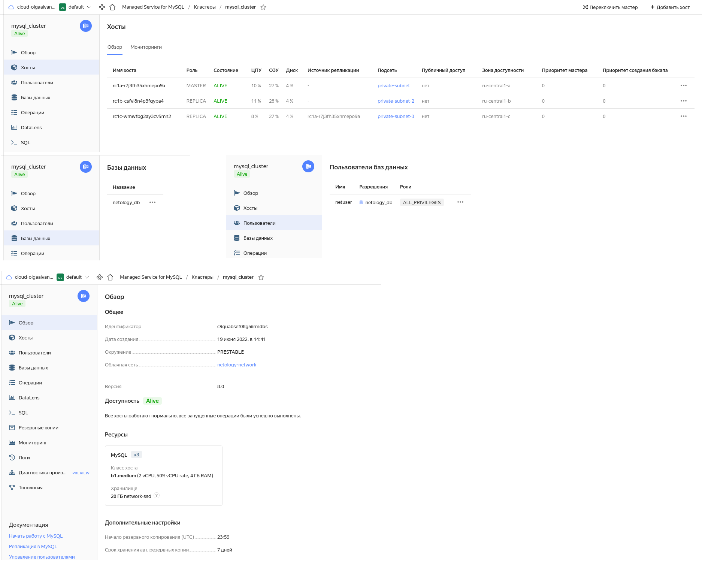
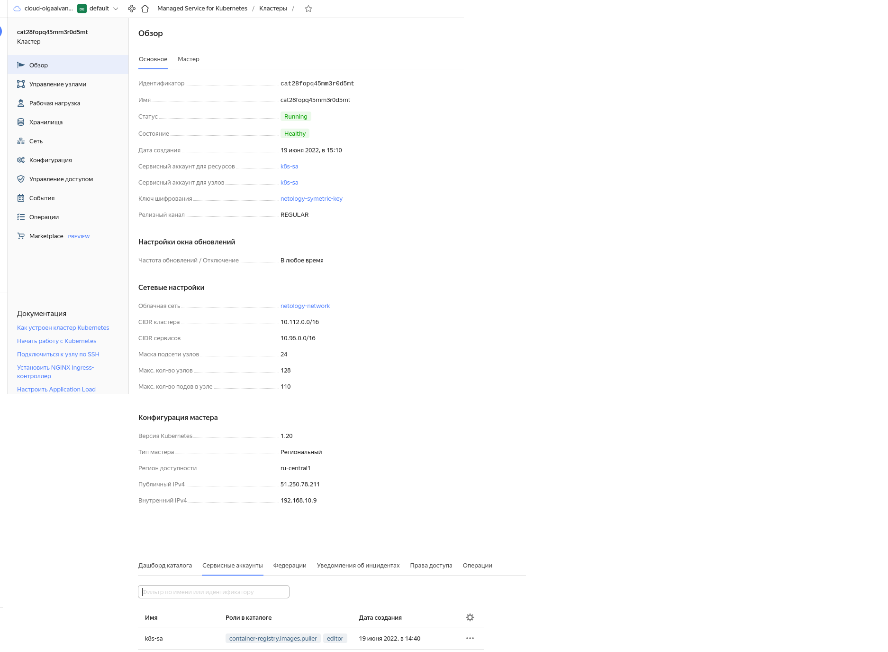
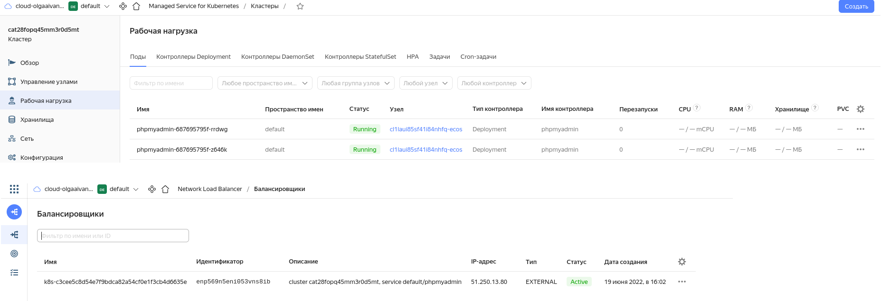

# Домашнее задание к занятию 15.4 "Кластеры. Ресурсы под управлением облачных провайдеров"

Организация кластера Kubernetes и кластера баз данных MySQL в отказоустойчивой архитектуре.
Размещение в private подсетях кластера БД, а в public - кластера Kubernetes.

---
## Задание 1. Яндекс.Облако (обязательное к выполнению)

1. Настроить с помощью Terraform кластер баз данных MySQL:
- Используя настройки VPC с предыдущих ДЗ, добавить дополнительно подсеть private в разных зонах, чтобы обеспечить отказоустойчивость
- Разместить ноды кластера MySQL в разных подсетях
- Необходимо предусмотреть репликацию с произвольным временем технического обслуживания
- Использовать окружение PRESTABLE, платформу Intel Broadwell с производительностью 50% CPU и размером диска 20 Гб
- Задать время начала резервного копирования - 23:59
- Включить защиту кластера от непреднамеренного удаления
- Создать БД с именем `netology_db` c логином и паролем

2. Настроить с помощью Terraform кластер Kubernetes
- Используя настройки VPC с предыдущих ДЗ, добавить дополнительно 2 подсети public в разных зонах, чтобы обеспечить отказоустойчивость
- Создать отдельный сервис-аккаунт с необходимыми правами
- Создать региональный мастер kubernetes с размещением нод в разных 3 подсетях
- Добавить возможность шифрования ключом из KMS, созданного в предыдущем ДЗ
- Создать группу узлов, состоящую из 3 машин с автомасштабированием до 6
- Подключиться к кластеру с помощью `kubectl`
- *Запустить микросервис phpmyadmin и подключиться к БД, созданной ранее
- *Создать сервис типа Load Balancer и подключиться к phpmyadmin. Предоставить скриншот с публичным адресом и подключением к БД

Документация
- [MySQL cluster](https://registry.terraform.io/providers/yandex-cloud/yandex/latest/docs/resources/mdb_mysql_cluster)
- [Создание кластера kubernetes](https://cloud.yandex.ru/docs/managed-kubernetes/operations/kubernetes-cluster/kubernetes-cluster-create)
- [K8S Cluster](https://registry.terraform.io/providers/yandex-cloud/yandex/latest/docs/resources/kubernetes_cluster)
- [K8S node group](https://registry.terraform.io/providers/yandex-cloud/yandex/latest/docs/resources/kubernetes_node_group)
--- 

## Ответ

### 1. Кластер БД MySQL
- Подсети private в разных зонах - [subnet.tf](../../cloud-terraform/subnet.tf)
- Кластер MySQL с базой данной и пользователем - [mysql.tf](../../cloud-terraform/mysql.tf)
- Для удаления потребовалось в интерфейсе снять "запрет удаления".



### 2. Кластер Kubernetes
- Подсети public в разных зонах - [subnet.tf](../../cloud-terraform/subnet.tf)
- Сервис-аккаунт `k8s-sa` с правами `editor` и `container-registry.images.puller` - [iam.tf](../../cloud-terraform/iam.tf)
- Кластер Kubernetes с региональным мастером и группой узлов - [k8s.tf](../../cloud-terraform/k8s.tf).  
Группа узлов с автомасштабированием может быть создана только в одной подсети (иначе появлялась ошибка).
- Для kubeconfig создан шаблон в [main.tf](../../cloud-terraform/k8s.tf). После завершения работы `terraform apply` выполнено:
```bash
terraform output kubeconfig > /home/olga/docs/config
sed '/EOT/d' -i /home/olga/config
```
Итоговый конфиг - см. [config](files/config) (certificate-authority-data обрезан).  
Для его использования потребовалось установить yandex cloud cli (после установки выполнен перезапуск терминала):
```bash
curl -sSL https://storage.yandexcloud.net/yandexcloud-yc/install.sh | bash
yc init
```

  
  


### 3. phpmyadmin
- Созданы файлы [deployment.yml](files/deployment.yml) и [load-balancer.yml](files/load-balancer.yml). Информация по подключению к MySQL взята из UI YC.
- Выполнен `kubectl apply -f`. Развернулись поды с phpmyadmin, а также автоматически был создан сетевой балансировщик с публичным IP-адресом
(см. [https://cloud.yandex.ru/docs/managed-kubernetes/operations/create-load-balancer](https://cloud.yandex.ru/docs/managed-kubernetes/operations/create-load-balancer)).  
- Выполнен вход в phpmyadmin, создана таблица, добавлена строка.

  
  

## Задание 2. Вариант с AWS (необязательное к выполнению)

1. Настроить с помощью terraform кластер EKS в 3 AZ региона, а также RDS на базе MySQL с поддержкой MultiAZ для репликации и создать 2 readreplica для работы:
- Создать кластер RDS на базе MySQL
- Разместить в Private subnet и обеспечить доступ из public-сети c помощью security-group
- Настроить backup в 7 дней и MultiAZ для обеспечения отказоустойчивости
- Настроить Read prelica в кол-ве 2 шт на 2 AZ.

2. Создать кластер EKS на базе EC2:
- С помощью terraform установить кластер EKS на 3 EC2-инстансах в VPC в public-сети
- Обеспечить доступ до БД RDS в private-сети
- С помощью kubectl установить и запустить контейнер с phpmyadmin (образ взять из docker hub) и проверить подключение к БД RDS
- Подключить ELB (на выбор) к приложению, предоставить скрин

Документация
- [Модуль EKS](https://learn.hashicorp.com/tutorials/terraform/eks)
